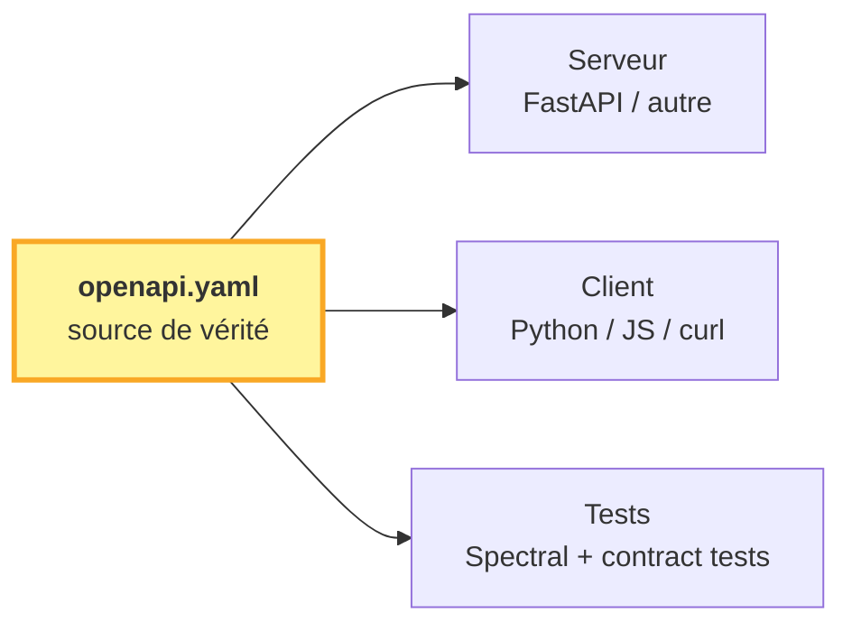

# API CPV — Contrat REST

!!! success "TL;DR"

    Spec **OpenAPI 3.1 contract-first** du service REST EcoWave. Le fichier [`openapi.yaml`](openapi.yaml) est la **source de vérité unique** : un développeur peut implémenter le serveur, un autre peut coder le client, sans autre référence. La spec est indépendante de l'implémentation Python existante — un serveur conforme peut être écrit dans n'importe quel langage. Six endpoints : `forecast`, `benchmark`, `verdict`, `panels`, `panels/{panel}/variables`, `diagnostics/{panel}/{variable}`.

## Dans cette page

- **[Pourquoi contract-first](#pourquoi)** — décorrélation serveur ↔ client
- **[Comment lire `openapi.yaml`](#lire)** — `paths`, `components/schemas`, `info`
- **[Les 6 endpoints en un tableau](#endpoints)** — méthode, rôle, schéma de réponse
- **[Statut & versioning](#versioning)** — `/v1/...`, breaking changes
- **[Outils](#outils)** — Swagger UI, validation Spectral, génération clients
- **[Aller plus loin](#aller-plus-loin)** — server.md, client.md

---

## Pourquoi contract-first { #pourquoi }

Trois choix structurants :

1. **Un seul contrat** — `openapi.yaml`. Pas de "doc humaine + code source à lire en plus pour deviner les schémas". Tout schéma utilisé est défini formellement dans `components/schemas`.

2. **Indépendant de l'implémentation** — la spec n'est pas générée à partir d'un serveur FastAPI existant. Elle décrit le **contrat** ; quand un serveur sera livré (probablement FastAPI), il devra s'y conformer, pas l'inverse.

3. **Décorrélation serveur ↔ client** — deux équipes (ou deux personnes) peuvent coder en parallèle. Le serveur respecte la spec ; le client la requête ; un middleware (Spectral, openapi-generator) garantit l'interopérabilité.



## Comment lire `openapi.yaml` { #lire }

Trois sections seulement à comprendre :

| Section | Rôle |
|---|---|
| `info` | Métadonnées : titre, version, licence, contact |
| `paths` | Les endpoints. Chaque `/path:` → méthodes HTTP → request/response schemas |
| `components/schemas` | Les types réutilisables (`ProbabilisticForecast`, `BenchmarkRequest`, …). Chaque endpoint y fait référence via `$ref` |

Lecture recommandée :

1. Skimmer `info` (10 secondes).
2. Lire la table `paths:` (5 endpoints) pour comprendre la surface.
3. Lire les schémas clés : `ForecastRequest`, `ProbabilisticForecast`, `BenchmarkReport`, `Verdict`.
4. Ignorer `parameters`, `responses` (utilitaires de DRY).

## Les 6 endpoints { #endpoints }

| Méthode | Path | Rôle | Schéma de réponse |
|---|---|---|---|
| `POST` | `/v1/forecast` | Prévision probabiliste pour une série | `ProbabilisticForecast` |
| `POST` | `/v1/benchmark` | Benchmark rolling-origin sur un panel | `BenchmarkReport` |
| `GET` | `/v1/verdict` | Verdict consolidé live | `Verdict` |
| `GET` | `/v1/panels` | Liste des 6 panels | `PanelInfo[]` |
| `GET` | `/v1/panels/{panel}/variables` | Variables d'un panel | `VariableInfo[]` |
| `GET` | `/v1/diagnostics/{panel}/{variable}` | 14 diagnostics dx (C+B+D+I+S) | `DiagnosticBundle` |

Erreurs : codes 400 / 404 / 422 / 500 / 503, format **RFC 7807 Problem Details** (`application/problem+json`).

## Statut & versioning { #versioning }

- **Statut V1** : contrat publié. Implémentation serveur non livrée — voir [server.md](server.md) pour le mapping vers le module Python existant.
- **Versioning** : namespace `/v1/...` immédiat. Tout changement breaking → `/v2/...`. Changements non-breaking (nouveau champ optionnel, nouvelle valeur d'enum) → restent dans `/v1/`.
- **Pas d'auth en V1** : lecture seule pour `GET`, `POST` techniques limités en taille de payload. Si auth requise plus tard : `bearer` JWT dans `components/securitySchemes`.

## Outils { #outils }

### Visualiser la spec (Swagger UI)

```bash
docker run --rm -p 8080:8080 \
  -e SWAGGER_JSON=/spec/openapi.yaml \
  -v $PWD/docs/api:/spec \
  swaggerapi/swagger-ui
```

Ouvrir [`http://localhost:8080`](http://localhost:8080).

### Valider la spec (Spectral)

```bash
docker run --rm -v $PWD/docs/api:/spec \
  stoplight/spectral lint /spec/openapi.yaml
```

Doit retourner 0 erreur, ≤ 3 warnings.

### Générer un client (n'importe quel langage)

```bash
docker run --rm -v $PWD/docs/api:/spec -v $PWD:/out \
  openapitools/openapi-generator-cli generate \
  -i /spec/openapi.yaml -g python -o /out/clients/python
```

Langages disponibles : Python, TypeScript/JavaScript, Go, Java, Rust, et ~50 autres.
Voir la liste : `docker run --rm openapitools/openapi-generator-cli list`.

## Aller plus loin { #aller-plus-loin }

- **[Implémentation serveur](server.md)** — guide FastAPI + mapping vers `ecowave.forecasting`
- **[Utilisation client](client.md)** — exemples curl, Python (httpx), JS (fetch)
- **[Le fichier `openapi.yaml`](openapi.yaml)** — la spec elle-même

---

!!! info "Cohabitation avec `code_api.md`"

    Le track Quants a une [doc Python du module `ecowave.forecasting`](../tracks/quants/code_api.md). Cette doc reste la référence du **module Python en-process** (import direct dans un notebook). La présente section décrit le **contrat REST externe** — un service exposable à des clients externes. Les deux coexistent : l'un documente le code, l'autre le service.
