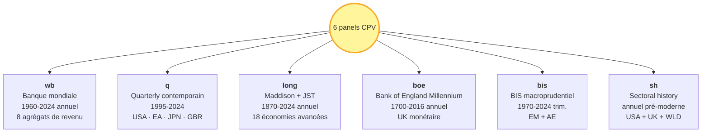

# Sources de données citées

!!! success "TL;DR"

    Toutes les analyses CPV (réfutation des 4 cycles, cluster C+B+D+I+S, benchmark PASS 78 %) reposent sur **6 panels macroéconomiques** ingérés depuis des sources publiques avec **traçabilité complète** : payload brut + SHA-256 dans SQLite. Cette page liste chaque panel, chaque dataset, chaque variable, avec identifiant exact et licence.

## Dans cette page

- **[Vue d'ensemble](#vue-densemble)** — diagramme des 6 panels et leurs périodes
- **[Panel `wb`](#panel-wb)** — Banque mondiale, 1960-2024, 8 agrégats de revenu
- **[Panel `q`](#panel-q)** — quarterly contemporain, 1995-2024, 6 zones
- **[Panel `long`](#panel-long)** — Maddison + JST, 1870-2024, 18 économies avancées
- **[Panel `boe`](#panel-boe)** — Bank of England Millennium, 1700-2016
- **[Panel `bis`](#panel-bis)** — BIS macroprudentiel, 1970-2024, économies AE + EM
- **[Panel `sh`](#panel-sh)** — sectoral history, séries Wen 2005
- **[Pilote 2008](#pilote-2008)** — variables du pilote crise historique
- **[Reproductibilité et licences](#reproductibilite-et-licences)**

---

## Vue d'ensemble { #vue-densemble }



**Couverture temporelle totale** : 1700-2024 (324 ans). **Volume diagnostic** : 9 436 cellules sur les 6 panels combinés.

---

## Panel `wb` — Banque mondiale { #panel-wb }

!!! info "Couverture"
    World Bank Open Data, 8 agrégats par niveau de revenu, 1960-2024.

**Source** : [World Bank Open Data](https://data.worldbank.org). **Licence** : [Creative Commons Attribution 4.0](https://creativecommons.org/licenses/by/4.0/).

**Manifest** : `cycles_manifest.json`.

**Agrégats utilisés** : WLD (monde), HIC (haut revenu), UMC (revenu moyen supérieur), LMC (revenu moyen inférieur), LIC (faible revenu), OECD, G7, BRICS.

### Variables

| Code | Série World Bank | Bande cible |
|---|---|---|
| CY_GDP | `NY.GDP.MKTP.KD.ZG` | Toutes bandes (croissance PIB réel) |
| CY_INV | `NE.GDI.TOTL.ZS` | Juglar (investissement fixe) |
| CY_TRD | `NE.TRD.GNFS.ZS` | Juglar / Kuznets (commerce % PIB) |
| CY_POP | `SP.URB.TOTL.IN.ZS` | Kuznets (urbanisation) |
| CY_FIN | `FS.AST.PRVT.GD.ZS` | Juglar / Kondratieff (crédit domestique) |
| CY_PRD | `NY.GDP.PCAP.KD` | Kondratieff (PIB par habitant) |

---

## Panel `q` — Quarterly contemporain { #panel-q }

!!! info "Couverture"
    FRED + Eurostat + OECD/IFS, 1995-2024, 6 zones économiques.

**Sources** :

- [FRED — Federal Reserve Bank of St. Louis](https://fred.stlouisfed.org). Conditions : [legal terms](https://fred.stlouisfed.org/legal/).
- [Eurostat](https://ec.europa.eu/eurostat). Licence : © European Union, reuse authorized.
- [OECD Main Economic Indicators](https://www.oecd.org/sdd/oecdmaineconomicindicatorsmei.htm), via FRED.

**Manifest** : `quarterly_manifest.json`.

**Agrégats utilisés** : USA, EA (Euro Area), JPN, GBR, G7Q, OECDQ.

### Variables

| Code | Description | Source d'origine |
|---|---|---|
| Q_GDP | PIB réel (log-différence annualisée) | FRED `GDPC1`, Eurostat `namq_10_gdp`, FRED `JPNRGDPEXP`, `NGDPRSAXDCGBQ`, `NGDPRSAXDCCAQ` |
| Q_CPI | Inflation CPI (log-différence annualisée) | FRED `CPIAUCSL`, Eurostat `prc_hicp_mmor`, FRED `JPNCPIALLMINMEI`, `GBRCPIALLMINMEI` |
| Q_UNRATE | Taux de chômage | FRED `UNRATE`, Eurostat `une_rt_q`, FRED `LRUNTTTTJPM156S`, `LRUN64TTGBQ156S` |
| Q_YIELD | Taux 10 ans souverain | FRED `IRLTLT01USM156N`, `IRLTLT01EZM156N`, `IRLTLT01JPM156N`, `IRLTLT01GBM156N` |
| Q_INV | Investissement réel | FRED + Eurostat agrégats nationaux |

---

## Panel `long` — Maddison + Jordà-Schularick-Taylor { #panel-long }

!!! info "Couverture"
    Histoire longue 1870-2024, 18 économies avancées + agrégats régionaux.

**Sources** :

- **Maddison Project Database 2023** — Bolt, J., & van Zanden, J. L. (2024). [Site officiel](https://www.rug.nl/ggdc/historicaldevelopment/maddison/). Variable : `gdppc` (PIB par habitant réel).
- **Jordà-Schularick-Taylor Macrohistory Database (Release 6)** — [macrohistory.net/database/](https://www.macrohistory.net/database/). 18 économies avancées, 1870-2020.

**Manifest** : `long_history_manifest.json`.

**Agrégats utilisés** : ADV18 (18 advanced economies), G7, USA, EU4 (UK+FR+DE+IT), ANGLO (US+UK+AU+CA), NORDIC (SE+DK+NO+FI).

### Variables

| Code | Variable JST/Maddison | Couverture | Source |
|---|---|---|---|
| LH_GDP | `gdppc` réel | 1820-2022, 169 pays | Maddison Project 2023 |
| LH_CREDIT | `tloans` | 1870-2020, 18 pays | JST R6 |
| LH_HPI | `hpnom / cpi → réel` | 1870-2020, 18 pays | JST R6 |
| LH_EQUITY | `eq_capgain` | 1870-2020, 18 pays | JST R6 |
| LH_YIELD | `ltrate` | 1870-2020, 18 pays | JST R6 |
| LH_CPI | `cpi` | 1870-2020, 18 pays | JST R6 |
| LH_MONEY | `money` | 1870-2020, 18 pays | JST R6 |
| LH_NARROW | `narrowm` | 1870-2020, 18 pays | JST R6 |
| LH_BANKDEBT | `bankdebt` | 1870-2020, 18 pays | JST R6 |
| LH_EXP | `expenditure` | 1870-2020, 18 pays | JST R6 |
| LH_REV | `revenue` | 1870-2020, 18 pays | JST R6 |
| LH_MORT | `mortgages` | 1870-2020, 18 pays | JST R6 |
| LH_IMPORTS | `imports` | 1870-2020, 18 pays | JST R6 |
| LH_EXPORTS | `exports` | 1870-2020, 18 pays | JST R6 |

---

## Panel `boe` — Bank of England Millennium { #panel-boe }

!!! info "Couverture"
    Royaume-Uni monétaire 1700-2016, 316 ans, dataset annuel.

**Source** : Bank of England — A Millennium of Macroeconomic Data, version 3.1. [Site officiel](https://www.bankofengland.co.uk/statistics/research-datasets).

**Manifest** : `boe_millennium_manifest.json`.

**Agrégat utilisé** : UK_BOE.

### Variables

| Code | Description | Couverture |
|---|---|---|
| BOE_MONEY | Money supply | 1870-2016 |
| BOE_GDP | PIB nominal | 1700-2016 |
| BOE_CPI | Indice des prix | 1209-2016 |
| BOE_LTIR | Taux long | 1700-2016 |
| BOE_STIR | Taux short | 1700-2016 |
| BOE_WAGE | Salaires nominaux | 1500-2016 |
| BOE_NETLD | Crédit privé net | 1820-2016 |
| BOE_NX | Balance commerciale | 1700-2016 |

---

## Panel `bis` — BIS macroprudentiel { #panel-bis }

!!! info "Couverture"
    Bank for International Settlements, 1970-2024 trimestriel, EM + AE.

**Source** : [BIS Statistics](https://www.bis.org/statistics/index.htm).

**Manifest** : `bis_manifest.json`.

**Agrégats utilisés** :

- **BIS_AE** : économies avancées (US + UK + DE + FR + IT + JP + …)
- **BIS_EM** : économies émergentes (BR + CN + IN + MX + KR + TR + ZA + RU + ID)
- Pays individuels : BR_BIS, CN_BIS, IN_BIS, MX_BIS, KR_BIS, TR_BIS, ZA_BIS, RU_BIS, ID_BIS

### Variables

| Code | Description |
|---|---|
| BIS_HHCRED | Crédit aux ménages (% PIB) |
| BIS_NFCRED | Crédit aux entreprises non-financières (% PIB) |
| BIS_CRATIO | Credit-to-GDP gap |
| BIS_TOTCR | Crédit total à l'économie privée |
| BIS_HPI | House Price Index nominal |
| BIS_DEBT | Dette publique (% PIB) |

**Citations académiques associées** :

- Drehmann, M., Borio, C., & Tsatsaronis, K. (2012). *Characterising the financial cycle: don't lose sight of the medium term!* BIS Working Paper 380.
- Borio, C. (2014). *The financial cycle and macroeconomics: what have we learnt?* Journal of Banking & Finance 45: 182-198.

---

## Panel `sh` — Sectoral history { #panel-sh }

!!! info "Couverture"
    Séries sectorielles historiques pré-modernes, USA + UK + monde.

**Sources** :

- [FRED](https://fred.stlouisfed.org) (séries historiques US)
- [Our World in Data](https://ourworldindata.org)
- [BEIS](https://www.gov.uk/government/organisations/department-for-business-energy-and-industrial-strategy) (UK historical industrial data)

**Manifest** : `sectoral_history_manifest.json`.

**Agrégats utilisés** : US_SH, UK_SH, WORLD_SH.

### Variables (test direct Wen 2005)

| Code | Description | Source | Couverture |
|---|---|---|---|
| SH_US_RAILFREIGHT | Fret ferroviaire US | FRED historical | 1920-2020 |
| SH_US_STEEL | Production d'acier US | FRED + USGS | 1900-2020 |
| SH_US_INDPROD | Production industrielle US | FRED `INDPRO` | 1919-2024 |
| SH_UK_COAL | Production de charbon UK | BEIS historical | 1700-2020 |
| SH_WORLD_TRADE | Commerce mondial volume | OWID | 1830-2020 |

**Citation associée** :

- Wen, Y. (2005). *Understanding the Inventory Cycle*. Journal of Monetary Economics 52(8): 1533-1555.

---

## Pilote 2008 (panel historique de validation) { #pilote-2008 }

Avant les 6 panels principaux, EcoWave avait un pilote sur la crise 2008. Les variables sont conservées pour reproductibilité historique.

| Code | Variable | Source | Identifiant |
|---|---|---|---|
| E1 | VIX (volatilité actions) | FRED | `VIXCLS` |
| E2 | TED Spread | FRED | `TEDRATE` |
| E3 | NASDAQ Composite | FRED | `NASDAQCOM` |
| E4 | PIB réel US + Euro | FRED | `GDPC1 + CLVMNACSCAB1GQEA19` |
| E5 | Chômage US + Euro | FRED | `UNRATE + LRHUTTTTEZM156S` |
| E6 | Inflation YoY US + Euro | FRED | `CPIAUCSL + CP0000EZ19M086NEST` |
| D1 | CISS (ECB systemic stress) | ECB Data Portal | `CISS/D.U2.Z0Z.4F.EC.SS_CIN.IDX` |
| D2 | Spreads souverains périphérie | FRED | `IRLTLT01{IT,ES,PT,DE}M156N` |
| S1 | Chômage des jeunes Euro | FRED | `LRHU24TTEZM156S` |
| L1 | Prix Brent | FRED | `DCOILBRENTEU` |
| L2 | Importations mondiales | World Bank | `NE.IMP.GNFS.KD` |
| I1 | EPU (Baker-Bloom-Davis) | FRED | `USEPUINDXM + EUEPUINDXM` |

**Citation associée pour EPU** :

- Baker, S. R., Bloom, N., & Davis, S. J. (2016). *Measuring Economic Policy Uncertainty*. Quarterly Journal of Economics 131(4): 1593-1636.

---

## Reproductibilité et licences { #reproductibilite-et-licences }

!!! tip "Traçabilité complète"

    Chaque payload brut est stocké sous `data_raw/<fournisseur>/<dataset>.json` avec son **SHA-256** enregistré dans la table SQLite `raw_files`. Cela permet de **reproduire bit-à-bit** chaque analyse à partir des sources originales.

### Reproduction Docker

```bash
# Initialiser la DB
docker compose run --rm ecowave init-db

# Ingérer chaque panel
for panel in wb q long boe bis sh; do
  docker compose run --rm ecowave position-cycles --horizon ${panel}
done
```

Voir [benchmark reproductible](tracks/quants/benchmark_reproducible.md) pour le pipeline complet end-to-end.

### Licences par fournisseur

| Fournisseur | Licence | Redistribution |
|---|---|---|
| **FRED** | [Federal Reserve Bank legal](https://fred.stlouisfed.org/legal/) | À vérifier par série (la plupart sont libres mais certaines amont commerciales) |
| **World Bank** | [CC BY 4.0](https://creativecommons.org/licenses/by/4.0/) | Libre avec attribution |
| **ECB** | © European Central Bank | Non-redistribuable en l'état |
| **Eurostat** | © European Union, reuse authorized | Libre avec attribution |
| **Maddison Project** | Citation académique requise | Libre pour la recherche |
| **JST Macrohistory** | Citation académique requise | Libre pour la recherche |
| **Bank of England Millennium** | © BoE, citation requise | Libre pour la recherche |
| **BIS** | © BIS, citation requise | Conditions BIS spécifiques |
| **OWID** | [CC BY 4.0](https://creativecommons.org/licenses/by/4.0/) | Libre avec attribution |
| **BEIS** | Open Government Licence | Libre avec attribution |

!!! warning "Redistribution des payloads bruts"

    Les payloads bruts d'API **ne sont pas redistribués** sur ce site. EcoWave publie uniquement les **statistiques dérivées** (cycle_positions, dx_diagnostics, forecast_benchmark). Vérifiez la licence amont de chaque fournisseur avant toute redistribution.

---

## Citations à inclure dans toute publication utilisant ces données

```bibtex
@misc{cpv-database-2026,
  title = {EcoWave Cycle Position Vector — multi-panel macro database},
  author = {Geffroy, Sylvain},
  year = {2026},
  url = {https://s-geffroy.github.io/EcoWave/}
}

@article{maddison-project-2024,
  title = {Maddison Project Database 2023},
  author = {Bolt, Jutta and van Zanden, Jan Luiten},
  year = {2024},
  url = {https://www.rug.nl/ggdc/historicaldevelopment/maddison/}
}

@article{jorda-schularick-taylor-2017,
  title = {Macrofinancial History and the New Business Cycle Facts},
  author = {Jordà, Òscar and Schularick, Moritz and Taylor, Alan M.},
  journal = {NBER Macroeconomics Annual},
  volume = {31},
  pages = {213--263},
  year = {2017}
}

@article{boe-millennium-2017,
  title = {A Millennium of UK Macroeconomic Data},
  author = {Thomas, Ryland and Dimsdale, Nicholas},
  publisher = {Bank of England OBRA dataset},
  year = {2017}
}
```

---

## Pour aller plus loin

| Question | Page |
|---|---|
| Comment les variables sont-elles agrégées par groupe ? | [Groupes agrégés](groupes.md) |
| Comment les panels alimentent-ils le benchmark ? | [Pipeline benchmark](tracks/quants/note_quants.md) |
| Où trouver la bibliographie complète ? | [Bibliographie](bibliographie.md) |
| Comment reproduire l'ingestion ? | [Benchmark reproductible](tracks/quants/benchmark_reproducible.md) |
