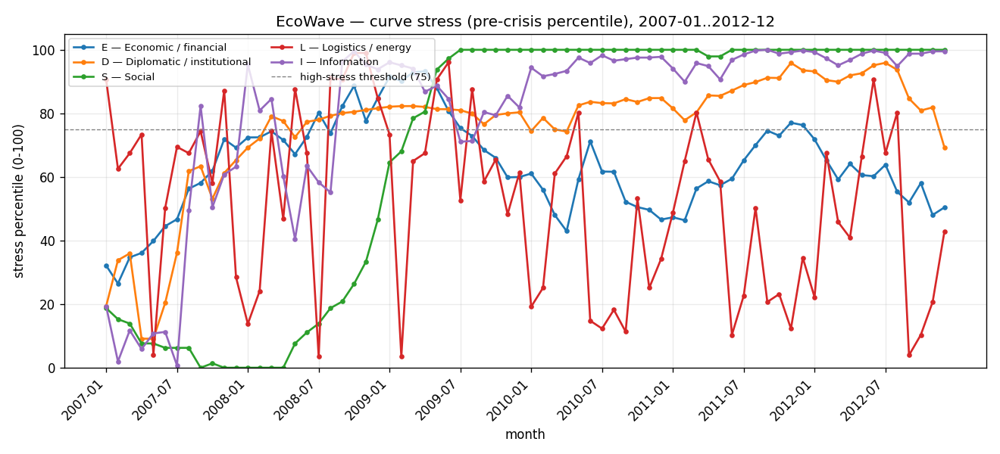
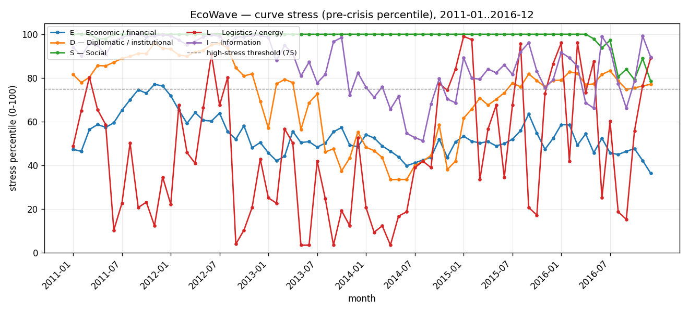
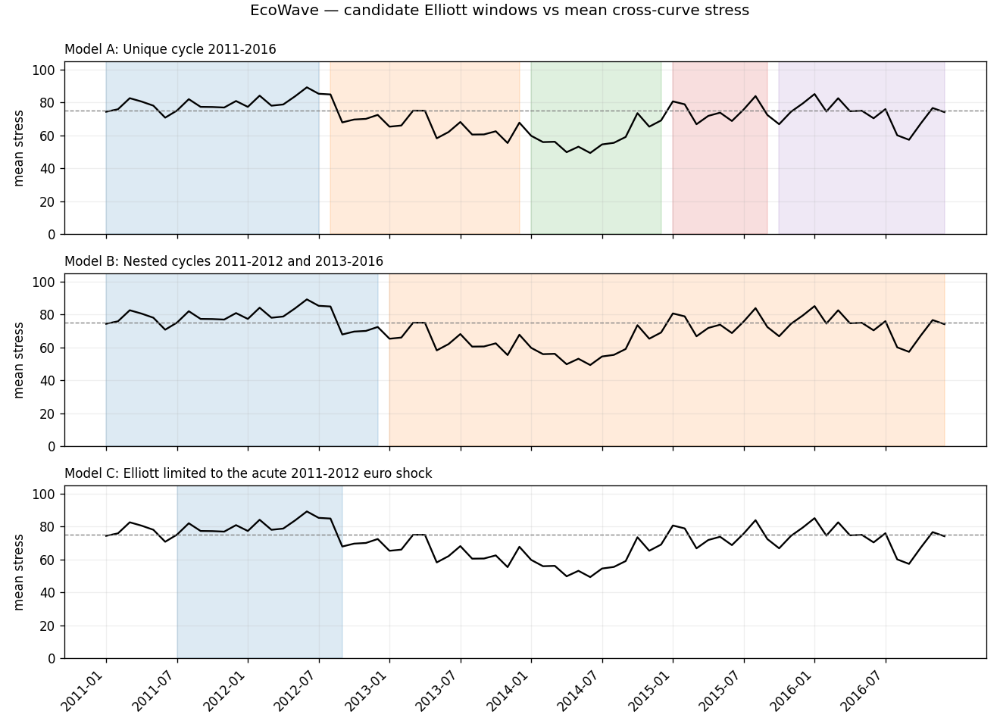

# Figures

Visualizations produced by the pipeline from the real monthly panels. Stress is the
**pre-crisis percentile (0–100)**; the dashed line marks the high-stress threshold (75)
used by the C1 synchronisation criterion.

## Pilot 2008 — global financial + euro sovereign crisis (2007–2012)

### Curve stress
Stress aggregated by curve (E economic, D institutional, S social, L logistics,
I information — the latter proxied by news-based EPU).

### Candidate Elliott windows vs mean stress

## Pilot 2011-2016 — late euro crisis, recovery and 2015–2016 shocks

### Curve stress

### Candidate Elliott windows vs mean stress

!!! note
    Figures are regenerated by each pilot run and refreshed on the site via `make site`.
    They are descriptive, not a final verdict — see [Reports](reports/report_2008_pilot.md).
