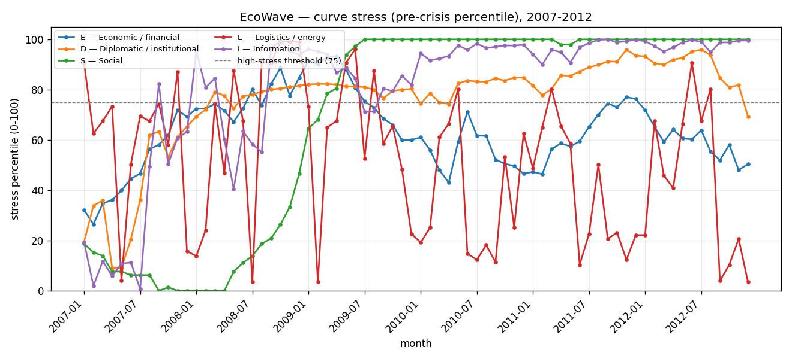
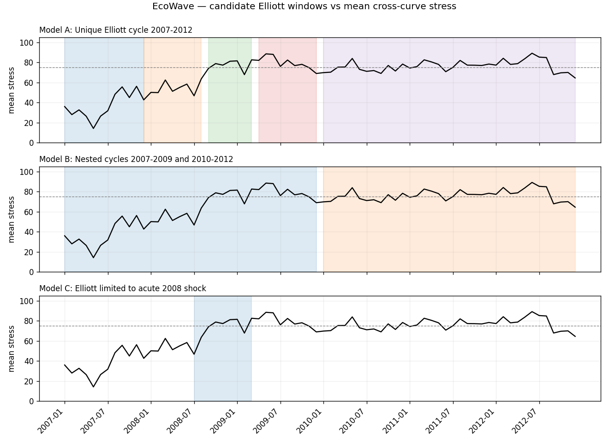

# Curves

Visualizations produced by the pipeline (`ecowave run-pilot 2008`) from the real
monthly panel. Stress is the **pre-crisis percentile (0–100)**; the dashed line marks
the high-stress threshold (75) used by the C1 synchronisation criterion.

## Curve stress, 2007–2012

Stress aggregated by curve (E economic, D institutional, S social, L logistics,
I information). The I curve is a **proxy** (I1 = news-based EPU); its tone component
(I2) is still absent.

## Candidate Elliott windows vs mean stress

Each panel overlays a competing model's candidate phase windows on the mean
cross-curve stress.

!!! note
    These figures are regenerated by every pilot run and refreshed on the site via
    `make site`. They are descriptive, not a final verdict — see
    [Reports](reports/report_2008_pilot.md).
