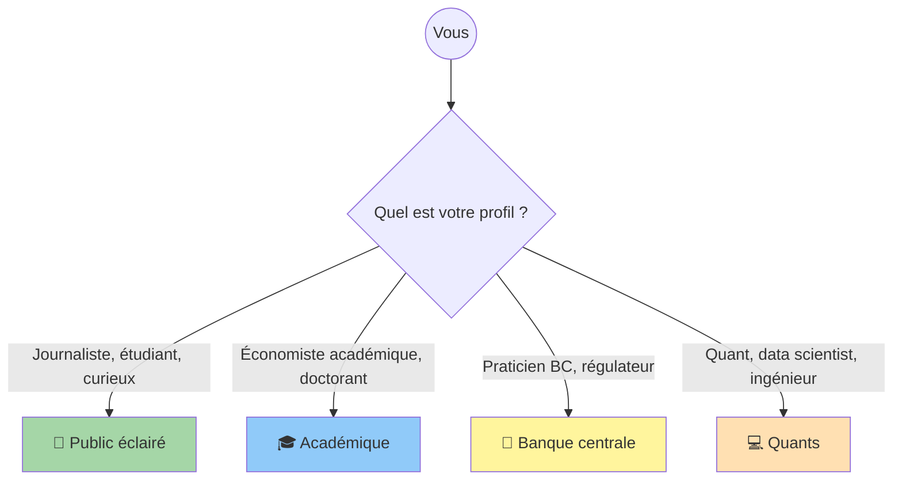

# Comment naviguer ce site

!!! success "TL;DR"

    Le hub multi-track CPV est organisé par **audience cible** (Public éclairé, Académique, Banque centrale, Quants) plutôt que par ordre logique de recherche. Choisissez votre porte d'entrée selon votre profil ou votre question. 5 niveaux de profondeur disponibles (survol 5 min → recherche académique mois/années).

!!! info "Mise à jour V3 (juin 2026)"

    Le papier *Cycles Refuted* est passé en V3 (réponse aux 10 recommandations du referee TSE). La thèse a évolué : **trois cycles canoniques vindiqués** sur les variables substantives prédites (Juglar / Kuznets / Kitchin), Kondratieff **recasté** comme chronologie de dette de guerre Reinhart-Rogoff, lecture **universaliste rejetée** par BH-FDR. Voir [résumé V3](papers/cycles_refuted_v3.md). Les pages historiques type *« le cycle est mort »* ont reçu un encadré de mise à jour mais restent accessibles pour préserver les permaliens.

## Dans cette page

- **[Choisir par profil](#par-profil)** — 4 audiences
- **[Choisir par question](#par-question)** — 8 questions fréquentes
- **[Cross-tracks recommandés](#cross-tracks)** — combinaisons par profil
- **[Hiérarchie de profondeur](#profondeur)** — 5 niveaux
- **[Pour contribuer](#contribuer)** — GitHub MIT
- **[Pour signaler une erreur](#signaler)**

---

## Choisir son point d'entrée par profil { #par-profil }

### Vous êtes journaliste, étudiant, ou lecteur curieux

→ Allez sur le **[track Public éclairé](tracks/public/index.md)**.

Cette track est écrite en français accessible sans jargon, avec
analogies physiques (fleuve vs étang pour la longue mémoire, cascade
en turbulence pour la métaphore unificatrice). Quatre pages :

1. [Le cycle est mort](tracks/public/the_cycle_is_dead.md) — la
   démolition expliquée
2. [Ce qui le remplace](tracks/public/what_replaces_it.md) — la
   cascade fractale
3. [Pourquoi ça compte](tracks/public/why_it_matters.md) — 5
   implications concrètes
4. [Essai phare](tracks/public/note_public.md) — récit accessible
   ~2 500 mots prêt à être lu d'une vue

### Vous êtes économiste académique, théoricien, ou doctorant

→ Allez sur le **[track Académique](tracks/acad/index.md)**.

Cette track formalise la méthode, présente le verdict en ton AER/JME,
et critique le DSGE en proposant 3 modifications structurelles
précises. Six pages :

1. [Méthode compacte](tracks/acad/method_compact.md) — formalisme
   statistique
2. [Verdict constructif](tracks/acad/verdict_constructive.md) —
   cluster + benchmark
3. [DSGE en accusation](tracks/acad/dsge_in_dock.md) — modifications
   requises
4. [Synthèse AMH](tracks/acad/synthesis_amh.md) — Friston + MRW + AMH
5. [5 prédictions falsifiables](tracks/acad/falsifiable_predictions.md)
6. [Paper V2 académique](tracks/acad/paper_v2_academic.md) — paper
   phare ~4 500 mots avec abstract + JEL codes

### Vous travaillez dans une banque centrale ou un régulateur prudentiel

→ Allez sur le **[track Banque centrale](tracks/bc/index.md)**.

Cette track présente 4 outils opérationnels insérables dans une
pipeline BC existante : credibility radar, forward guidance réflexif,
EWS tipping points, horizon-aware targeting. Six pages :

1. [Méthode pour praticiens](tracks/bc/method_for_practitioners.md)
2. [Credibility radar](tracks/bc/credibility_radar.md) — `d` GPH
   inflation
3. [Forward guidance réflexif](tracks/bc/forward_guidance_reflexive.md)
4. [Tipping point detection (EWS)](tracks/bc/tipping_point_detection.md)
5. [Horizon-aware targeting](tracks/bc/horizon_aware_targeting.md)
6. [Note phare BC](tracks/bc/note_bc.md) — ~5 000 mots

### Vous êtes data scientist, quant, forecaster, ou ingénieur logiciel

→ Allez sur le **[track Quants](tracks/quants/index.md)**.

Cette track documente l'API Python, le benchmark reproductible, et
les failure modes. Six pages :

1. [Catalogue des modèles](tracks/quants/models_catalog.md) — specs
   précises des 6 modèles
2. [Benchmark reproductible](tracks/quants/benchmark_reproducible.md)
   — pas-à-pas Docker
3. [API publique](tracks/quants/code_api.md) — référence Python
4. [Extensions roadmap](tracks/quants/extensions_roadmap.md) —
   chantiers futurs
5. [Failure modes](tracks/quants/failure_modes.md) — 15 échecs
   analysés
6. [Note phare Quants](tracks/quants/note_quants.md) — ~5 000 mots

## Choisir son point d'entrée par question { #par-question }

### "Les 4 cycles canoniques sont-ils statistiquement valides ?"

**En trois temps (verdict V3, juin 2026)** :

1. **Oui** sur les canaux substantifs prédits par chaque théorie d'origine —
   Juglar sur investissement-PIB et chômage (67 / 605 cellules JST, excès 2.2×),
   Kuznets sur prix immobiliers / population / crédit (51 / 529 cellules JST, 1.9×),
   Kitchin sur agrégats crédit BIS marchés émergents (25 / 93 cellules trimestrielles, 5.3×).
2. **Non** sur la lecture **universaliste** sinusoïdale-sur-tout (un seul cycle pour toutes les variables) — rejetée par BH-FDR sur la grille jointe de 1 456 cellules.
3. **Kondratieff** : **pas** vindiqué comme long-wave endogène ; **recasté** comme chronologie de dette de guerre Reinhart-Rogoff (seules deux séries UK dette BoE passent Gate 1 dual null AR(1)+ARFIMA ; toutes les autres séries UK Kondratieff-éligibles échouent).

Voir :

- [Résumé V3 portail](papers/cycles_refuted_v3.md) (papier publié)
- [Pages cycles individuels](cycles/kitchin.md) (verdict par cycle)
- [Évidence par variable](evidence_per_variable.md) (chiffres bruts V3)
- [Le cycle est mort](tracks/public/the_cycle_is_dead.md) (page historique avec encadré V3)

### "Quels modèles battent random walk en macroéconomie ?"

Les modèles cluster (HAR, ARFIMA+RS, MSM) sur 78 % des variables.
Voir :

- [Verdict consolidé](forecast_benchmark.md) — PASS 78 %
- [Catalogue des modèles](tracks/quants/models_catalog.md) — specs
- [Benchmark reproductible](tracks/quants/benchmark_reproducible.md)
  — comment vérifier

### "Comment mesurer la crédibilité d'une banque centrale ?"

Par le paramètre `d` GPH appliqué à l'inflation. Voir :

- [Credibility radar](tracks/bc/credibility_radar.md) (BC)

### "Que faut-il modifier dans le DSGE ?"

Trois modifications structurelles. Voir :

- [DSGE en accusation](tracks/acad/dsge_in_dock.md) (Académique)

### "Comment détecter un tipping point macro avec ~3 mois d'avance ?"

Par un test KS sliding-window sur les statistiques d'ordre supérieur.
Voir :

- [Tipping point detection](tracks/bc/tipping_point_detection.md) (BC)

### "Comment reproduire le verdict PASS 78 % sur ma machine ?"

Une commande Docker. Voir :

- [Benchmark reproductible](tracks/quants/benchmark_reproducible.md)

### "Quelles sont les prédictions falsifiables du programme CPV ?"

Cinq. Quatre testables maintenant ; une déjà confirmée. Voir :

- [5 prédictions falsifiables](tracks/acad/falsifiable_predictions.md)
- [Paper V1 §5.4](papers/cpv_main_paper.md)

### "Quel cadre théorique pour unifier les 5 piliers du cluster ?"

AMH + Friston + MRW comme programme ouvert. Voir :

- [Synthèse AMH](tracks/acad/synthesis_amh.md) (Académique)

## Cross-tracks recommandés { #cross-tracks }

Selon votre profil de départ, certains tracks complémentaires sont
recommandés :

| Vous êtes... | Track principal | Cross-tracks utiles |
|---|---|---|
| Étudiant en économie | Public | Académique pour le formalisme |
| Doctorant | Académique | Quants pour reproduire |
| Économiste BC | BC | Quants pour le code, Académique pour la théorie |
| Quant finance | Quants | BC pour les applications, Public pour communiquer |
| Journaliste écho | Public | BC pour les implications politiques |
| Régulateur | BC | Quants pour les outils techniques |
| Théoricien physique | Académique | Quants pour validation empirique |

## Hiérarchie de profondeur { #profondeur }

Le site propose plusieurs niveaux de profondeur :

### Niveau 1 — Survol (5 minutes)

- [Accueil](index.md) — verdict en une page
- [Glossaire](glossary.md) — termes clés

### Niveau 2 — Tour d'horizon (30 minutes)

- Une note phare au choix (Public ~2 500 mots, BC/Quants ~5 000 mots,
  Académique ~4 500 mots)

### Niveau 3 — Détail technique (3 heures)

- Toutes les pages de votre track principal
- [Verdict consolidé](forecast_benchmark.md)
- [Évidence par variable](evidence_per_variable.md)

### Niveau 4 — Reproduction et contribution (3 jours)

- [Méthode complète](methodology/protocole_cpv.md)
- [Benchmark reproductible](tracks/quants/benchmark_reproducible.md)
- [API publique](tracks/quants/code_api.md)
- [Extensions roadmap](tracks/quants/extensions_roadmap.md)

### Niveau 5 — Recherche académique (mois/années)

- [Paper V2](tracks/acad/paper_v2_academic.md)
- [Paper V1 archive](papers/cpv_main_paper.md)
- [Synthèse théorique manquante](tracks/acad/synthesis_amh.md)
- [5 prédictions falsifiables](tracks/acad/falsifiable_predictions.md)

## Pour contribuer { #contribuer }

Le projet est open-source sous MIT sur
[GitHub](https://github.com/s-geffroy/EcoWave). Les contributions
externes sont bienvenues :

- **Code** : voir [extensions roadmap](tracks/quants/extensions_roadmap.md)
  pour les chantiers prioritaires (HABM, MRW continu, AMH-ensemble,
  active inference Friston, Diebold-Mariano, parallélisation).
- **Réplications** : voir
  [5 prédictions falsifiables](tracks/acad/falsifiable_predictions.md)
  pour les tests à mener.
- **Critiques méthodologiques** : tous les protocoles sont conçus
  pour publier leurs échecs. Si vous identifiez un biais ou un
  artefact, ouvrir une issue GitHub.

Tous les tests sont conteneurisés Docker (`docker compose run --rm
--entrypoint pytest ecowave` doit afficher 225+ passed).

## Pour signaler une erreur ou une omission { #signaler }

Ouvrir une issue sur
[GitHub](https://github.com/s-geffroy/EcoWave/issues) avec le titre
de la page concernée et le détail du problème.
