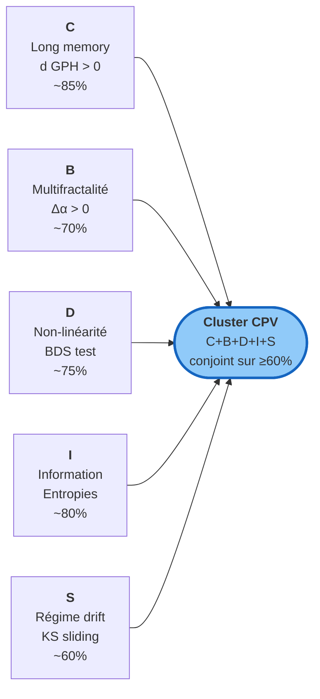
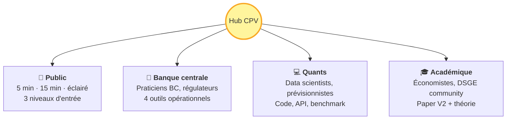

# CPV — Trois cycles substantifs vindiqués, universalisme rejeté

!!! success "TL;DR — papier *Cycles Refuted* V3 (juin 2026)"

    **Pilier 1 — verdict V3 publié.** Sur 1 456 cellules testables, **166 positifs Gate 1 unadjusted (excès 2.3×)** concentrés sur les variables que la théorie substantive prédit :

    - **Juglar** vindiqué sur investissement-PIB (39 % JST) et chômage (G7Q/OECDQ/GBR/JPN) : 67 / 605 cellules JST, excès 2.2×. UK chômage (BoE) passe les deux nulls : *p*<sub>AR(1)</sub> = 0.004, *p*<sub>ARFIMA</sub> = 0.002 à *d̂* = 0.49.
    - **Kuznets** vindiqué sur prix immobiliers (46 % JST, 6/13), population (39 %), crédit (41 %) : 51 / 529 cellules, excès 1.9×.
    - **Kitchin** vindiqué sur agrégats crédit BIS marchés émergents (Corée/Chine/Mexique/Afrique du Sud/Turquie/Russie/Indonésie) : 25 / 93 cellules trimestrielles, excès 5.3×. **BoE Kitchin déclassé** comme artefact de bande-edge (pass-rate 0 % sous resserrement [4,5]).
    - **Kondratieff** — pas vindiqué comme long-wave endogène. Seules deux séries UK passent : dette publique (*p*<sub>AR(1)</sub> = 0.002, *p*<sub>ARFIMA</sub> = 0.022 à *d̂* = +0.436) et dette centrale brute (*p*<sub>AR(1)</sub> = 0.032, *p*<sub>ARFIMA</sub> = 0.048). **Recastée** comme chronologie de dette de guerre Reinhart-Rogoff. Toutes les autres séries UK Kondratieff-éligibles (PIB réel, CPI, salaires réels, actions, population) échouent Gate 1 sur les deux nulls.

    **Ce qui est rejeté** : la lecture **universaliste** sinusoïdale-sur-tout (un seul cycle canonique pour toute série macro). L'ajustement Benjamini-Hochberg FDR α = 0.05 sur la grille jointe rejette cette lecture (le floor 1/(B+1) > p* = 3.4 × 10⁻⁵).

    **Pilier 2 — papier compagnon en préparation.** Une signature à 5 familles statistiques (C long memory, B multifractalité, D non-linéarité, I information structurée, S reflexive regime drift) émerge conjointement sur ≥ 60 % des cellules. Trois modèles cluster (**MSM**, **ARFIMA + regime-switching**, **HAR**) **battent le random walk en out-of-sample CRPS sur 78 % des 68 variables testées**. Ce volet fait l'objet d'un papier compagnon distinct, dont le présent site continue de servir de site-pilote.

## Dans cette page

- **[Verdict V3 (papier publié)](#verdict-v3)** — où les cycles vivent, où ils sont morts, où ils sont recastés
- **[Pipeline benchmark (companion paper)](#pipeline-benchmark)** — PASS 78 % out-of-sample
- **[La méthode](#la-methode-en-un-coup-d-oeil)** — Gate 1 dual null AR(1)+ARFIMA + robustesses R4/R5
- **[La signature cluster CBDIS](#la-signature-cluster-cbdis)** — pilier 2, en préparation
- **[Choisir son point d'entrée](#choisir-son-point-dentree)** — 4 tracks par audience cible

---

## Verdict V3 — papier *Cycles Refuted* { #verdict-v3 }

Verdict publié dans le papier `papers/cycles_refuted/` V3 (juin 2026). Les chiffres sont ceux des sections 5 (`results.tex`) et 0 (`abstract.tex`).

| Cycle | Pass / Testable | Excès vs null | Variables porteuses | Lecture V3 |
|---|---|---|---|---|
| **Juglar** (7–11 ans) | 67 / 605 (JST) | **2.2×** | LH_INV 39 %, LH_UNRATE 33 %, LH_BUSCREDIT 33 %, BoE UK chômage (deux nulls) | ✅ Vindiqué sur canaux substantifs |
| **Kuznets** (15–25 ans) | 51 / 529 (JST) | **1.9×** | LH_HPI 46 %, LH_POP 39 %, LH_CREDIT 41 % | ✅ Vindiqué sur canaux substantifs |
| **Kitchin** (3–5 ans) | 25 / 93 (BIS Q) | **5.3×** | Crédit BIS EM (KR/CN/MX/ZA/TR/RU/ID) | ✅ Vindiqué (BoE Kitchin déclassé R4) |
| **Kondratieff** (40–60 ans) | 2 / 16 (BoE UK) | n/a | UK dette publique + dette gouv. centrale | ♻️ **Recasté** chronologie Reinhart-Rogoff |
| **Lecture universaliste** | 0 BH-FDR | floor > p* | grille 1 456 cellules | ❌ Rejetée |
| **Total Gate 1** | 166 / 1 456 | **2.3×** | tous panels confondus | unadjusted |

!!! info "Comment lire le verdict V3"

    Le verdict est **double**. (1) Lecture **variable-spécifique** : trois cycles canoniques sont alive sur exactement les variables que Kitchin, Juglar, Kuznets ont nommées il y a un siècle. (2) Lecture **universaliste sinusoïdale-sur-tout** : rejetée par BH-FDR.

    Le cas **Kondratieff** est explicitement *recasté* : le seul positif (UK dette) est une chronologie de **dette de guerre Reinhart-Rogoff** (Napoléon, Crimée, WWI, WWII), pas une long-wave endogène. Toutes les autres séries UK Kondratieff-éligibles (PIB réel, CPI, salaires réels, actions) échouent Gate 1 sur les deux nulls.

[Lire le papier V3 (résumé portail) →](papers/cycles_refuted_v3.md){ .md-button }
[Détail par variable →](evidence_per_variable.md){ .md-button }

---

## Pipeline benchmark (companion paper en préparation) { #pipeline-benchmark }

!!! note "Pilier 2 — companion paper"

    Le verdict ci-dessous correspond au **papier compagnon en préparation** (cf. section *Status of the companion paper* du conclusion V3, lignes 137–144). Il documente la signature statistique non-cyclique qui émerge à côté du verdict cycles. Aucune submission jusqu'à ce que le companion soit disponible comme preprint citable.

<!-- BEGIN: AUTO-VERDICT -->

✅ **Verdict consolidé companion** : PASS — pass rate 78 % sur 53 / 68 variables (6 panels, as_of = 2026-05).

| Modèle cluster | Wins | Part |
|---|---|---|
| MSM (Calvet-Fisher) | 23 | 43 % |
| HAR (Corsi 2009) | 16 | 30 % |
| ARFIMA + regime-switching | 14 | 26 % |

<!-- END: AUTO-VERDICT -->

Le **pass rate** est la fraction des variables où au moins un modèle cluster bat le random walk en CRPS out-of-sample à horizon 12. Seuil falsifiable 50 %.

[Voir le verdict consolidé multi-panels →](forecast_benchmark.md){ .md-button }
[Reproduire en Docker →](tracks/quants/benchmark_reproducible.md){ .md-button }

---

## La méthode en un coup d'œil { #la-methode-en-un-coup-d-oeil }

Une cascade de gates falsifiables avec **threshold transparency** (les bornes, surrogate counts, seuils Gate sont figés dans l'historique Git public avant ingestion des panels — distincte d'une pré-enregistrement OSF formel).

```mermaid
flowchart TD
    A([Série macro<br/>panel × variable]) --> LM{Diagnostics par cellule<br/>ADF · KPSS · GPH d̂ · DFA Hurst}
    LM --> B{Gate 1<br/>Dual null<br/>AR(1) bootstrap +<br/>ARFIMA(0, d̂_GPH, 0)}
    B -->|p ≥ 0.05 AR(1)| Z1([❌ Rejet<br/>cycle non détecté])
    B -->|p < 0.05 AR(1) ET ARFIMA| C{Gate 2<br/>Consensus<br/>4 méthodes}
    B -->|p < 0.05 AR(1) seul,<br/>échec ARFIMA| FP([⚠️ Faux positif<br/>long-memory])
    C -->|< 3/4 d'accord| Z2([❌ Cycle disputed])
    C -->|≥ 3/4 d'accord| D{Gate 3<br/>Concordance<br/>cross-agrégats}
    D --> Y([✅ Verdict variable-spécifique<br/>publié])
    Y --> R4{R4 Band-edge<br/>sensibilité ±1y/±2y}
    R4 -->|stable| BHFDR{BH-FDR<br/>grille jointe}
    R4 -->|0 % pass sous resserrement| ART([❌ Artefact<br/>p.ex. BoE Kitchin])
    BHFDR -->|p_floor > p*| UNIV([❌ Lecture universaliste<br/>rejetée])
    BHFDR -->|p < p*| ULT([✅ Cycle universel])
    style Y fill:#a5d6a7,stroke:#388e3c
    style Z1 fill:#ffcdd2,stroke:#c62828
    style Z2 fill:#ffcdd2,stroke:#c62828
    style FP fill:#ffe0b2,stroke:#ef6c00
    style ART fill:#ffe0b2,stroke:#ef6c00
    style UNIV fill:#ffcdd2,stroke:#c62828
    style ULT fill:#90caf9,stroke:#1565c0
```

**Verdict V3 sur 5 panels indépendants (1700-2024, 1 456 cellules testables)** :

| Cycle candidat | Pass Gate 1 unadjusted | Excès | Verdict V3 |
|---|---|---|---|
| Kitchin (3-5 ans) | 25 / 93 (BIS Q) + 3 / 26 (sectoral) | 5.3× | ✅ EM credit ; BoE déclassé |
| Juglar (7-11 ans) | 67 / 605 (JST) + 12 / 55 (Q) | 2.2–4.3× | ✅ Investissement + chômage |
| Kuznets (15-25 ans) | 51 / 529 (JST) | 1.9× | ✅ HPI + population + crédit |
| Kondratieff (40-60 ans) | 2 / 16 (BoE UK) | n/a | ♻️ Recasté chronologie R-R |
| **Lecture universaliste** | 0 (BH-FDR) | n/a | ❌ Rejetée |

[Détail méthode trois portes →](methodology/trois_portes.md){ .md-button }
[Dual null AR(1) + ARFIMA →](methodology/arfima_dual_null.md){ .md-button }
[Sensibilité band-edge (R4) →](methodology/band_sensitivity.md){ .md-button }

---

## La signature cluster C+B+D+I+S { #la-signature-cluster-cbdis }

!!! note "Pilier 2 — papier compagnon en préparation"

    Le cluster CBDIS est l'objet d'un papier compagnon distinct, en préparation. Il documente une signature statistique non-cyclique qui **co-existe** avec la lecture variable-spécifique des trois cycles canoniques (Pilier 1, V3). Le papier *Cycles Refuted* V3 ne préjuge pas du verdict cluster.

Sur ≥ 60 % des cellules, **5 familles statistiques émergent conjointement** :



!!! tip "Métaphore unificatrice — la cascade"

    Imaginez l'eau qui dégringole d'une chute : régulière en haut, agitée en grandes vagues à mi-chute, brisée en mille tourbillons en bas. Il y a **transfert d'énergie** entre échelles. C'est l'image de la **turbulence Kolmogorov K41** — et c'est l'image qui remplace l'horloge cyclique en macroéconomie.

[Verdict constructif (acad) →](tracks/acad/verdict_constructive.md){ .md-button }
[Cluster expliqué (public) →](tracks/public/what_replaces_it.md){ .md-button }

---

## Le pipeline benchmark

La signature statistique est validée **opérationnellement** par un benchmark out-of-sample : on compare 6 modèles sur 68 variables réelles et on regarde quels modèles battent random walk.

```mermaid
flowchart LR
    H[Historique<br/>panel × variable] --> Split[Hold-out<br/>25% terminal]
    Split --> Origins[n_origins = 12<br/>rolling-origin]
    Origins --> Models[6 modèles<br/>RW · AR(1) · ARMA(1,1)<br/>HAR · ARFIMA+RS · MSM]
    Models --> Forecast[ProbabilisticForecast<br/>n_samples × horizons]
    Forecast --> Score[Scoring propre<br/>CRPS · coverage<br/>tail · bias]
    Score --> Verdict([Verdict<br/>PASS / FAIL<br/>par variable])
    style Verdict fill:#a5d6a7,stroke:#388e3c
```

| Modèle | Spécialité empirique |
|---|---|
| **MSM** Calvet-Fisher | Panels longs (Bank of England, long-history) |
| **HAR** Corsi | Quarterly contemporain (q USA + EA) |
| **ARFIMA+RS** Bhardwaj-Swanson | Variables de crédit |

[Catalogue détaillé des modèles →](tracks/quants/models_catalog.md){ .md-button }
[Pipeline complet →](tracks/quants/note_quants.md){ .md-button }

---

## Choisir son point d'entrée

!!! tip "Vous découvrez ?"

    **[Expliqué en 5 minutes](tracks/public/explain_5min.md)** — zéro jargon, métaphores du quotidien (rivière, vagues). Pour journaliste, lycéen, voisin curieux. · **[Expliqué en 15 minutes](tracks/public/explain_15min.md)** — niveau L1 éco, les 5 propriétés et 3 implications concrètes.



<div class="grid cards" markdown>

-   :material-book-open-variant:{ .lg .middle } **[Public](tracks/public/index.md)**

    ---

    *3 niveaux d'entrée : journaliste/lycéen (5 min), étudiant L1 (15 min), public éclairé (essai ~2 500 mots).*

    Le cycle est mort, voici ce qui le remplace. Sans jargon, avec analogies physiques.

    **Doc phare** : essai ~2 500 mots prêt à être lu d'une vue.

-   :material-bank:{ .lg .middle } **[Banque centrale](tracks/bc/index.md)**

    ---

    *Pour praticiens BC, économistes monétaires, analystes macroprudentiels.*

    Credibility radar, forward guidance réflexif, EWS tipping points, horizon-aware targeting.

    **Doc phare** : note ~5 000 mots.

-   :material-code-tags:{ .lg .middle } **[Quants](tracks/quants/index.md)**

    ---

    *Pour data scientists, quants, forecasters, équipes risque.*

    Catalogue MSM/ARFIMA+RS/HAR, reproduction du PASS 78 %, API publique, failure modes.

    **Doc phare** : note ~5 000 mots.

-   :material-school:{ .lg .middle } **[Académique](tracks/acad/index.md)**

    ---

    *Pour économistes théoriciens, DSGE community, doctorants.*

    DSGE en accusation, AMH + Friston + MRW comme méta-cadre, 5 prédictions falsifiables.

    **Doc phare** : paper V2 ~4 500 mots.

</div>

---

## Si tu cherches autre chose

| Question | Où aller |
|---|---|
| Naviguer par profil ou par question | [Comment naviguer](how_to_navigate.md) |
| Un terme technique précis | [Glossaire](glossary.md) |
| Le papier V3 (résumé portail + PDF) | [Cycles Refuted V3](papers/cycles_refuted_v3.md) |
| Le détail méthodologique technique | [Méthode CPV](methodology/protocole_cpv.md) |
| Le verdict companion paper (PASS 78 %) | [Forecast benchmark consolidé](forecast_benchmark.md) |
| Le verdict V3 cycle par cycle | [Kitchin](cycles/kitchin.md) · [Juglar](cycles/juglar.md) · [Kuznets](cycles/kuznets.md) · [Kondratieff](cycles/kondratieff.md) |
| Tous les groupes/sources/bibliographie | [Référence](groupes.md) |
| La version V1 (réfutation-first, archivée) | [Working paper V1](papers/cpv_main_paper.md) |

---

!!! note "Reproductibilité"

    Tout le code Python est conteneurisé Docker. Un seul `docker compose run --rm ecowave forecast-benchmark-consolidate` régénère le verdict consolidé à partir des sidecars JSON par panel. Tous les chiffres affichés sur cette page sont citables avec leur `as_of`. Voir [reproduction (Quants)](tracks/quants/benchmark_reproducible.md).
