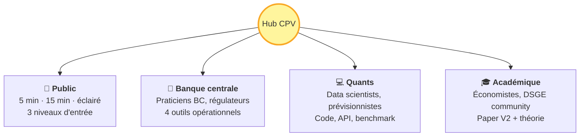

# CPV — La macroéconomie n'est pas cyclique

!!! success "TL;DR"

    Les **4 cycles canoniques** (Kitchin, Juglar, Kuznets, Kondratieff) **ne survivent pas** à un protocole falsifiable rigoureux sur 6 panels macro couvrant 1700-2024.

    À leur place émerge une **signature à 5 familles statistiques** présentes conjointement sur la quasi-totalité des séries macro :

    - **C** — *long memory* (les chocs s'éteignent lentement, pas exponentiellement)
    - **B** — *multifractalité* (la texture des fluctuations diffère selon l'échelle de temps)
    - **D** — *non-linéarité* (cause et effet ne sont pas proportionnels)
    - **I** — *information structurée* (prédictibilité partielle exploitable)
    - **S** — *reflexive regime drift* (les régimes cognitifs glissent au cours du temps)

    Trois modèles statistiques qui reproduisent cette signature (**MSM**, **ARFIMA + regime-switching**, **HAR**) **battent le random walk en out-of-sample CRPS sur 78 % des 68 variables testées**.

## Dans cette page

- **[Le verdict](#le-verdict)** — chiffres clés, leaderboard, lien vers le détail
- **[La méthode](#la-methode-en-un-coup-d-oeil)** — diagramme des 3 portes falsifiables
- **[La signature qui émerge](#la-signature-cluster-cbdis)** — les 5 familles statistiques
- **[Comment le cluster est validé](#le-pipeline-benchmark)** — pipeline benchmark out-of-sample
- **[Choisir son point d'entrée](#choisir-son-point-dentree)** — 4 tracks par audience cible

---

## Le verdict

<!-- BEGIN: AUTO-VERDICT -->

✅ **Verdict consolidé** : PASS — pass rate 78 % sur 53 / 68 variables (6 panels, as_of = 2026-05).

| Modèle cluster | Wins | Part |
|---|---|---|
| MSM (Calvet-Fisher) | 23 | 43 % |
| HAR (Corsi 2009) | 16 | 30 % |
| ARFIMA + regime-switching | 14 | 26 % |

<!-- END: AUTO-VERDICT -->

!!! info "Comment lire le verdict"

    Le **pass rate** est la fraction des variables où **au moins un** modèle du cluster (MSM, HAR, ARFIMA+RS) bat le **random walk** en out-of-sample CRPS à horizon 12. Le seuil falsifiable est 50 %. Avec 78 %, on est largement au-dessus.
    Aucune baseline stationnaire (AR(1), ARMA(1,1)) ne gagne quand un modèle cluster est compétent.

[Voir le verdict consolidé multi-panels →](forecast_benchmark.md){ .md-button }
[Reproduire en Docker →](tracks/quants/benchmark_reproducible.md){ .md-button }

---

## La méthode en un coup d'œil { #la-methode-en-un-coup-d-oeil }

Trois portes successives. Une cellule (cycle × variable × agrégat) doit passer **les trois** pour être déclarée valide.

```mermaid
flowchart TD
    A([Série macro<br/>panel × variable]) --> B{Gate 1<br/>Dual null<br/>AR(1) + phase-scramble}
    B -->|p ≥ 0.05<br/>sur un des deux| Z1([❌ Rejet<br/>Cycle non détecté])
    B -->|p < 0.05<br/>sur les deux| C{Gate 2<br/>Consensus<br/>4 méthodes}
    C -->|< 3/4 d'accord| Z2([❌ Rejet<br/>Cycle disputed])
    C -->|≥ 3/4 d'accord| D{Gate 3<br/>Universalité<br/>5 agrégats}
    D -->|< 4/5 d'accord| Z3([❌ Rejet<br/>Cycle régional])
    D -->|≥ 4/5 d'accord| Y([✅ Cycle universel<br/>publié])
    style Y fill:#a5d6a7,stroke:#388e3c
    style Z1 fill:#ffcdd2,stroke:#c62828
    style Z2 fill:#ffcdd2,stroke:#c62828
    style Z3 fill:#ffcdd2,stroke:#c62828
```

**Verdict sur les 6 panels CPV (1700-2024, 9 436 cellules testées)** :

| Cycle candidat | Survie aux 3 portes |
|---|---|
| Kitchin (3-5 ans) | **0** cellule |
| Juglar (7-11 ans) | **0** cellule |
| Kuznets (15-25 ans) | **0** cellule |
| Kondratieff (40-60 ans) | **0** cellule |

[Détail méthode trois portes →](methodology/trois_portes.md){ .md-button }

---

## La signature cluster C+B+D+I+S

À la place des cycles, **5 familles statistiques émergent conjointement** sur ≥ 60 % des cellules. C'est la nouvelle image de la dynamique macroéconomique.


!!! tip "Métaphore unificatrice — la cascade"

    Imaginez l'eau qui dégringole d'une chute : régulière en haut, agitée en grandes vagues à mi-chute, brisée en mille tourbillons en bas. Il y a **transfert d'énergie** entre échelles. C'est l'image de la **turbulence Kolmogorov K41** — et c'est l'image qui remplace l'horloge cyclique en macroéconomie.

[Verdict constructif (acad) →](tracks/acad/verdict_constructive.md){ .md-button }
[Cluster expliqué (public) →](tracks/public/what_replaces_it.md){ .md-button }

---

## Le pipeline benchmark

La signature statistique est validée **opérationnellement** par un benchmark out-of-sample : on compare 6 modèles sur 68 variables réelles et on regarde quels modèles battent random walk.

```mermaid
flowchart LR
    H[Historique<br/>panel × variable] --> Split[Hold-out<br/>25% terminal]
    Split --> Origins[n_origins = 12<br/>rolling-origin]
    Origins --> Models[6 modèles<br/>RW · AR(1) · ARMA(1,1)<br/>HAR · ARFIMA+RS · MSM]
    Models --> Forecast[ProbabilisticForecast<br/>n_samples × horizons]
    Forecast --> Score[Scoring propre<br/>CRPS · coverage<br/>tail · bias]
    Score --> Verdict([Verdict<br/>PASS / FAIL<br/>par variable])
    style Verdict fill:#a5d6a7,stroke:#388e3c
```

| Modèle | Spécialité empirique |
|---|---|
| **MSM** Calvet-Fisher | Panels longs (Bank of England, long-history) |
| **HAR** Corsi | Quarterly contemporain (q USA + EA) |
| **ARFIMA+RS** Bhardwaj-Swanson | Variables de crédit |

[Catalogue détaillé des modèles →](tracks/quants/models_catalog.md){ .md-button }
[Pipeline complet →](tracks/quants/note_quants.md){ .md-button }

---

## Choisir son point d'entrée

!!! tip "Vous découvrez ?"

    **[Expliqué en 5 minutes](tracks/public/explain_5min.md)** — zéro jargon, métaphores du quotidien (rivière, vagues). Pour journaliste, lycéen, voisin curieux. · **[Expliqué en 15 minutes](tracks/public/explain_15min.md)** — niveau L1 éco, les 5 propriétés et 3 implications concrètes.



<div class="grid cards" markdown>

-   :material-book-open-variant:{ .lg .middle } **[Public](tracks/public/index.md)**

    ---

    *3 niveaux d'entrée : journaliste/lycéen (5 min), étudiant L1 (15 min), public éclairé (essai ~2 500 mots).*

    Le cycle est mort, voici ce qui le remplace. Sans jargon, avec analogies physiques.

    **Doc phare** : essai ~2 500 mots prêt à être lu d'une vue.

-   :material-bank:{ .lg .middle } **[Banque centrale](tracks/bc/index.md)**

    ---

    *Pour praticiens BC, économistes monétaires, analystes macroprudentiels.*

    Credibility radar, forward guidance réflexif, EWS tipping points, horizon-aware targeting.

    **Doc phare** : note ~5 000 mots.

-   :material-code-tags:{ .lg .middle } **[Quants](tracks/quants/index.md)**

    ---

    *Pour data scientists, quants, forecasters, équipes risque.*

    Catalogue MSM/ARFIMA+RS/HAR, reproduction du PASS 78 %, API publique, failure modes.

    **Doc phare** : note ~5 000 mots.

-   :material-school:{ .lg .middle } **[Académique](tracks/acad/index.md)**

    ---

    *Pour économistes théoriciens, DSGE community, doctorants.*

    DSGE en accusation, AMH + Friston + MRW comme méta-cadre, 5 prédictions falsifiables.

    **Doc phare** : paper V2 ~4 500 mots.

</div>

---

## Si tu cherches autre chose

| Question | Où aller |
|---|---|
| Naviguer par profil ou par question | [Comment naviguer](how_to_navigate.md) |
| Un terme technique précis | [Glossaire](glossary.md) |
| Le détail méthodologique technique | [Méthode CPV](methodology/protocole_cpv.md) |
| Le verdict par panel | [Forecast benchmark consolidé](forecast_benchmark.md) |
| La réfutation détaillée par cycle | [Réfutation des cycles](cycles/kitchin.md) |
| Tous les groupes/sources/bibliographie | [Référence](groupes.md) |
| La version originale réfutation-first | [Working paper V1](papers/cpv_main_paper.md) |

---

!!! note "Reproductibilité"

    Tout le code Python est conteneurisé Docker. Un seul `docker compose run --rm ecowave forecast-benchmark-consolidate` régénère le verdict consolidé à partir des sidecars JSON par panel. Tous les chiffres affichés sur cette page sont citables avec leur `as_of`. Voir [reproduction (Quants)](tracks/quants/benchmark_reproducible.md).
