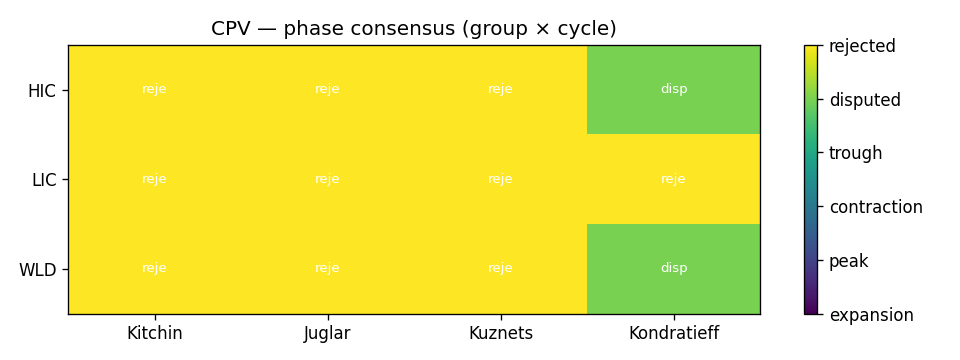
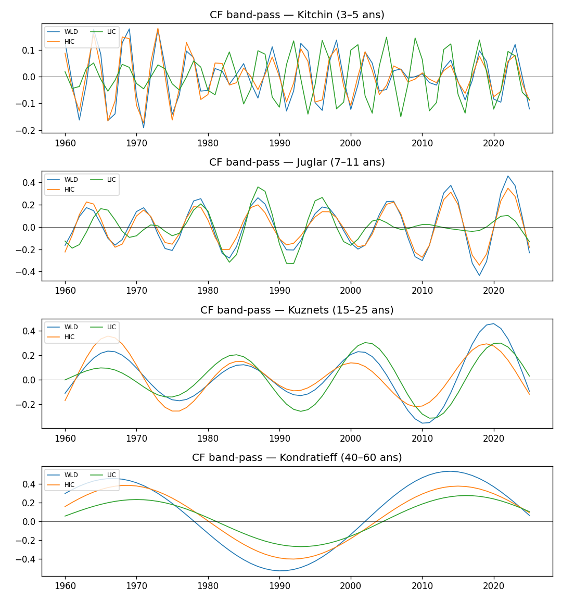
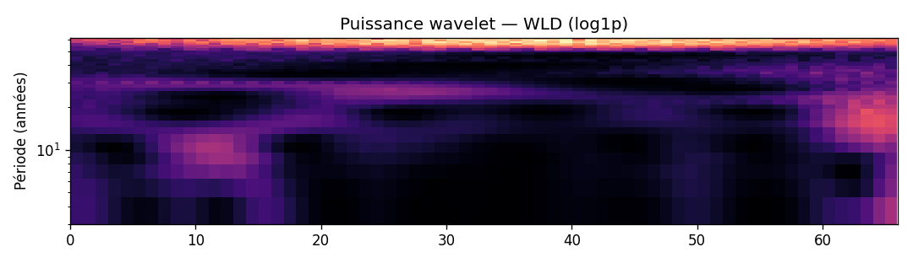

# Où se situe le monde en 2026-05 dans les 4 cycles canoniques ?

> Note signée — sortie du protocole CPV (Cycle Position Vector).
> Méthode : CF band-pass + Morlet wavelet + Hilbert phase + Markov-switching
> + Bry-Boschan, avec 3 gates de falsifiabilité (existence AR(1), consensus
> méthodologique ≥3/4, universalité cross-group ≥4/5). Voir
> `methodology/multi_cycle_decomposition.md` pour la spécification complète.

## Matrice de phase (Gate 2 — consensus inter-méthode)

| group_code   | kitchin   | juglar   | kuznets   | kondratieff   |
|:-------------|:----------|:---------|:----------|:--------------|
| HIC          | rejected  | rejected | rejected  | disputed      |
| LIC          | rejected  | rejected | rejected  | rejected      |
| WLD          | rejected  | rejected | rejected  | disputed      |

## p-values AR(1) (Gate 1 — existence du cycle)

| group_code   |   kitchin |   juglar |   kuznets |   kondratieff |
|:-------------|----------:|---------:|----------:|--------------:|
| HIC          |     0.804 |    0.294 |     0.118 |         0.02  |
| LIC          |     0.412 |    0.627 |     0.627 |         0.216 |
| WLD          |     0.863 |    0.667 |     0.431 |         0.02  |

## Drapeau d'universalité par cycle (Gate 3 — cross-group)

| cycle       | modal_phase   |   n_groups_concording |   n_groups_total | status   |
|:------------|:--------------|----------------------:|-----------------:|:---------|
| kitchin     | rejected      |                     0 |                3 | regional |
| juglar      | rejected      |                     0 |                3 | regional |
| kuznets     | rejected      |                     0 |                3 | regional |
| kondratieff | rejected      |                     0 |                3 | regional |

## Votes par modèle (D/E/F/G) — détail Gate 2

### Kondratieff

| group_code   | D    | E           | F         | G           |
|:-------------|:-----|:------------|:----------|:------------|
| HIC          | peak | contraction | expansion | contraction |
| WLD          | peak | contraction | expansion | contraction |

## Figures

## Lecture par cycle (ancrage littérature)

- **Kitchin (3-5 ans)** — cycle d'inventaire. Référence : Kitchin (1923) ;
  contestation moderne : Diebolt & Doliger (2008).
- **Juglar (7-11 ans)** — cycle d'investissement fixe. Référence :
  Schumpeter (1939) ; opérationalisation : Harding & Pagan (2002).
- **Kuznets (15-25 ans)** — cycle infrastructure/démographie. Référence :
  Kuznets (1930) ; lecture financière : Borio & Drehmann (2009).
- **Kondratieff (40-60 ans)** — vague techno-économique longue. Référence :
  Kondratieff (1925) ; lecture quantitative : Korotayev & Tsirel (2010).

## Caveats

- **Effet endpoint CF** : les dernières `hi_years/2` années sont moins
  fiables (filtre asymétrique). Les cellules concernées sont marquées
  `endpoint_caveat=1` dans la table `cycle_positions`.
- **Fréquence annuelle WB** : Kitchin (3-5 ans) est borderline ; la bande
  basse 3a est inutilisable annuellement (Nyquist).
- **Small-N Kondratieff** : WB démarre en 1960, soit ≈ 1.0-1.5 K-wave. Le
  null AR(1) peut rejeter Kondratieff (`separable=0`) pour plusieurs
  groupes : c'est honnête, pas un échec.

## Sign-off

- Date de la note : 2026-05-28T12:58:13+00:00
- As-of : 2026-05
- Schema EcoWave : `0.5.0`
- Pipeline : `ecowave position-cycles`
