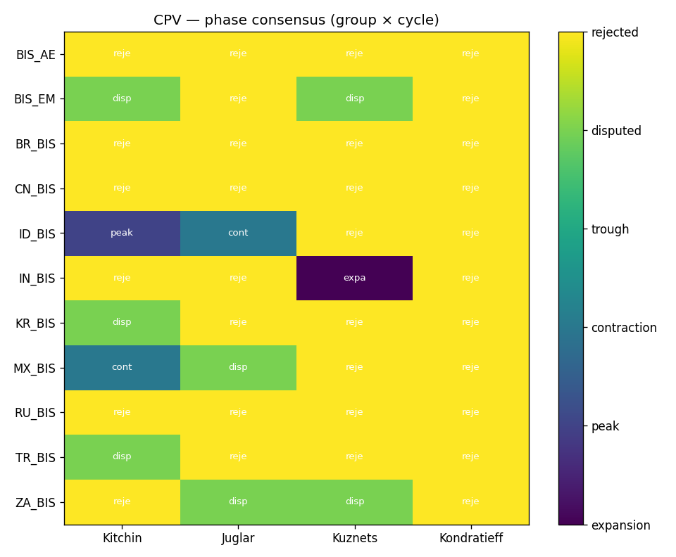
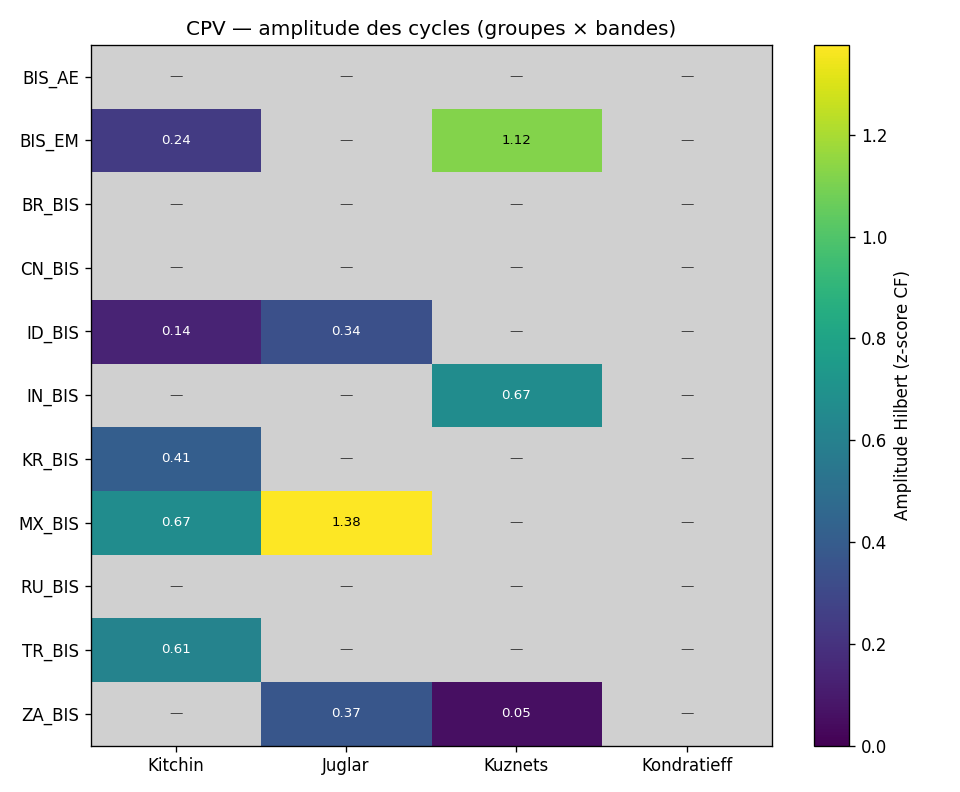
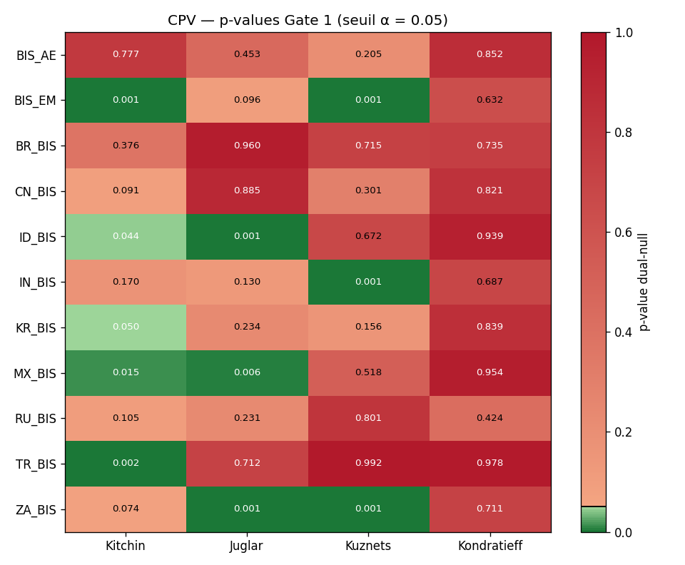
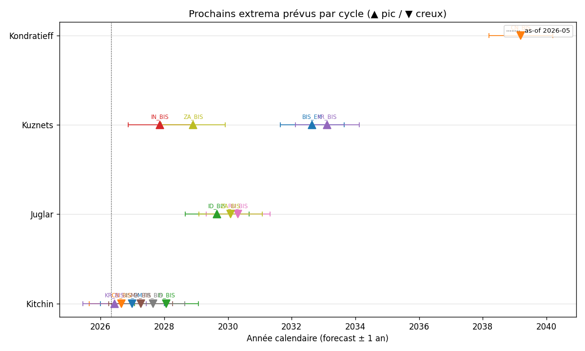
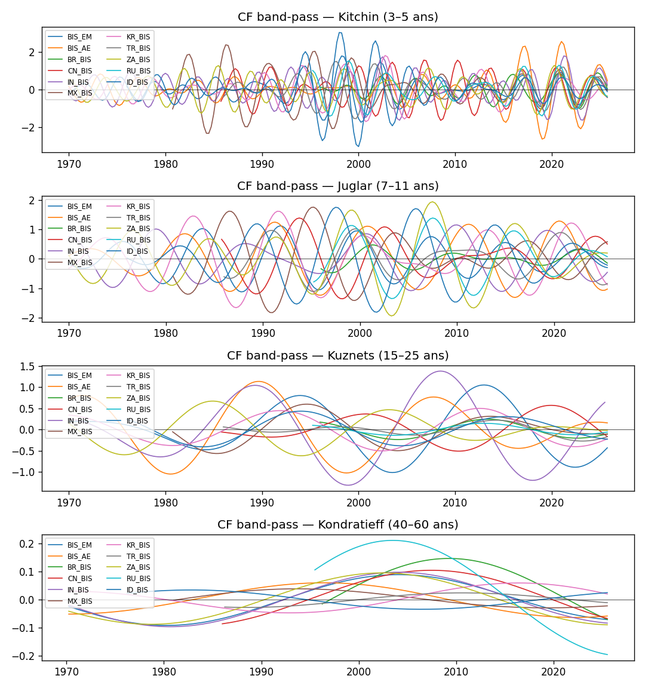
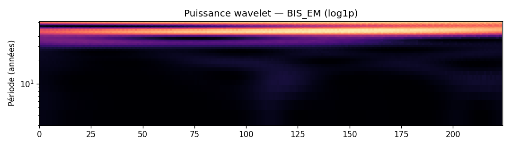
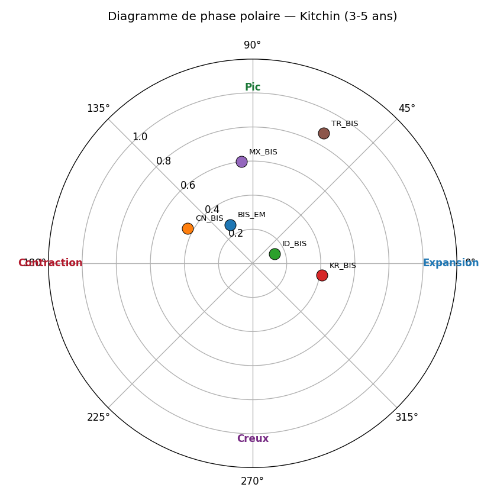
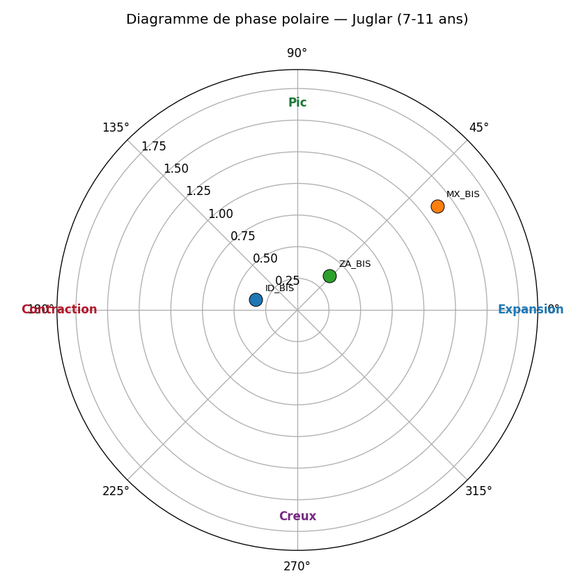
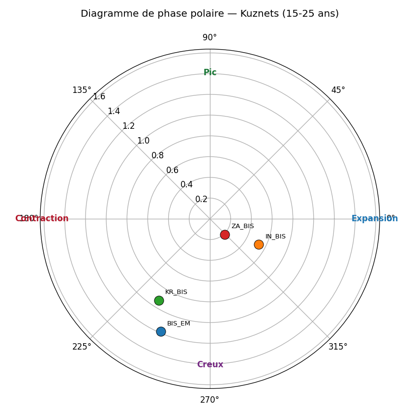
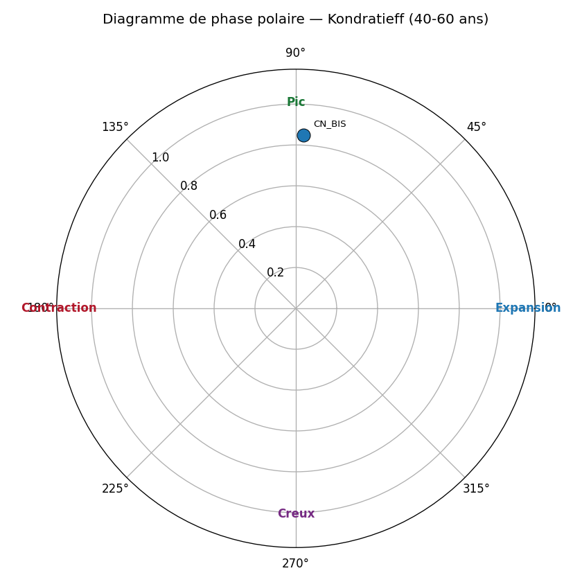

# Où se situe le monde en 2026-05 dans les 4 cycles canoniques ?

> Note signée — sortie du protocole CPV (Cycle Position Vector).
> Méthode : CF band-pass + Morlet wavelet + Hilbert phase + Markov-switching
> + Bry-Boschan, avec 3 gates de falsifiabilité (existence AR(1), consensus
> méthodologique ≥3/4, universalité cross-group ≥4/5). Voir
> `methodology/multi_cycle_decomposition.md` pour la spécification complète.

## Glossaire des agrégats

| Code | Définition |
|---|---|
| `WLD` | Monde — agrégat World Bank (population + GDP pondérés) |
| `OECD` | OECD — 38 pays membres de l'Organisation de Coopération et de Développement Économiques |
| `HIC` | High-Income Countries — RNB/hab > 14 005 USD (seuil WB 2024-2025) |
| `UMC` | Upper-Middle-Income — RNB/hab entre 4 516 et 14 005 USD |
| `LMC` | Lower-Middle-Income — RNB/hab entre 1 146 et 4 515 USD |
| `LIC` | Low-Income Countries — RNB/hab ≤ 1 145 USD |
| `G7` | G7 — USA, GBR, FRA, DEU, ITA, JPN, CAN (recompute pondéré PIB) |
| `G20` | G20 — 19 pays principaux (zone UE traitée par DEU+FRA+ITA) |
| `BRICS` | BRICS+ — Brésil, Russie, Inde, Chine, Afrique du Sud, Égypte, Émirats arabes unis, Éthiopie, Iran, Indonésie (10 pays, expansion Jan-2024 + Jan-2025) |

## Récapitulatif par agrégat (position, tendance, prochain extremum)

Pour chaque groupe, position du cycle, tendance instantanée et
ETA du prochain pic/creux (calculé via la fréquence instantanée Hilbert :
Δt = ((φ_cible − φ) mod 2π) / ω, où ω = 2π / période centrale de la bande).

### BIS_AE

| Cycle | Phase | Tendance | Prochain extremum |
|---|---|---|---|
| Kitchin ⚠️ | rejected | — | — |
| Juglar ⚠️ | rejected | — | — |
| Kuznets ⚠️ | rejected | — | — |
| Kondratieff ⚠️ | rejected | — | — |

### BIS_EM

| Cycle | Phase | Tendance | Prochain extremum |
|---|---|---|---|
| Kitchin ⚠️ | disputed | falling | 📉 min dans 9 mois |
| Juglar ⚠️ | rejected | — | — |
| Kuznets ⚠️ | disputed | rising (post-trough) | 📈 max dans 6.3 ans |
| Kondratieff ⚠️ | rejected | — | — |

### BR_BIS

| Cycle | Phase | Tendance | Prochain extremum |
|---|---|---|---|
| Kitchin ⚠️ | rejected | — | — |
| Juglar ⚠️ | rejected | — | — |
| Kuznets ⚠️ | rejected | — | — |
| Kondratieff ⚠️ | rejected | — | — |

### CN_BIS

| Cycle | Phase | Tendance | Prochain extremum |
|---|---|---|---|
| Kitchin ⚠️ | rejected | — | — |
| Juglar ⚠️ | rejected | — | — |
| Kuznets ⚠️ | rejected | — | — |
| Kondratieff ⚠️ | rejected | — | — |

### ID_BIS

| Cycle | Phase | Tendance | Prochain extremum |
|---|---|---|---|
| Kitchin ⚠️ | peak | rising (post-peak) | 📉 min dans 1.2 ans |
| Juglar ⚠️ | contraction | falling | 📉 min dans 4 mois |
| Kuznets ⚠️ | rejected | — | — |
| Kondratieff ⚠️ | rejected | — | — |

### IN_BIS

| Cycle | Phase | Tendance | Prochain extremum |
|---|---|---|---|
| Kitchin ⚠️ | rejected | — | — |
| Juglar ⚠️ | rejected | — | — |
| Kuznets ⚠️ | expansion | rising | 📈 max dans 9 mois |
| Kondratieff ⚠️ | rejected | — | — |

### KR_BIS

| Cycle | Phase | Tendance | Prochain extremum |
|---|---|---|---|
| Kitchin ⚠️ | disputed | rising (post-peak) | 📉 min dans 1.8 ans |
| Juglar ⚠️ | rejected | — | — |
| Kuznets ⚠️ | rejected | — | — |
| Kondratieff ⚠️ | rejected | — | — |

### MX_BIS

| Cycle | Phase | Tendance | Prochain extremum |
|---|---|---|---|
| Kitchin ⚠️ | contraction | falling | 📉 min dans 12 mois |
| Juglar ⚠️ | disputed | rising (post-peak) | 📉 min dans 3.6 ans |
| Kuznets ⚠️ | rejected | — | — |
| Kondratieff ⚠️ | rejected | — | — |

### RU_BIS

| Cycle | Phase | Tendance | Prochain extremum |
|---|---|---|---|
| Kitchin ⚠️ | rejected | — | — |
| Juglar ⚠️ | rejected | — | — |
| Kuznets ⚠️ | rejected | — | — |
| Kondratieff ⚠️ | rejected | — | — |

### TR_BIS

| Cycle | Phase | Tendance | Prochain extremum |
|---|---|---|---|
| Kitchin ⚠️ | disputed | rising (post-peak) | 📉 min dans 1.2 ans |
| Juglar ⚠️ | rejected | — | — |
| Kuznets ⚠️ | rejected | — | — |
| Kondratieff ⚠️ | rejected | — | — |

### ZA_BIS

| Cycle | Phase | Tendance | Prochain extremum |
|---|---|---|---|
| Kitchin ⚠️ | rejected | — | — |
| Juglar ⚠️ | disputed | rising (post-peak) | 📉 min dans 3.3 ans |
| Kuznets ⚠️ | disputed | falling | 📉 min dans 3.9 ans |
| Kondratieff ⚠️ | rejected | — | — |

_⚠️ = effet endpoint CF dominant (les dernières hi_years/2 années sont moins fiables ; la prévision donne l'ordre de grandeur, pas la date exacte)._

## Matrice de phase (Gate 2 — consensus inter-méthode)

| group_code   | kitchin     | juglar      | kuznets   | kondratieff   |
|:-------------|:------------|:------------|:----------|:--------------|
| BIS_AE       | rejected    | rejected    | rejected  | rejected      |
| BIS_EM       | disputed    | rejected    | disputed  | rejected      |
| BR_BIS       | rejected    | rejected    | rejected  | rejected      |
| CN_BIS       | rejected    | rejected    | rejected  | rejected      |
| ID_BIS       | peak        | contraction | rejected  | rejected      |
| IN_BIS       | rejected    | rejected    | expansion | rejected      |
| KR_BIS       | disputed    | rejected    | rejected  | rejected      |
| MX_BIS       | contraction | disputed    | rejected  | rejected      |
| RU_BIS       | rejected    | rejected    | rejected  | rejected      |
| TR_BIS       | disputed    | rejected    | rejected  | rejected      |
| ZA_BIS       | rejected    | disputed    | disputed  | rejected      |

## p-values AR(1) (Gate 1 — existence du cycle)

| group_code   |   kitchin |   juglar |   kuznets |   kondratieff |
|:-------------|----------:|---------:|----------:|--------------:|
| BIS_AE       |     0.777 |    0.453 |     0.205 |         0.852 |
| BIS_EM       |     0.001 |    0.096 |     0.001 |         0.632 |
| BR_BIS       |     0.376 |    0.96  |     0.715 |         0.735 |
| CN_BIS       |     0.091 |    0.885 |     0.301 |         0.821 |
| ID_BIS       |     0.044 |    0.001 |     0.672 |         0.939 |
| IN_BIS       |     0.17  |    0.13  |     0.001 |         0.687 |
| KR_BIS       |     0.05  |    0.234 |     0.156 |         0.839 |
| MX_BIS       |     0.015 |    0.006 |     0.518 |         0.954 |
| RU_BIS       |     0.105 |    0.231 |     0.801 |         0.424 |
| TR_BIS       |     0.002 |    0.712 |     0.992 |         0.978 |
| ZA_BIS       |     0.074 |    0.001 |     0.001 |         0.711 |

## Drapeau d'universalité par cycle (Gate 3 — cross-group)

| cycle       | modal_phase   |   n_groups_concording |   n_groups_total | status   |
|:------------|:--------------|----------------------:|-----------------:|:---------|
| kitchin     | contraction   |                     1 |               11 | regional |
| juglar      | contraction   |                     1 |               11 | regional |
| kuznets     | expansion     |                     1 |               11 | regional |
| kondratieff | rejected      |                     0 |               11 | regional |

## Votes par modèle (D/E/F/G) — détail Gate 2

### Kitchin

| group_code   | D           | E           | F           | G           |
|:-------------|:------------|:------------|:------------|:------------|
| BIS_EM       | expansion   | peak        | contraction | contraction |
| ID_BIS       | contraction | peak        | peak        | contraction |
| KR_BIS       | trough      | expansion   | peak        | expansion   |
| MX_BIS       | trough      | contraction | contraction | contraction |
| TR_BIS       | contraction | contraction | peak        | contraction |

### Juglar

| group_code   | D           | E         | F           | G           |
|:-------------|:------------|:----------|:------------|:------------|
| ID_BIS       | contraction | peak      | contraction | contraction |
| MX_BIS       | trough      | expansion | peak        | expansion   |
| ZA_BIS       | contraction | peak      | peak        | contraction |

### Kuznets

| group_code   | D           | E      | F           | G           |
|:-------------|:------------|:-------|:------------|:------------|
| BIS_EM       | contraction | trough | trough      | expansion   |
| IN_BIS       | expansion   | trough | expansion   | expansion   |
| ZA_BIS       | expansion   | peak   | contraction | contraction |

## Figures

## Lecture par cycle (ancrage littérature)

- **Kitchin (3-5 ans)** — cycle d'inventaire. Référence : Kitchin (1923) ;
  contestation moderne : Diebolt & Doliger (2008).
- **Juglar (7-11 ans)** — cycle d'investissement fixe. Référence :
  Schumpeter (1939) ; opérationalisation : Harding & Pagan (2002).
- **Kuznets (15-25 ans)** — cycle infrastructure/démographie. Référence :
  Kuznets (1930) ; lecture financière : Borio & Drehmann (2009).
- **Kondratieff (40-60 ans)** — vague techno-économique longue. Référence :
  Kondratieff (1925) ; lecture quantitative : Korotayev & Tsirel (2010).

## Caveats

- **Effet endpoint CF** : les dernières `hi_years/2` années sont moins
  fiables (filtre asymétrique). Les cellules concernées sont marquées
  `endpoint_caveat=1` dans la table `cycle_positions`.
- **Fréquence annuelle WB** : Kitchin (3-5 ans) est borderline ; la bande
  basse 3a est inutilisable annuellement (Nyquist).
- **Small-N Kondratieff** : WB démarre en 1960, soit ≈ 1.0-1.5 K-wave. Le
  null AR(1) peut rejeter Kondratieff (`separable=0`) pour plusieurs
  groupes : c'est honnête, pas un échec.

## Sign-off

- Date de la note : 2026-05-29T11:04:09+00:00
- As-of : 2026-05
- Schema EcoWave : `0.5.1`
- Pipeline : `ecowave position-cycles`
