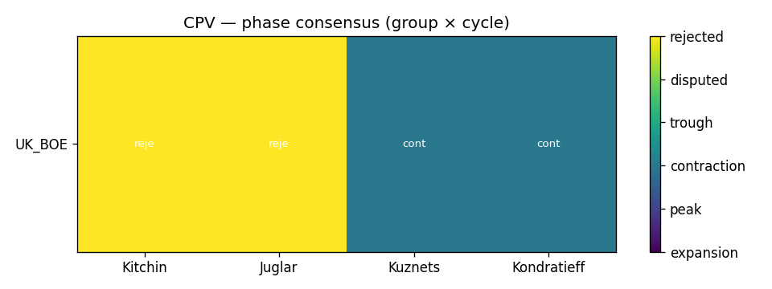
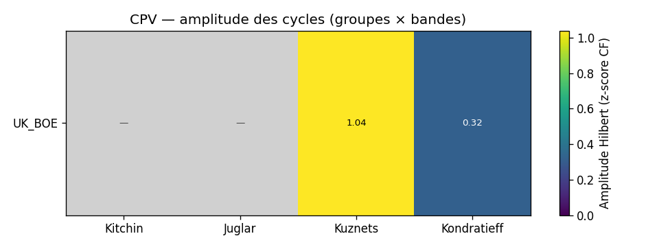
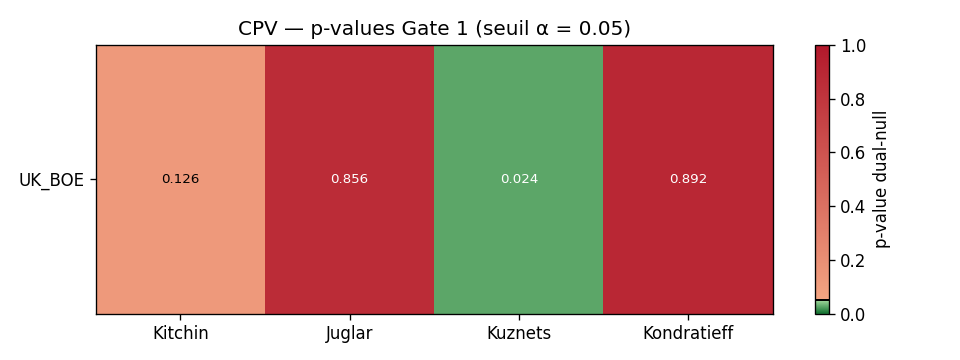
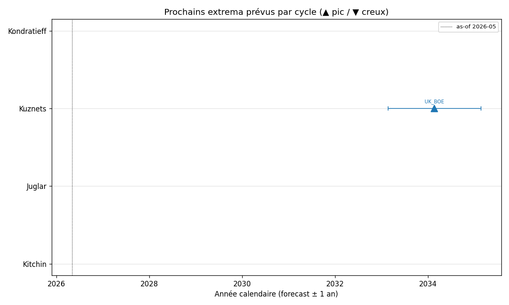
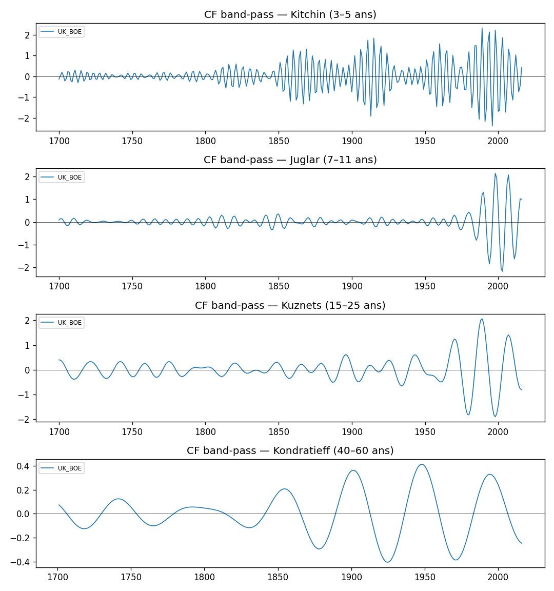
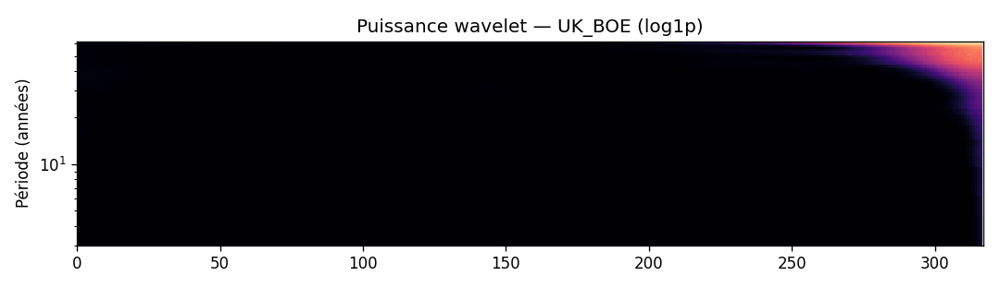
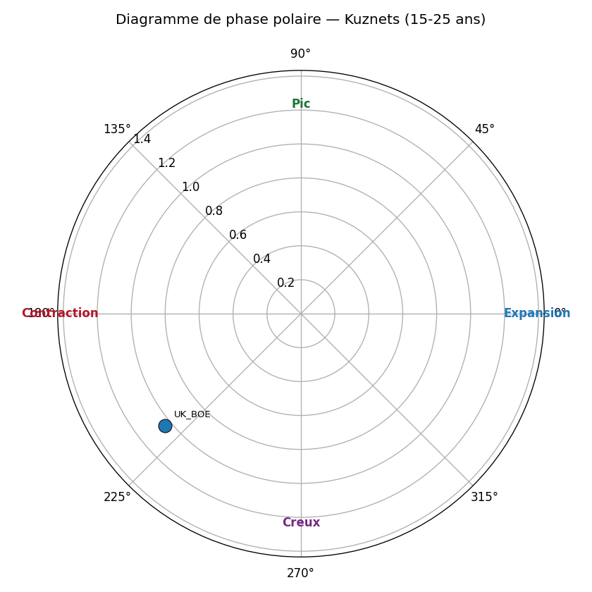
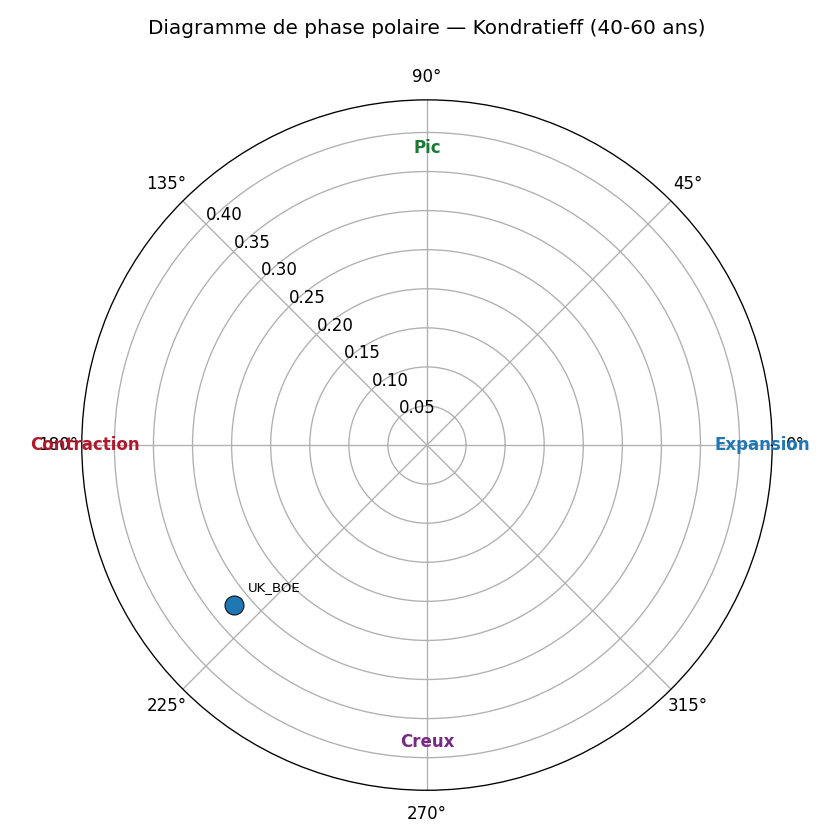

# Bank of England Millennium (1700-2016) — position cyclique 2026-05

> Note signée — sortie du protocole CPV (Cycle Position Vector).
> Méthode : CF band-pass + Morlet wavelet + Hilbert phase + Markov-switching
> + Bry-Boschan, avec 3 gates de falsifiabilité (existence AR(1) + ARFIMA en V3, consensus
> méthodologique ≥3/4, concordance cross-group). Voir
> [protocole CPV](../methodology/protocole_cpv.md) pour la spécification complète.

!!! info "Mise à jour V3 (juin 2026) — BoE est le seul panel qui peut tester Kondratieff"

    Verdicts V3 (source : `papers/cycles_refuted/sections/05_results.tex`) :

    - **Kondratieff (40-60 ans) — recasté Reinhart-Rogoff.** Sur 16 séries UK long-enough, **seules 2 cellules passent Gate 1** : UK dette publique (*p*AR(1) = 0.002, *p*ARFIMA = 0.022 à *d̂* = +0.436) et UK dette gouv. centrale brute (*p*AR(1) = 0.032, *p*ARFIMA = 0.048). Toutes les autres séries UK Kondratieff-éligibles (PIB réel, CPI, salaires réels, actions, population) échouent les deux nulls. **Recasté** chronologie de dette de guerre Reinhart-Rogoff, pas long-wave endogène. R5 rolling-window localise la puissance maximale post-1815 (Napoléon) et post-1945 (WWII). Voir [Kondratieff](../cycles/kondratieff.md).
    - **Juglar — UK chômage passe les deux nulls.** *p*AR(1) = 0.004, *p*ARFIMA = 0.002 à *d̂* = 0.49. La cellule load-bearing du verdict Juglar V3. Idem real USD-GBP exchange rate (*p*AR(1) = 0.006, *p*ARFIMA = 0.002).
    - **Kuznets — UK debt/GDP + real/nominal effective exchange rates** passent (les 2 dernières sur les 2 nulls).
    - **Kitchin DÉCLASSÉ (R4 band-edge).** Pass-rate 7.7 % sur `[3,5]` → **0 % sous `[4,5]`**, 16.9 % sous `[3,6]` → signature d'artefact band-edge, **exclu** du support à la vindication Kitchin V3. Voir [band_sensitivity](../methodology/band_sensitivity.md).
    - **Long-memory diagnostics V3** : 100 % des cellules BoE ont `|d̂| > 0.1`, médiane *Ĥ*DFA = 1.64 — l'AR(1) seul est mis-spécifié, la lecture load-bearing est l'ARFIMA-conditional. 16 cellules sont déclassées comme faux positifs long-memory.

## Glossaire des agrégats

| Code | Définition |
|---|---|
| `WLD` | Monde — agrégat World Bank (population + GDP pondérés) |
| `OECD` | OECD — 38 pays membres de l'Organisation de Coopération et de Développement Économiques |
| `HIC` | High-Income Countries — RNB/hab > 14 005 USD (seuil WB 2024-2025) |
| `UMC` | Upper-Middle-Income — RNB/hab entre 4 516 et 14 005 USD |
| `LMC` | Lower-Middle-Income — RNB/hab entre 1 146 et 4 515 USD |
| `LIC` | Low-Income Countries — RNB/hab ≤ 1 145 USD |
| `G7` | G7 — USA, GBR, FRA, DEU, ITA, JPN, CAN (recompute pondéré PIB) |
| `G20` | G20 — 19 pays principaux (zone UE traitée par DEU+FRA+ITA) |
| `BRICS` | BRICS+ — Brésil, Russie, Inde, Chine, Afrique du Sud, Égypte, Émirats arabes unis, Éthiopie, Iran, Indonésie (10 pays, expansion Jan-2024 + Jan-2025) |

## Récapitulatif par agrégat (position, tendance, prochain extremum)

Pour chaque groupe, position du cycle, tendance instantanée et
ETA du prochain pic/creux (calculé via la fréquence instantanée Hilbert :
Δt = ((φ_cible − φ) mod 2π) / ω, où ω = 2π / période centrale de la bande).

### UK_BOE

| Cycle | Phase | Tendance | Prochain extremum |
|---|---|---|---|
| Kitchin | rejected | — | — |
| Juglar | rejected | — | — |
| Kuznets ⚠️ | rejected | — | — |
| Kondratieff ⚠️ | rejected | — | — |

_⚠️ = effet endpoint CF dominant (les dernières hi_years/2 années sont moins fiables ; la prévision donne l'ordre de grandeur, pas la date exacte)._

## Matrice de phase (Gate 2 — consensus inter-méthode)

| group_code   | kitchin   | juglar   | kuznets   | kondratieff   |
|:-------------|:----------|:---------|:----------|:--------------|
| UK_BOE       | rejected  | rejected | rejected  | rejected      |

## p-values AR(1) (Gate 1 — existence du cycle)

| group_code   |   kitchin |   juglar |   kuznets |   kondratieff |
|:-------------|----------:|---------:|----------:|--------------:|
| UK_BOE       |     0.126 |    0.856 |     0.024 |         0.001 |

## Drapeau d'universalité par cycle (Gate 3 — cross-group)

| cycle       | modal_phase   |   n_groups_concording |   n_groups_total | status   |
|:------------|:--------------|----------------------:|-----------------:|:---------|
| kitchin     | rejected      |                     0 |                1 | regional |
| juglar      | rejected      |                     0 |                1 | regional |
| kuznets     | rejected      |                     0 |                1 | regional |
| kondratieff | rejected      |                     0 |                1 | regional |

## Figures

## Lecture par cycle (ancrage littérature)

- **Kitchin (3-5 ans)** — cycle d'inventaire. Référence : Kitchin (1923) ;
  contestation moderne : Diebolt & Doliger (2008).
- **Juglar (7-11 ans)** — cycle d'investissement fixe. Référence :
  Schumpeter (1939) ; opérationalisation : Harding & Pagan (2002).
- **Kuznets (15-25 ans)** — cycle infrastructure/démographie. Référence :
  Kuznets (1930) ; lecture financière : Borio & Drehmann (2009).
- **Kondratieff (40-60 ans)** — vague techno-économique longue. Référence :
  Kondratieff (1925) ; lecture quantitative : Korotayev & Tsirel (2010).

## Caveats

- **Effet endpoint CF** : les dernières `hi_years/2` années sont moins
  fiables (filtre asymétrique). Les cellules concernées sont marquées
  `endpoint_caveat=1` dans la table `cycle_positions`.
- **Fréquence annuelle WB** : Kitchin (3-5 ans) est borderline ; la bande
  basse 3a est inutilisable annuellement (Nyquist).
- **Small-N Kondratieff** : WB démarre en 1960, soit ≈ 1.0-1.5 K-wave. Le
  null AR(1) peut rejeter Kondratieff (`separable=0`) pour plusieurs
  groupes : c'est honnête, pas un échec.

## Sign-off

- Date de la note : 2026-05-29T12:19:49+00:00
- As-of : 2026-05
- Schema EcoWave : `0.5.1`
- Pipeline : `ecowave position-cycles`
