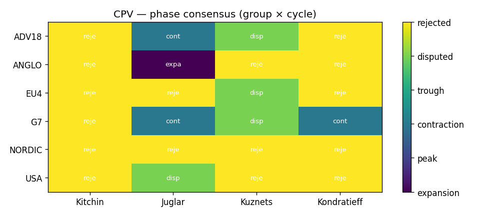
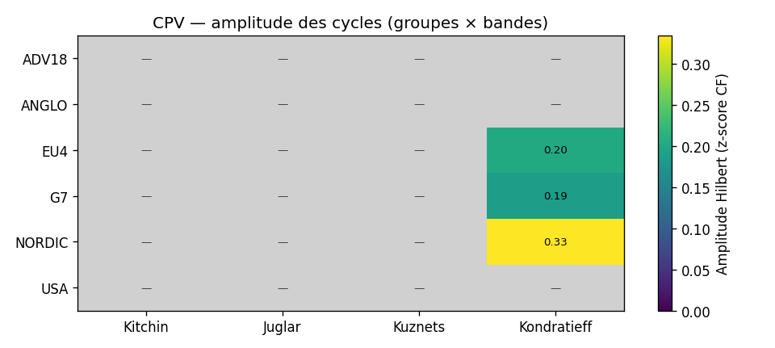
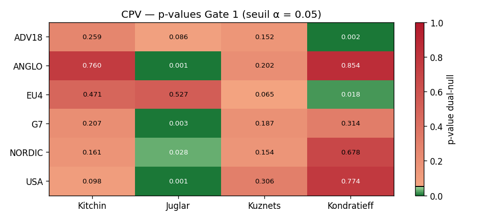
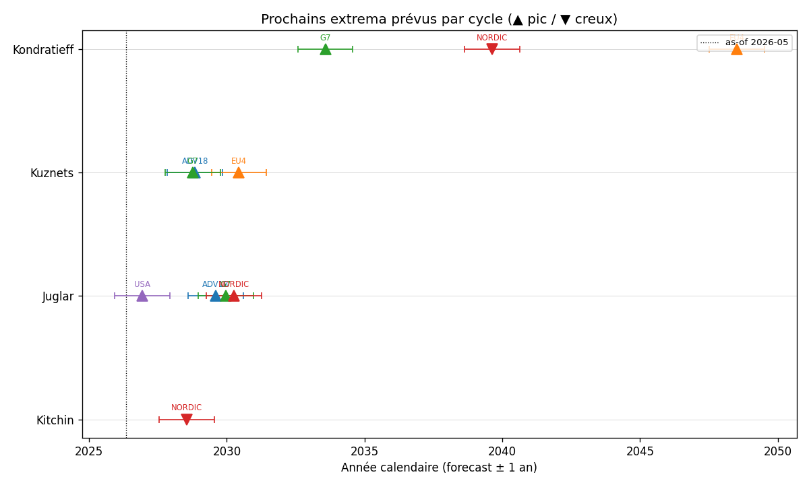
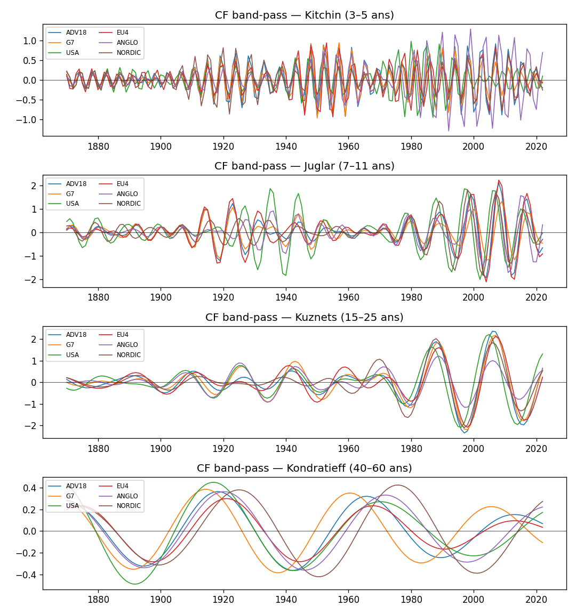
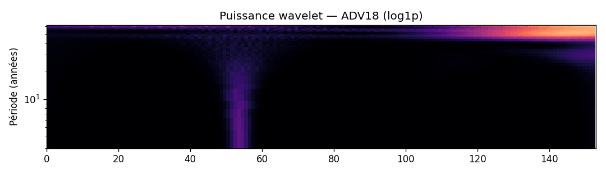
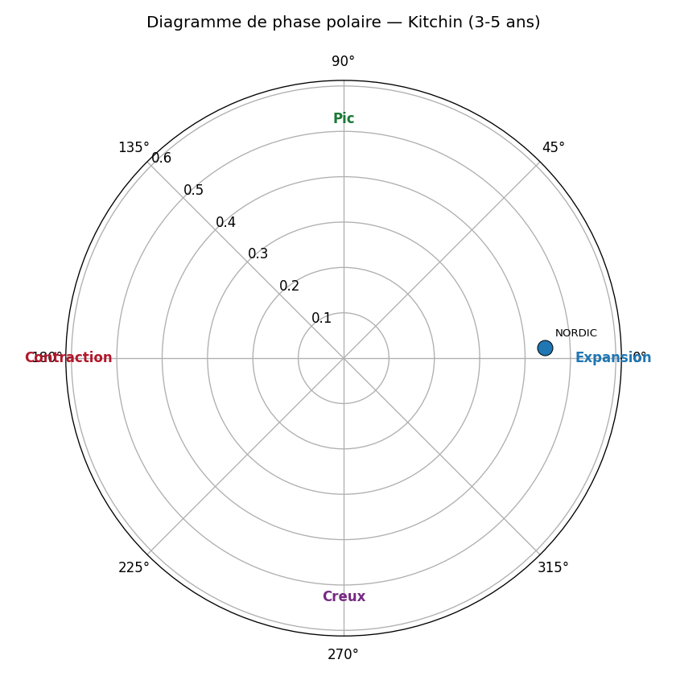
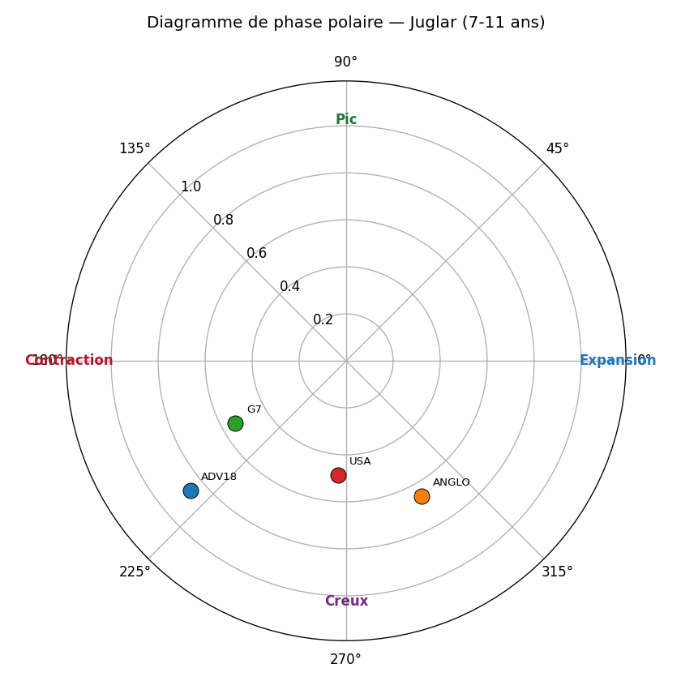
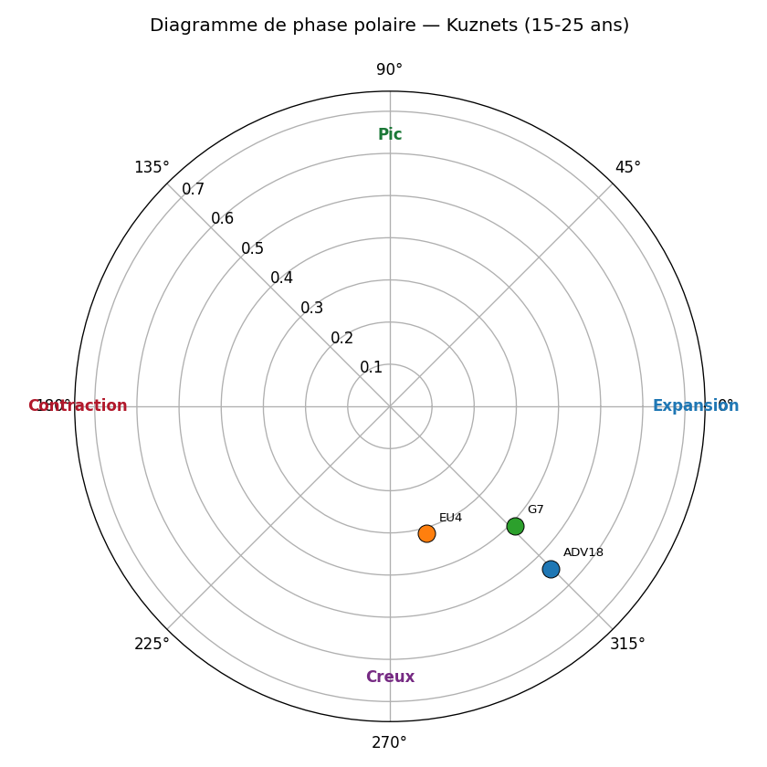
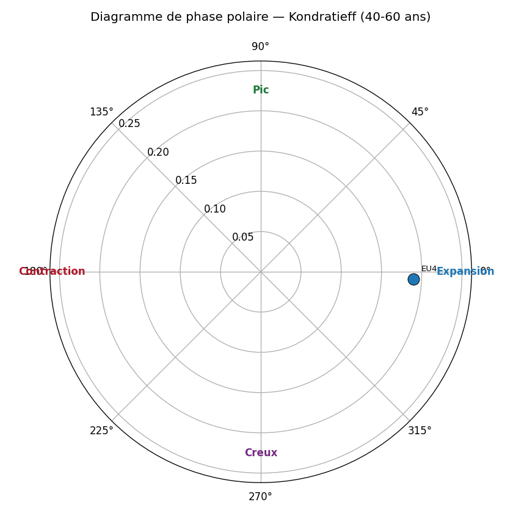

# Histoire longue JST R6 (1870-2022) — position cyclique 2026-05

> Note signée — sortie du protocole CPV (Cycle Position Vector).
> Méthode : CF band-pass + Morlet wavelet + Hilbert phase + Markov-switching
> + Bry-Boschan, avec 3 gates de falsifiabilité (existence AR(1) + ARFIMA en V3, consensus
> méthodologique ≥3/4, concordance cross-group). Voir
> [protocole CPV](../methodology/protocole_cpv.md) pour la spécification complète.

!!! success "Mise à jour V3 (juin 2026) — JST porte les vindications Juglar et Kuznets"

    Verdicts V3 (source : `papers/cycles_refuted/sections/05_results.tex`) :

    - **Juglar (7-11 ans)** : **67 / 605 cellules** Gate 1 unadjusted (**2.2× excès**). Concentration : `LH_INV` 39 % des pays (CH/CA *p*1 = 0.001) ; `LH_UNRATE` 33 % ; `LH_BUSCREDIT` 33 % ; `LH_RCONS`, `LH_HPI`, `LH_RGDP_BARRO`, `LH_DEBTGDP` : 4 chacune. **Théorique faux positif** : `LH_XRUSD` passe sur 61 % (11 / 18) mais exclu de la claim (mécanisme Juglar ne prédit pas le taux de change USD bilatéral).
    - **Kuznets (15-25 ans)** : **51 / 529 cellules** Gate 1 unadjusted (**1.9× excès**). Concentration : `LH_HPI` 46 % (6 / 13) ; `LH_POP` 39 % (7 / 18) ; `LH_CREDIT` 41 % (7 / 17) ; `LH_MORT` 5 ; `LH_DEBTGDP` & `LH_CA` 4.
    - **Kitchin** : reporté principalement sur les panels trimestriels (BIS quarterly 5.3× excès) ; les agrégats JST annuels sont border-Nyquist sur la bande basse [3,5].
    - **Kondratieff** : JST est window-bound (max N = 151 < seuil 240). Voir [BoE 1700-2016](cycle_position_2026_05_boe.md) pour le test complet.
    - **Long-memory** : 97 % des cellules JST ont `|d̂| > 0.1` ; médiane *Ĥ*DFA = 1.76. La lecture load-bearing est l'ARFIMA-conditional ([détail](../methodology/arfima_dual_null.md)).

## Glossaire des agrégats

| Code | Définition |
|---|---|
| `WLD` | Monde — agrégat World Bank (population + GDP pondérés) |
| `OECD` | OECD — 38 pays membres de l'Organisation de Coopération et de Développement Économiques |
| `HIC` | High-Income Countries — RNB/hab > 14 005 USD (seuil WB 2024-2025) |
| `UMC` | Upper-Middle-Income — RNB/hab entre 4 516 et 14 005 USD |
| `LMC` | Lower-Middle-Income — RNB/hab entre 1 146 et 4 515 USD |
| `LIC` | Low-Income Countries — RNB/hab ≤ 1 145 USD |
| `G7` | G7 — USA, GBR, FRA, DEU, ITA, JPN, CAN (recompute pondéré PIB) |
| `G20` | G20 — 19 pays principaux (zone UE traitée par DEU+FRA+ITA) |
| `BRICS` | BRICS+ — Brésil, Russie, Inde, Chine, Afrique du Sud, Égypte, Émirats arabes unis, Éthiopie, Iran, Indonésie (10 pays, expansion Jan-2024 + Jan-2025) |

## Récapitulatif par agrégat (position, tendance, prochain extremum)

Pour chaque groupe, position du cycle, tendance instantanée et
ETA du prochain pic/creux (calculé via la fréquence instantanée Hilbert :
Δt = ((φ_cible − φ) mod 2π) / ω, où ω = 2π / période centrale de la bande).

### ADV18

| Cycle | Phase | Tendance | Prochain extremum |
|---|---|---|---|
| Kitchin | rejected | — | — |
| Juglar ⚠️ | rejected | — | — |
| Kuznets ⚠️ | rejected | — | — |
| Kondratieff ⚠️ | rejected | — | — |

### ANGLO

| Cycle | Phase | Tendance | Prochain extremum |
|---|---|---|---|
| Kitchin | rejected | — | — |
| Juglar ⚠️ | rejected | — | — |
| Kuznets ⚠️ | rejected | — | — |
| Kondratieff ⚠️ | rejected | — | — |

### EU4

| Cycle | Phase | Tendance | Prochain extremum |
|---|---|---|---|
| Kitchin | rejected | — | — |
| Juglar ⚠️ | rejected | — | — |
| Kuznets ⚠️ | rejected | — | — |
| Kondratieff ⚠️ | contraction | falling | 📈 max dans 22 ans |

### G7

| Cycle | Phase | Tendance | Prochain extremum |
|---|---|---|---|
| Kitchin | rejected | — | — |
| Juglar ⚠️ | rejected | — | — |
| Kuznets ⚠️ | rejected | — | — |
| Kondratieff ⚠️ | expansion | rising | 📈 max dans 7.2 ans |

### NORDIC

| Cycle | Phase | Tendance | Prochain extremum |
|---|---|---|---|
| Kitchin | rejected | — | — |
| Juglar ⚠️ | rejected | — | — |
| Kuznets ⚠️ | rejected | — | — |
| Kondratieff ⚠️ | peak | rising (post-peak) | 📉 min dans 13 ans |

### USA

| Cycle | Phase | Tendance | Prochain extremum |
|---|---|---|---|
| Kitchin | rejected | — | — |
| Juglar ⚠️ | rejected | — | — |
| Kuznets ⚠️ | rejected | — | — |
| Kondratieff ⚠️ | rejected | — | — |

_⚠️ = effet endpoint CF dominant (les dernières hi_years/2 années sont moins fiables ; la prévision donne l'ordre de grandeur, pas la date exacte)._

## Matrice de phase (Gate 2 — consensus inter-méthode)

| group_code   | kitchin   | juglar   | kuznets   | kondratieff   |
|:-------------|:----------|:---------|:----------|:--------------|
| ADV18        | rejected  | rejected | rejected  | rejected      |
| ANGLO        | rejected  | rejected | rejected  | rejected      |
| EU4          | rejected  | rejected | rejected  | contraction   |
| G7           | rejected  | rejected | rejected  | expansion     |
| NORDIC       | rejected  | rejected | rejected  | peak          |
| USA          | rejected  | rejected | rejected  | rejected      |

## p-values AR(1) (Gate 1 — existence du cycle)

| group_code   |   kitchin |   juglar |   kuznets |   kondratieff |
|:-------------|----------:|---------:|----------:|--------------:|
| ADV18        |     0.86  |    0.001 |     0.001 |         0.066 |
| ANGLO        |     0.994 |    0.953 |     0.408 |         0.38  |
| EU4          |     0.238 |    0.596 |     0.001 |         0.004 |
| G7           |     0.706 |    0.041 |     0.001 |         0.001 |
| NORDIC       |     0.003 |    0.009 |     0.363 |         0.001 |
| USA          |     0.566 |    0.015 |     0.888 |         0.405 |

## Drapeau d'universalité par cycle (Gate 3 — cross-group)

| cycle       | modal_phase   |   n_groups_concording |   n_groups_total | status   |
|:------------|:--------------|----------------------:|-----------------:|:---------|
| kitchin     | rejected      |                     0 |                6 | regional |
| juglar      | rejected      |                     0 |                6 | regional |
| kuznets     | rejected      |                     0 |                6 | regional |
| kondratieff | expansion     |                     1 |                6 | regional |

## Votes par modèle (D/E/F/G) — détail Gate 2

### Kondratieff

| group_code   | D      | E      | F           | G           |
|:-------------|:-------|:-------|:------------|:------------|
| EU4          | peak   | peak   | contraction | contraction |
| G7           | trough | trough | expansion   | expansion   |
| NORDIC       | peak   | peak   | peak        | contraction |

## Figures

## Lecture par cycle (ancrage littérature)

- **Kitchin (3-5 ans)** — cycle d'inventaire. Référence : Kitchin (1923) ;
  contestation moderne : Diebolt & Doliger (2008).
- **Juglar (7-11 ans)** — cycle d'investissement fixe. Référence :
  Schumpeter (1939) ; opérationalisation : Harding & Pagan (2002).
- **Kuznets (15-25 ans)** — cycle infrastructure/démographie. Référence :
  Kuznets (1930) ; lecture financière : Borio & Drehmann (2009).
- **Kondratieff (40-60 ans)** — vague techno-économique longue. Référence :
  Kondratieff (1925) ; lecture quantitative : Korotayev & Tsirel (2010).

## Caveats

- **Effet endpoint CF** : les dernières `hi_years/2` années sont moins
  fiables (filtre asymétrique). Les cellules concernées sont marquées
  `endpoint_caveat=1` dans la table `cycle_positions`.
- **Fréquence annuelle WB** : Kitchin (3-5 ans) est borderline ; la bande
  basse 3a est inutilisable annuellement (Nyquist).
- **Small-N Kondratieff** : WB démarre en 1960, soit ≈ 1.0-1.5 K-wave. Le
  null AR(1) peut rejeter Kondratieff (`separable=0`) pour plusieurs
  groupes : c'est honnête, pas un échec.

## Sign-off

- Date de la note : 2026-05-29T12:18:07+00:00
- As-of : 2026-05
- Schema EcoWave : `0.5.1`
- Pipeline : `ecowave position-cycles`
