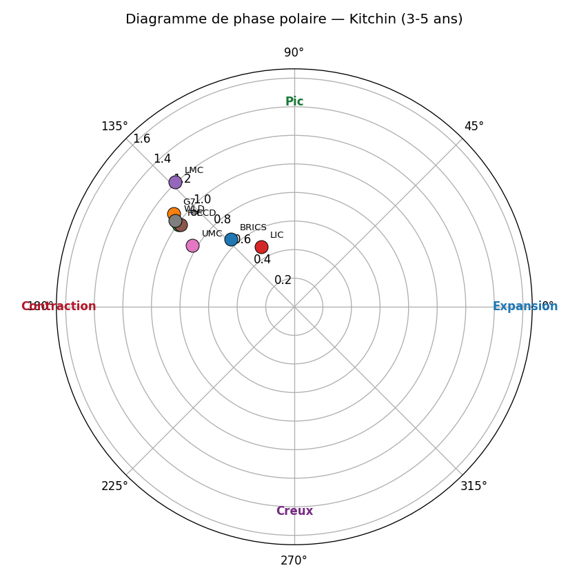
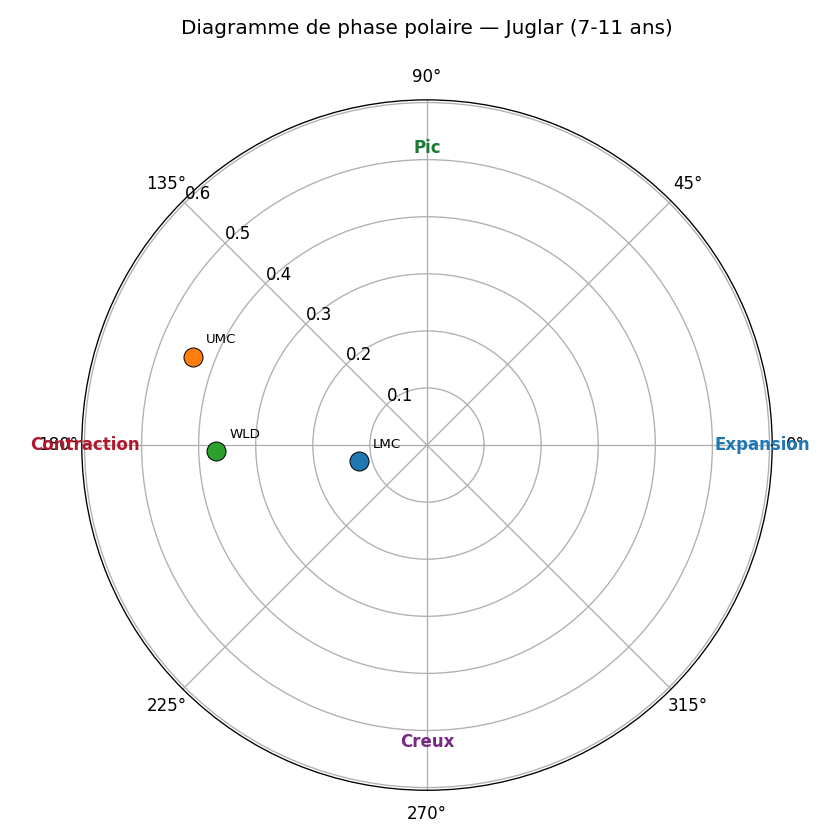
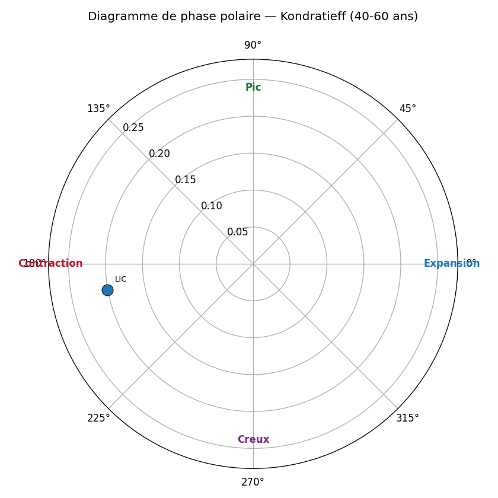

# Où se situe le monde en 2026-05 dans les 4 cycles canoniques ?

> Note signée — sortie du protocole CPV (Cycle Position Vector).
> Méthode : CF band-pass + Morlet wavelet + Hilbert phase + Markov-switching
> + Bry-Boschan, avec 3 gates de falsifiabilité (existence AR(1), consensus
> méthodologique ≥3/4, universalité cross-group ≥4/5). Voir
> `methodology/multi_cycle_decomposition.md` pour la spécification complète.

## Glossaire des agrégats

| Code | Définition |
|---|---|
| `WLD` | Monde — agrégat World Bank (population + GDP pondérés) |
| `OECD` | OECD — 38 pays membres de l'Organisation de Coopération et de Développement Économiques |
| `HIC` | High-Income Countries — RNB/hab > 14 005 USD (seuil WB 2024-2025) |
| `UMC` | Upper-Middle-Income — RNB/hab entre 4 516 et 14 005 USD |
| `LMC` | Lower-Middle-Income — RNB/hab entre 1 146 et 4 515 USD |
| `LIC` | Low-Income Countries — RNB/hab ≤ 1 145 USD |
| `G7` | G7 — USA, GBR, FRA, DEU, ITA, JPN, CAN (recompute pondéré PIB) |
| `G20` | G20 — 19 pays principaux (zone UE traitée par DEU+FRA+ITA) |
| `BRICS` | BRICS+ — Brésil, Russie, Inde, Chine, Afrique du Sud, Égypte, Émirats arabes unis, Éthiopie, Iran, Indonésie (10 pays, expansion Jan-2024 + Jan-2025) |

## Récapitulatif par agrégat (position, tendance, prochain extremum)

Pour chaque groupe, position du cycle, tendance instantanée et
ETA du prochain pic/creux (calculé via la fréquence instantanée Hilbert :
Δt = ((φ_cible − φ) mod 2π) / ω, où ω = 2π / période centrale de la bande).

### BRICS

| Cycle | Phase | Tendance | Prochain extremum |
|---|---|---|---|
| Kitchin ⚠️ | disputed | falling | 📉 min dans 7 mois |
| Juglar ⚠️ | rejected | — | — |
| Kuznets ⚠️ | rejected | — | — |
| Kondratieff ⚠️ | rejected | — | — |

### G7

| Cycle | Phase | Tendance | Prochain extremum |
|---|---|---|---|
| Kitchin ⚠️ | contraction | falling | 📉 min dans 6 mois |
| Juglar ⚠️ | rejected | — | — |
| Kuznets ⚠️ | rejected | — | — |
| Kondratieff ⚠️ | rejected | — | — |

### HIC

| Cycle | Phase | Tendance | Prochain extremum |
|---|---|---|---|
| Kitchin ⚠️ | disputed | falling | 📉 min dans 5 mois |
| Juglar ⚠️ | rejected | — | — |
| Kuznets ⚠️ | rejected | — | — |
| Kondratieff ⚠️ | disputed | rising | 📈 max dans 1.6 ans |

### LIC

| Cycle | Phase | Tendance | Prochain extremum |
|---|---|---|---|
| Kitchin ⚠️ | contraction | falling | 📉 min dans 9 mois |
| Juglar ⚠️ | rejected | — | — |
| Kuznets ⚠️ | rejected | — | — |
| Kondratieff ⚠️ | rejected | — | — |

### LMC

| Cycle | Phase | Tendance | Prochain extremum |
|---|---|---|---|
| Kitchin ⚠️ | contraction | falling | 📉 min dans 7 mois |
| Juglar ⚠️ | rejected | — | — |
| Kuznets ⚠️ | rejected | — | — |
| Kondratieff ⚠️ | rejected | — | — |

### OECD

| Cycle | Phase | Tendance | Prochain extremum |
|---|---|---|---|
| Kitchin ⚠️ | disputed | falling | 📉 min dans 5 mois |
| Juglar ⚠️ | rejected | — | — |
| Kuznets ⚠️ | rejected | — | — |
| Kondratieff ⚠️ | disputed | rising | 📈 max dans 1.2 ans |

### UMC

| Cycle | Phase | Tendance | Prochain extremum |
|---|---|---|---|
| Kitchin ⚠️ | disputed | falling | 📉 min dans 5 mois |
| Juglar ⚠️ | contraction | falling | 📉 min dans 8 mois |
| Kuznets ⚠️ | rejected | — | — |
| Kondratieff ⚠️ | rejected | — | — |

### WLD

| Cycle | Phase | Tendance | Prochain extremum |
|---|---|---|---|
| Kitchin ⚠️ | contraction | falling | 📉 min dans 5 mois |
| Juglar ⚠️ | rejected | — | — |
| Kuznets ⚠️ | rejected | — | — |
| Kondratieff ⚠️ | contraction | rising | 📈 max dans 7.3 ans |

_⚠️ = effet endpoint CF dominant (les dernières hi_years/2 années sont moins fiables ; la prévision donne l'ordre de grandeur, pas la date exacte)._

## Matrice de phase (Gate 2 — consensus inter-méthode)

| group_code   | kitchin     | juglar      | kuznets   | kondratieff   |
|:-------------|:------------|:------------|:----------|:--------------|
| BRICS        | disputed    | rejected    | rejected  | rejected      |
| G7           | contraction | rejected    | rejected  | rejected      |
| HIC          | disputed    | rejected    | rejected  | disputed      |
| LIC          | contraction | rejected    | rejected  | rejected      |
| LMC          | contraction | rejected    | rejected  | rejected      |
| OECD         | disputed    | rejected    | rejected  | disputed      |
| UMC          | disputed    | contraction | rejected  | rejected      |
| WLD          | contraction | rejected    | rejected  | contraction   |

## p-values AR(1) (Gate 1 — existence du cycle)

| group_code   |   kitchin |   juglar |   kuznets |   kondratieff |
|:-------------|----------:|---------:|----------:|--------------:|
| BRICS        |     0.001 |    0.15  |     0.463 |         0.999 |
| G7           |     0.029 |    0.267 |     0.714 |         0.055 |
| HIC          |     0.01  |    0.589 |     0.351 |         0.001 |
| LIC          |     0.025 |    0.85  |     0.299 |         0.506 |
| LMC          |     0.014 |    0.54  |     0.746 |         0.063 |
| OECD         |     0.01  |    0.498 |     0.577 |         0.001 |
| UMC          |     0.001 |    0.041 |     0.214 |         0.38  |
| WLD          |     0.002 |    0.444 |     0.054 |         0.001 |

## Drapeau d'universalité par cycle (Gate 3 — cross-group)

| cycle       | modal_phase   |   n_groups_concording |   n_groups_total | status   |
|:------------|:--------------|----------------------:|-----------------:|:---------|
| kitchin     | contraction   |                     3 |                5 | regional |
| juglar      | contraction   |                     1 |                5 | regional |
| kuznets     | rejected      |                     0 |                5 | regional |
| kondratieff | contraction   |                     1 |                5 | regional |

## Votes par modèle (D/E/F/G) — détail Gate 2

### Kitchin

| group_code   | D           | E           | F           | G           |
|:-------------|:------------|:------------|:------------|:------------|
| BRICS        | peak        | peak        | contraction | contraction |
| G7           | contraction | contraction | contraction | contraction |
| HIC          | contraction | peak        | contraction | contraction |
| LIC          | peak        | contraction | contraction | contraction |
| LMC          | contraction | contraction | contraction | contraction |
| OECD         | contraction | peak        | contraction | contraction |
| UMC          | contraction | peak        | contraction | contraction |
| WLD          | contraction | contraction | contraction | contraction |

### Juglar

| group_code   | D           | E    | F           | G           |
|:-------------|:------------|:-----|:------------|:------------|
| UMC          | contraction | peak | contraction | contraction |

### Kondratieff

| group_code   | D    | E           | F         | G           |
|:-------------|:-----|:------------|:----------|:------------|
| HIC          | peak | peak        | expansion | contraction |
| OECD         | peak | peak        | expansion | contraction |
| WLD          | peak | contraction | expansion | contraction |

## Figures

## Lecture par cycle (ancrage littérature)

- **Kitchin (3-5 ans)** — cycle d'inventaire. Référence : Kitchin (1923) ;
  contestation moderne : Diebolt & Doliger (2008).
- **Juglar (7-11 ans)** — cycle d'investissement fixe. Référence :
  Schumpeter (1939) ; opérationalisation : Harding & Pagan (2002).
- **Kuznets (15-25 ans)** — cycle infrastructure/démographie. Référence :
  Kuznets (1930) ; lecture financière : Borio & Drehmann (2009).
- **Kondratieff (40-60 ans)** — vague techno-économique longue. Référence :
  Kondratieff (1925) ; lecture quantitative : Korotayev & Tsirel (2010).

## Caveats

- **Effet endpoint CF** : les dernières `hi_years/2` années sont moins
  fiables (filtre asymétrique). Les cellules concernées sont marquées
  `endpoint_caveat=1` dans la table `cycle_positions`.
- **Fréquence annuelle WB** : Kitchin (3-5 ans) est borderline ; la bande
  basse 3a est inutilisable annuellement (Nyquist).
- **Small-N Kondratieff** : WB démarre en 1960, soit ≈ 1.0-1.5 K-wave. Le
  null AR(1) peut rejeter Kondratieff (`separable=0`) pour plusieurs
  groupes : c'est honnête, pas un échec.

## Sign-off

- Date de la note : 2026-05-29T07:50:46+00:00
- As-of : 2026-05
- Schema EcoWave : `0.5.1`
- Pipeline : `ecowave position-cycles`
