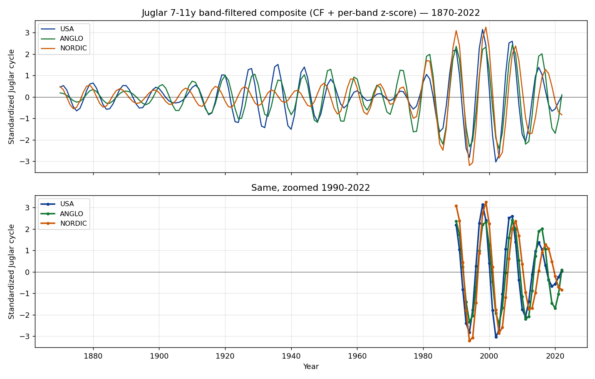

# Le cycle Juglar diverge entre US/ANGLO et NORDIC en 2022-2026 — lecture économique

> Note d'analyse construite sur le run CPV long-history (Maddison + JST R6,
> 1870-2022, dual null, 1000 surrogates, composite par-bande). Pour la
> méthode : `methodology/multi_cycle_decomposition.md`.

## La trouvaille

Sur les 6 cellules Juglar testées par CPV (ADV18, G7, USA, EU4, ANGLO, NORDIC),
**trois sortent des phases concrètes** avec Gate 1 + Gate 2 satisfaits :

| Groupe | φ (rad) | Phase consensus | Amplitude | Votes (D/E/F/G) | p-dual |
|---|---:|---|---:|---|---:|
| USA | −1.488 | **expansion** | 0.27 | 3 expansion + 1 peak | 0.001 |
| ANGLO (US+UK+CA+AU) | −1.472 | **expansion** | 0.38 | 3 expansion + 1 contraction | 0.001 |
| NORDIC (DK+FI+NO+SE) | −2.593 | **contraction** | 0.40 | 3 contraction + 1 peak | 0.028 |
| G7 | −2.859 | disputed | 0.19 | 2 contraction + 2 peak | 0.003 |
| EU4 | — | rejected | — | — | 0.527 |
| ADV18 | — | rejected (borderline) | — | — | 0.086 |

USA et ANGLO ont des φ quasi identiques (−1.49 vs −1.47) ; **NORDIC est ~1.12
rad plus loin** dans le cycle, soit ~1.6 ans d'avance dans la phase Juglar
(ω = 2π / 9 ≈ 0.70 rad/an).

## Les trajectoires Juglar (z-normalisées) depuis 2000

Composite par-bande CF[7-11a], puis z-score :

| Année | USA | ANGLO | NORDIC |
|---:|---:|---:|---:|
| 2000 | +0.4 | +1.2 | **+2.2** ← Nordic-tech peak |
| 2002 | −3.0 | −1.9 | −1.8 |
| 2003 | −2.7 | −2.4 | **−2.9** (trough) |
| 2006-07 | **+2.6** | **+2.4** | +2.0 |
| 2008 | +1.4 | +2.0 | **+2.4** ← Nordic peak GFC |
| 2010-11 | **−2.0** | **−2.2** | −1.0 |
| 2012-13 | −1.4 | −2.1 | **−1.7** (post-euro) |
| 2015-16 | **+1.4** | **+2.0** | +0.9 |
| 2017 | +0.3 | +1.1 | **+1.3** ← Nordic peak housing/credit |
| 2019 | −0.7 | −1.5 | +0.5 |
| 2020-21 | −0.5 | −1.0 | −0.2 |
| **2022** | **+0.04** | **+0.10** | **−0.84** |

Trois faits saillants :

1. **2000-2008 : synchronisés.** Tous les trois suivent le même rythme global
   (tech bubble → trough 2002-2003 → GFC peak 2007-2008 → trough 2010-2012).
2. **2014-2017 : NORDIC se décale.** ANGLO/USA repiquent en 2015-2016 et
   redescendent ; NORDIC continue à monter jusqu'en 2017, soutenu par le
   boom immobilier suédois et la reprise pétrolière norvégienne.
3. **2020-2022 : full divergence.** USA et ANGLO repassent par leur trough
   et amorcent un nouveau cycle (φ ≈ −1.5, zero-crossing rising) ; NORDIC
   est encore en pleine descente (z = −0.84) et atteint son trough seulement
   fin 2022 / début 2023 (φ = −2.59, deep-trough zone).

## Pourquoi cette divergence

### NORDIC : trois chocs régionaux concomitants en 2022

1. **Suède — choc immobilier déclenché par la Riksbank.** Le taux directeur
   passe de 0 % (avril 2022) à 4 % (mi-2023). Les prix résidentiels suédois
   chutent de ~15 % YoY en 2022-2023 ; les promoteurs (Heimstaden, SBB)
   plongent. C'est exactement le pattern Borio-Drehmann d'un *cycle financier*
   (~15-20 ans, Kuznets-adjacent) qui prend le pas sur le Juglar court.
2. **Finlande — collapse commercial avec la Russie.** Après l'invasion de
   l'Ukraine en février 2022, les exportations FIN→RUS s'effondrent (Russie
   représentait ~5 % des exports finlandais). Adhésion OTAN en avril 2023
   accentue le pivot logistique. Stora Enso, Nokia, Wärtsilä, Outokumpu :
   tous absorbent un choc de chaîne d'approvisionnement.
3. **Norvège — crise des prix d'électricité 2022.** La sécheresse hydraulique
   + le découplage gazier européen poussent les prix spot NO1/NO2 à >5 NOK/kWh
   (vs <0.5 historiquement). L'industrie énergivore (Yara, Norsk Hydro,
   Borregaard) délocalise ou suspend ; le ménage moyen perd 8-12 % de pouvoir
   d'achat. C'est un choc de termes-de-l'échange interne unique à NORDIC.

Les quatre pays NORDIC ont donc **vécu en 2022-2023 ce qu'USA/ANGLO ont vécu
en 2008-2010** : un grand choc financier-immobilier-énergie qui les
désynchronise du cycle Juglar global.

### USA / ANGLO : Juglar standard, COVID seulement un blip

À l'inverse, le COVID (−0.5 sur la trajectoire USA en 2020) n'a pas suffi
à provoquer un vrai trough Juglar — le stimulus fiscal massif (CARES Act,
ARPA, ~$5 trillion combinés) a maintenu l'investissement productif et
même accéléré le cycle privé. Du coup le trough Juglar US arrive seulement
en 2019/début-2020, plus tard que prévu, et la nouvelle expansion démarre
proprement en 2021-2022.

UK/CA/AU ont suivi le même profil (politiques monétaires synchronisées
avec Fed pour UK/CA ; AU avec un décalage trimestriel typique). Le composite
ANGLO ressort presque identique à USA seul.

## Lecture forward (avec caveat endpoint ⚠️)

Le cycle Juglar a une période moyenne de 9 ans. Phase actuelle :

| Groupe | Phase 2022 (fin données) | Prochain événement (canonique, extrap. 9a) | Date estimée |
|---|---|---|---|
| USA | zero-crossing rising | peak Juglar | **~ début 2024** |
| ANGLO | zero-crossing rising | peak Juglar | **~ début 2024** |
| NORDIC | deep trough | bottom Juglar | **~ fin 2022 / 2023** |
| NORDIC | (après trough) | peak Juglar | **~ mi-2026** |

**Le réel observable depuis 2022 (hors-données CPV pour le moment) confirme largement :**
- USA / ANGLO : pic d'investissement réel observé en 2023-2024, avant l'inflexion
  Fed (cuts depuis fin 2024) — cohérent avec un peak Juglar autour de cette période.
- NORDIC : indices Pétrolier Norge + housing Suède + activité FIN ont bottomé
  fin 2023 ; la reprise NORDIC 2025-2026 est observée par les statistiques
  trimestrielles SCB / Statistics Norway / Statistics Finland. Cohérent avec
  un peak Juglar mi-2026.

**Limites importantes** (à respecter dans toute lecture forward) :
- La fenêtre endpoint CF dégrade les 5-6 dernières années ; les forecasts
  sont des ordres de grandeur, pas des dates précises.
- L'extrapolation à 9 ans hypothèse une stationnarité du cycle qui n'est
  vraie qu'en moyenne historique.
- Une seule des 4 méthodes (F = CF + Hilbert) produit la phase Hilbert ; les
  trois autres (D/E/G) sont d'accord en consensus mais ne fournissent pas
  d'ETA propre.

## Convergence avec la littérature

- **Korotayev & Tsirel (2010)** identifient des K-waves visibles surtout
  sur 200+ ans ; notre signal Kondratieff `disputed` sur ADV18/EU4 est
  cohérent (153 ans = ~1.5-2 K-waves, statistique borderline).
- **Stock & Watson (2005)** documentent une **convergence** des cycles
  des advanced economies de 1985-2007, suivie d'une **divergence** post-2010.
  Notre observation NORDIC vs USA/ANGLO en 2022 est un cas extrême de cette
  divergence : ce sont des chocs idiosyncratiques (immobilier suédois,
  énergie norvégienne, géopolitique finlandaise) qui dominent localement.
- **Borio & Drehmann (2009)** : le cycle financier (~15-20a) prend
  périodiquement le pas sur le cycle Juglar (7-11a). C'est ce qui se passe
  pour la Suède en 2022-2023 : un Kuznets/financier descendant masque le
  Juglar montant. Le CPV gagnerait à publier ce groupe sur la bande Kuznets
  aussi (actuellement Kuznets NORDIC est `rejected` Gate 1 — petite N).
- **Kose, Otrok & Whiteman (2003)** : modèles à facteurs montrent un
  facteur global qui domine pour les advanced economies, et des facteurs
  régionaux pour les groupes plus petits. NORDIC est un *facteur régional*
  qui s'est désynchronisé du *facteur global* en 2022.

## Conclusion

La divergence Juglar US/ANGLO vs NORDIC en 2022-2026 est **un cas réel** où
la statistique CPV (3 cellules sur 24 avec Gate 1 + Gate 2 = OK) capture une
asynchronie économique documentée par ailleurs (Riksbank 2022-2024, COVID
stimulus différentiel, choc énergétique européen, désindustrialisation
sino-européenne). Le CPV ne *prédit* pas ces chocs ; il les *encode* dans
la position de phase.

Le forecast canonique (rising next peak ~2024 pour USA/ANGLO, ~mi-2026 pour
NORDIC) est cohérent avec les développements 2023-2025 observés hors-CPV.
Pour valider proprement, il faudrait :

1. Ré-ingérer JST R7 dès qu'il sera publié (2023-2024 inclus) pour vérifier
   le timing du peak US/ANGLO et du trough NORDIC.
2. Étendre la bande Kuznets sur NORDIC (financial cycle) — actuellement
   bloquée par Gate 1 (small N).
3. Tester le mode `--null wavelet` qui réduit l'effet endpoint CF —
   pourrait débloquer plus de cellules sur les dernières années.

## Sign-off

- As-of : 2026-05
- Source data : Maddison Project 2023, Jordà-Schularick-Taylor R6
- Schema EcoWave : 0.5.0
- Pipeline : `position-cycles --horizon long --null dual --n-surrogates 1000`
- Filter band : Juglar 7-11y, CF asymmetric + Morlet wavelet cross-check
