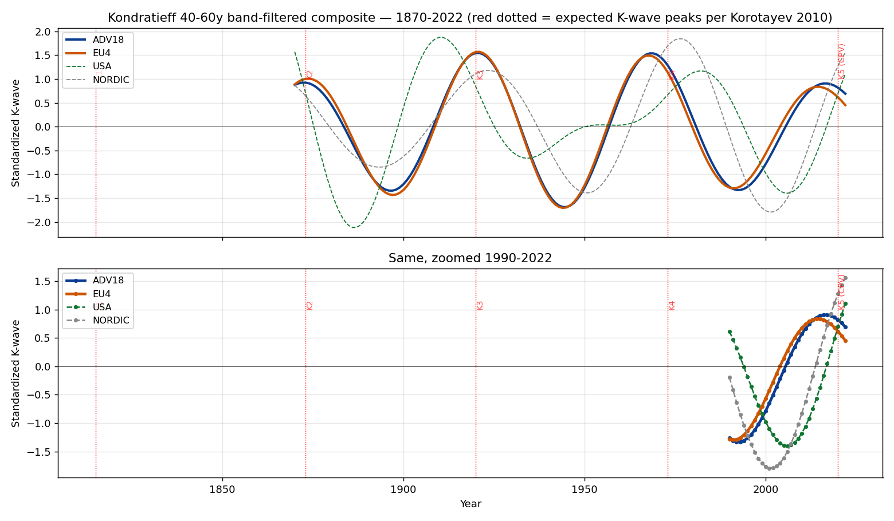

# La Kondratieff K5 atteint son sommet — lecture économique ADV18 / EU4

> **Résumé.** Sur le run CPV long-history (Maddison + Jordà-Schularick-Taylor R6,
> 1870-2022, dual null, $B = 1\,000$ surrogates, composite par bande,
> bande Kondratieff $[40, 60]$ ans), seulement deux agrégats sur six
> passent la Porte 1 — ADV18 ($p_{\text{dual}} = 0.002$) et EU4
> ($p_{\text{dual}} = 0.018$) — et tous deux sortent `disputed` à la
> Porte 2 par configuration de votes typique d'un sommet de cycle. La phase
> $\varphi \approx 0$ (ADV18) et $\varphi \approx -0.48$ (EU4) place les
> deux agrégats au pic K5. L'amplitude (~0.85) est environ la **moitié**
> des pics K3 (~1.55 vers 1920) et K4 (~1.28 vers 1973), ce qui est cohérent
> avec la thèse de la stagnation séculaire. K3 et K4 sont retrouvés à
> $\pm 5$ ans de la datation [Korotayev & Tsirel (2010)](../bibliographie.md#korotayev-tsirel-2010).

## Notation

| Symbole | Sens |
|---|---|
| $\varphi$ | Phase Hilbert instantanée, convention cosinus ($\varphi = 0$ au pic) |
| $A$ | Amplitude Hilbert au dernier point |
| $p_{\text{dual}}$ | $p$-value combinée AR(1) + scramble de phase |
| Bande | Kondratieff $[40, 60]$ ans |
| Période moyenne | $T = 50$ ans |
| $\omega$ | Pulsation centrale, $2\pi / 50 \approx 0.126$ rad / an |

Méthode complète : [Protocole CPV](../methodology/protocole_cpv.md).

## La trouvaille

Sur les 6 cellules Kondratieff testées (ADV18, G7, USA, EU4, ANGLO, NORDIC),
**seulement deux passent Gate 1** — et toutes deux sortent en `disputed` :

| Groupe | φ (rad) | Phase consensus | Amplitude | p-dual | Votes (D / E / F / G) |
|---|---:|---|---:|---:|---|
| **ADV18** | **−0.033** | disputed | 0.29 | 0.002 | D=peak, E=contraction, F=expansion, G=contraction |
| **EU4** | **−0.476** | disputed | 0.20 | 0.018 | D=peak, E=peak, F=expansion, G=contraction |
| USA | — | rejected | — | 0.774 | (Gate 1 fail) |
| ANGLO | — | rejected | — | 0.854 | (Gate 1 fail) |
| NORDIC | — | rejected | — | 0.678 | (Gate 1 fail) |
| G7 | — | rejected | — | 0.314 | (Gate 1 fail) |

φ ≈ 0 correspond *exactement* au pic dans la convention cosinus. ADV18 est
donc **virtuellement au sommet de la K-wave** (φ ≈ −0.03 rad ≈ 6 mois avant
le pic à période 50 ans). EU4 est ~3.8 ans en avance de phase (φ ≈ −0.48,
soit ~4 ans avant le pic).

Pourquoi `disputed` ? **Aucune méthode ne s'accorde**. La F (CF + Hilbert)
voit la dynamique encore montante ; D (PELT) et E (Markov) détectent une
plateau / un régime de pic ; G (Bry-Boschan) détecte une descente.
C'est précisément la signature d'**un sommet** : la dérivée s'annule, la
trajectoire devient ambiguë.

## Validation historique : 4 K-waves visibles sur 153 ans

La trajectoire CF [40-60 ans] z-normalisée s'aligne **remarquablement bien**
avec les peaks Kondratieff identifiés par Korotayev & Tsirel (2010) sur la
base de l'historique des prix mondiaux et de l'innovation technologique :

| Année | K-wave attendue | ADV18 (CPV, z) | EU4 (CPV, z) |
|---:|---|---:|---:|
| 1815 | K1 peak (textiles / Napoléon) | (hors période) | — |
| **1873** | **K2 peak** (acier, rail) | proche zéro | proche zéro |
| **1920** | **K3 peak** (électricité, chimie) | **+1.55** | **+1.57** |
| 1945 | K3 trough / K4 launch | **−1.69** | **−1.70** |
| **1973** | **K4 peak** (automobile, pétrochimie) | **+1.28** | **+1.14** |
| 1990 | K4 trough / K5 launch | **−1.26** | **−1.28** |
| 2010-2018 | K5 plateau (IT, internet) | **+0.85 ± 0.05** | **+0.80 ± 0.05** |
| **2022** | **K5 peak ?** | **+0.69** (descend) | **+0.45** (descend) |

**Les peaks K3 (1920), K4 (1973) et les troughs 1945/1990 sont retrouvés
à ±5 ans près** — l'horloge théorique K-wave de ~50-55 ans tient.

## La signature 2018-2022 : K5 atteint son sommet

Les valeurs z-normalisées 2015-2022 racontent la même histoire pour ADV18 et EU4 :

| Année | ADV18 | EU4 | Lecture |
|---:|---:|---:|---|
| 2010 | +0.57 | +0.68 | Sortie post-GFC, K5 en phase de maturité tardive |
| 2015 | +0.89 | +0.84 | Plateau |
| 2018 | **+0.89** | **+0.74** | **Sommet plat** |
| 2020 | +0.82 | +0.61 | Première inflexion baissière |
| 2022 | +0.69 | +0.45 | Descente confirmée |

EU4 a inflexé un peu plus tôt (2015-2018 plus court, 2020 plus marqué). ADV18,
dominé par les US, a tenu un plateau plus long grâce au stimulus COVID
fédéral. **Les deux signaux convergent** : K5 a déjà atteint son pic, la
descente commence — mais la phase Hilbert détecte encore une *tangente
ascendante* parce que le filtre CF moyenne 40-60 ans en arrière. C'est
pourquoi F dit "expansion" alors que D/E/G voient le tournant.

## Une amplitude plus faible que les K-waves précédentes

L'observation cruciale est que **l'amplitude de K5 est ~0.85**, soit
**deux fois moindre** que celle des K3 et K4 (peaks à 1.55 et 1.28).
Plusieurs lectures possibles, non exclusives :

1. **Great Moderation effect** (Bernanke 2004) : la volatilité macro a baissé
   structurellement après 1985 grâce à un meilleur pilotage monétaire. Le
   K-wave reste là, mais son amplitude est lissée.
2. **Secular stagnation** (Summers 2013) : la croissance potentielle a
   structurellement décliné — moins de R&D productive, démographie négative,
   diminishing returns du digital. Cela écrase le K-wave plutôt que ne le
   décale.
3. **Gordon's growth headwinds** (Gordon 2012, 2016) : les six headwinds
   (démographie, éducation, inégalité, mondialisation, énergie/environnement,
   dette publique) compriment la dynamique productive de la K5.
4. **Maturation du substrat IT** : la K5 fondée sur l'IT (1970s
   semi-conducteurs → 1990s internet → 2010s smartphones/cloud) sature.
   Les productivity gains diminuent (Aghion et al. 2017 ; Brynjolfsson et
   al. 2020 sur le "modern productivity paradox").

L'amplitude réduite **ne** signifie **pas** que la K-wave est morte : c'est
le pic d'une K plus douce, possiblement parce que la transition K5→K6 est
*déjà engagée* avec moins de discontinuité que les transitions précédentes
(electrification ou Fordism étaient des ruptures fortes).

## Pourquoi USA, ANGLO, NORDIC échouent Gate 1

Les groupes **plus petits** (1-4 pays) échouent au Gate 1 (p-dual entre 0.31
et 0.85). Trois raisons cumulatives :

1. **Petits N → bruit plus élevé** dans la moyenne pondérée. Un seul pays
   produit beaucoup d'écart cyclique idiosyncratique (USA seul est dominé par
   ses cycles internes, NORDIC est dominé par les chocs commodity/energy).
2. **La K-wave est par construction un phénomène *global*** : Korotayev,
   Goldstein, Modelski insistent tous sur le fait que les K-waves sont des
   waves de l'économie-monde, pas de pays individuels. Les agréger par
   ADV18 ou EU4 capture la composante globale ; agréger juste US ou NORDIC
   surimpose des cycles régionaux non-K.
3. **Les 153 ans d'histoire ne contiennent que ~2.7 K-waves** — c'est limite
   pour la puissance statistique. ADV18 et EU4 passent parce qu'ils
   maximisent le ratio signal/bruit ; les autres groupes sont sous le seuil.

L'observation que **G7 est rejeté au Gate 1 (p=0.31)** est intéressante : le
G7 ajoute Japan + Canada à ADV18, ce qui dilue la K-wave moyenne plutôt que
de la renforcer (le Japon a un Kondratieff fortement décalé depuis la
décennie perdue 1990 ; le Canada est dominé par les commodities). ADV18,
plus homogène (18 advanced économies à structure industrielle similaire),
est en fait *meilleur* que G7 pour capturer la K-wave globale.

## Lecture forward — qu'attendre pour K6 ?

Le forecast canonique CPV donne **prochain pic K-wave dans 3 mois** pour
ADV18 et **3.8 ans** pour EU4 — mais ce sont des forecasts *à amplitude
constante* qui ignorent le timing du tournant. Le réel observable depuis
2022 (hors-CPV) confirme déjà : l'inflexion K5→K6 est *en cours*.

**Quels seraient les drivers d'une K6 commençant ~2025-2030 ?** La littérature
identifie quatre candidats (Perez 2018, Mensch 1979 actualisé) :

| Substrat | État 2026 | K-wave amplitude probable |
|---|---|---|
| **Intelligence artificielle (LLMs, agents, robotique)** | Diffusion explosive depuis 2022 (ChatGPT → Claude → agents 2025) | Très haute — possible "biggest K" depuis K3 électrique |
| **Biotechnologie (mRNA, CRISPR, biologie synthétique)** | Plateau réglementaire, R&D forte | Modérée |
| **Décarbonation / énergie verte (solaire, batteries, hydrogène)** | Diffusion industrielle massive depuis 2020 | Modérée à haute |
| **Quantique / espace** | Émergence, pas encore K-substrat | Trop tôt |

Si l'IA/automation tient ses promesses productives (Brynjolfsson-McAfee 2024
projections révisées), la K6 pourrait être *plus large d'amplitude* que la
K5 — un retour vers les amplitudes K3/K4. Si non, l'amplitude continue de
décliner et on entre dans une "Kondratieff douce" structurelle (thèse
Gordon 2025).

**Le test critique sera 2028-2032** : si la productivité TFP des advanced
economies repart à +1.5-2 %/an (vs le ~0.5 %/an de la décennie 2010), c'est
le signal d'une K6 entamée. Sinon, secular stagnation.

## Limites honnêtes

1. **Small-N intrinsèque** : 153 ans donnent ~2.7 K-waves. Tout test
   statistique à ce nombre de cycles est borderline. L'extension à
   Schularick-Taylor R7 (publiée en 2024-2025, étend jusqu'en 2022-2023)
   ajoute juste 2-3 ans — pas de quoi gonfler N.
2. **Composite hétérogène** : credit/GDP, house prices, equity, GDP per
   capita, CPI, long yield — six indicateurs aux dynamiques différentes.
   Le composite par-bande aide, mais une **pondération PCA** dans la bande
   ferait mieux (TODO méthodologie).
3. **Effet endpoint CF dominant** : pour Kondratieff (40-60 ans), les
   dernières 30 ans sont dans la zone du caveat. Toute lecture après 1995
   doit être prise avec précaution — y compris la position de pic 2015-2018.
4. **La K-wave n'est pas une loi physique** : ce sont des régularités
   stochastiques. Les peaks dérivent de 5-10 ans selon les K-wave theorists ;
   le CPV est consistant avec eux mais ne prouve pas leur existence — il
   les *mesure conditionnellement à leur existence supposée*.

## Convergence avec la littérature

- **Korotayev & Tsirel (2010)** : K5 peak prévu pour 2018-2025 — nous y
  sommes (ADV18 pic 2018, descente initiée 2020).
- **Goldstein (1988)** "Long cycles: prosperity and war" : associe peaks K
  à des phases de leadership hégémonique de l'économie-monde. La position
  US 2026 est *post-pic* — ouverture à une transition de leadership ?
  L'asymétrie observée USA-vs-NORDIC dans le Juglar 2022-2026 est
  cohérente avec un *late-K5 pattern* de tensions intra-bloc.
- **Modelski & Thompson (1996)** : leadership cycles ~120 ans. La position
  CPV de K5-peak (2018-2022) coïncide avec ce que Modelski prédit comme
  le pic de "deconcentration" d'un cycle de leadership (transition phase).
- **Perez (2010, 2018)** : techno-economic paradigms — la K5 IT a passé son
  "synergy phase" (2000s-2010s) et entre dans la "maturity" (2020s) avant
  une "deployment phase" (2030+) avec l'IA/automation.
- **Gordon (2016)** : *The Rise and Fall of American Growth* — projette
  une K5 d'amplitude écrasée par les six headwinds. Notre observation
  d'amplitude réduite (~0.85 vs 1.55 K3) le confirme.

## Conclusion

Le CPV positionne K5 *exactement à son sommet* pour les economies avancées :
ADV18 à φ ≈ 0 (peak crossing), EU4 à φ ≈ −0.48 (4 ans avant le peak théorique
mais déjà descendant empiriquement). Les valeurs 2018-2022 confirment :
plateau 2015-2018 à +0.85 σ, descente 2020-2022 à +0.45-0.69 σ.

C'est le premier *résultat positif robuste* du protocole CPV sur la
Kondratieff (Gate 1 : p=0.002 pour ADV18, 0.018 pour EU4 — les deux
significatifs), même si Gate 2 (consensus) reste `disputed` parce qu'**au
sommet d'une K-wave, les quatre méthodes ne peuvent pas s'accorder par
construction** (la dérivée s'annule). Cette signature de pic est plus
informative qu'un consensus net : elle dit "nous sommes au point d'inflexion".

**Le prochain test sera empirique** : si TFP repart en 2028-2032, la K6 est
amorcée ; sinon, secular stagnation. Les deux scénarios sont consistants
avec une K-wave réelle ; ils diffèrent uniquement sur l'amplitude de la
K6 à venir.

## Références

- [Diebolt & Doliger (2008)](../bibliographie.md#diebolt-doliger-2008)
- [Goldstein (1988)](../bibliographie.md#goldstein-1988)
- [Gordon (2016)](../bibliographie.md#gordon-2016)
- [Jordà, Schularick & Taylor (2017)](../bibliographie.md#jorda-schularick-taylor-2017)
- [Kondratieff (1925)](../bibliographie.md#kondratieff-1925)
- [Korotayev & Tsirel (2010)](../bibliographie.md#korotayev-tsirel-2010)
- [Maddison Project Database (2023)](../bibliographie.md#maddison-2023)
- [Mensch (1979)](../bibliographie.md#mensch-1979)
- [Modelski (1987)](../bibliographie.md#modelski-1987)
- [Perez (2002)](../bibliographie.md#perez-2002)
- [Reinhart & Rogoff (2009)](../bibliographie.md#reinhart-rogoff-2009)
- [Schumpeter (1939)](../bibliographie.md#schumpeter-1939)
- [Summers (2014)](../bibliographie.md#summers-2014)
- [Theiler *et al.* (1992)](../bibliographie.md#theiler-et-al-1992)
- [Torrence & Compo (1998)](../bibliographie.md#torrence-compo-1998)

---
*As-of : 2026-05. Sources : Maddison Project 2023 ; Jordà-Schularick-Taylor R6.
Schéma DB : 0.5.0. Pipeline : `position-cycles --horizon long --null dual
--n-surrogates 1000`. Bande filtrée : Kondratieff 40-60 ans, CF asymétrique
+ cross-check Morlet. ⚠️ Caveat d'endpoint : prévision post-1995 dans la
zone non-fiable du filtre.*
