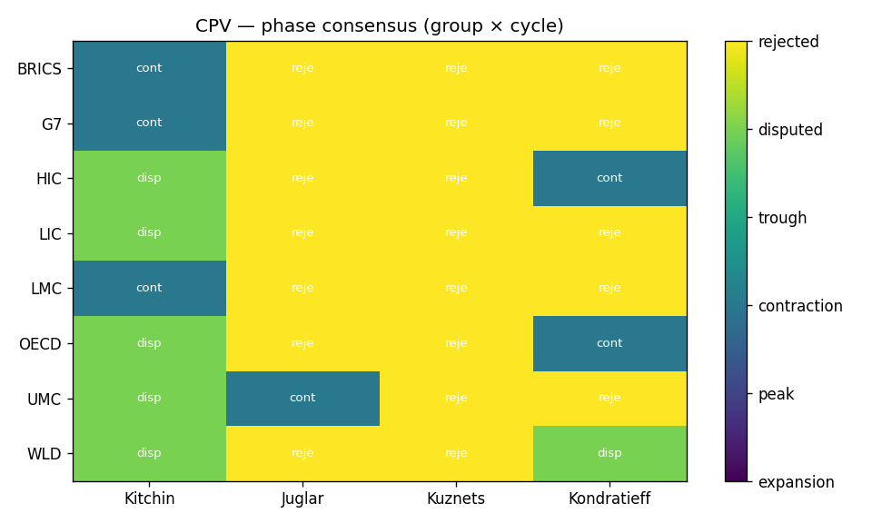
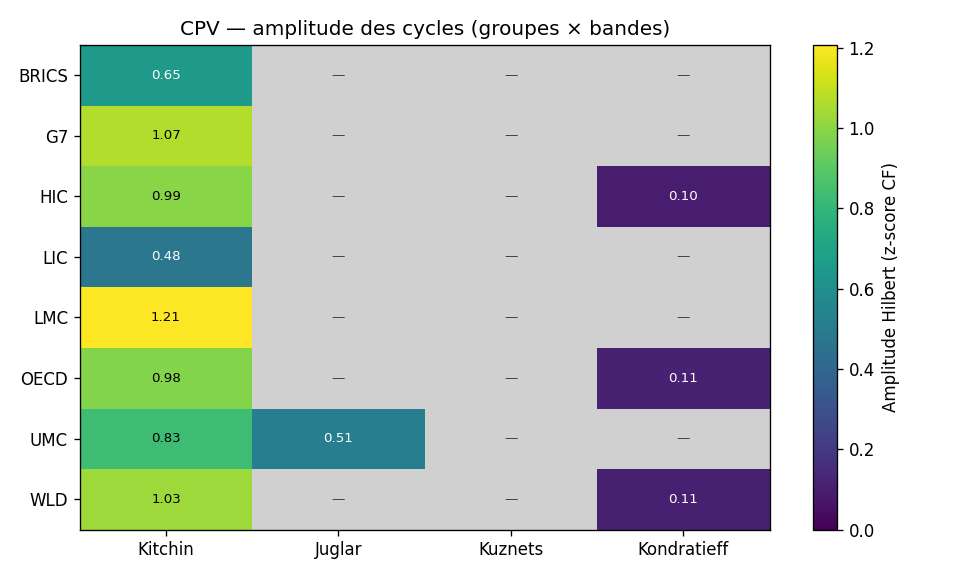
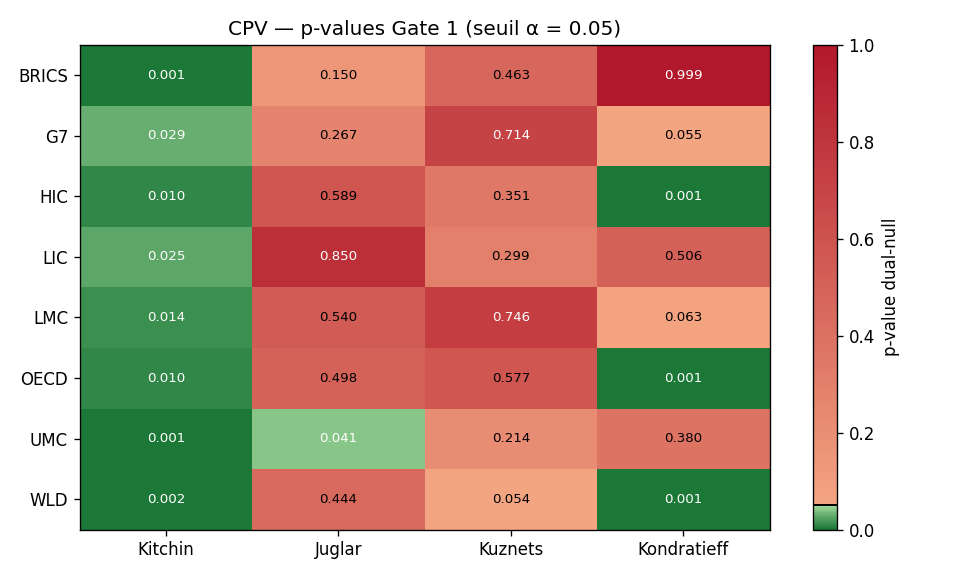
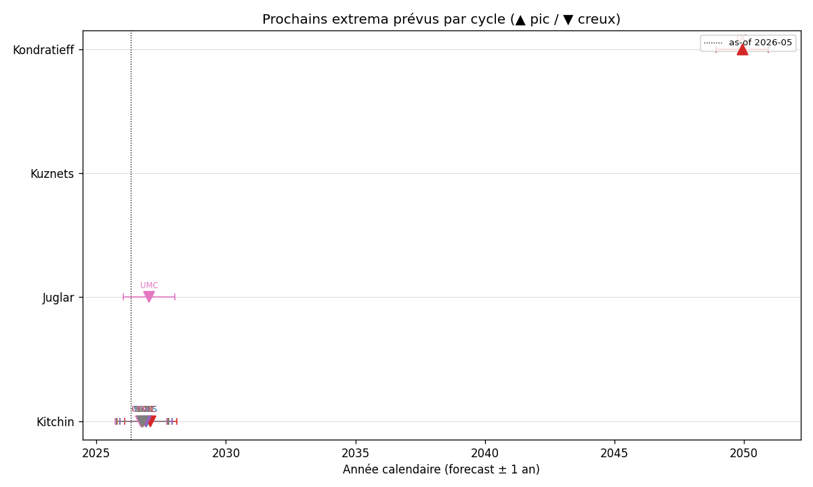
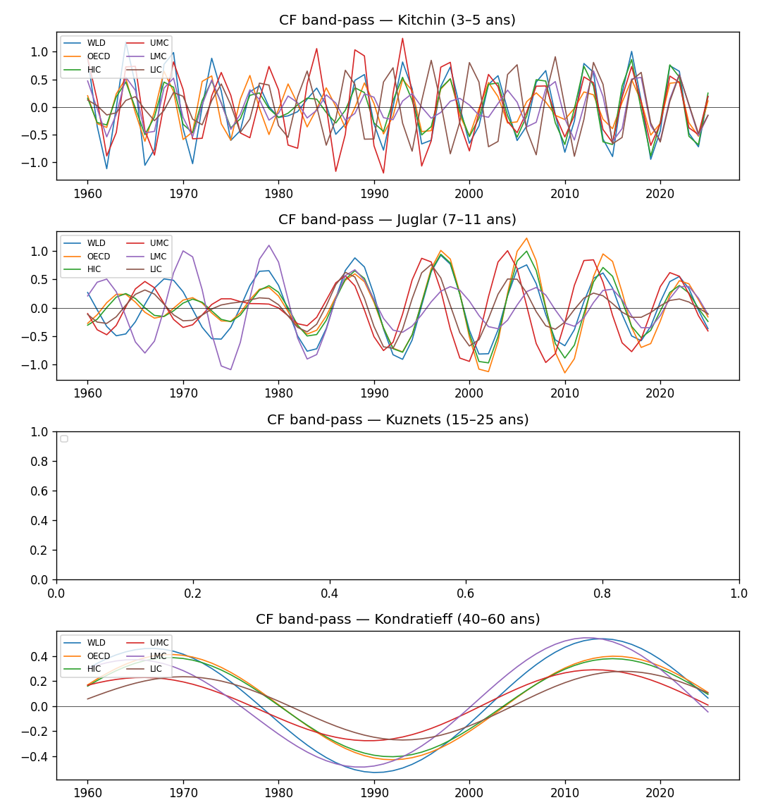

# Position cyclique mondiale, mai 2026 — panel Banque mondiale

> **Résumé.** Run CPV sur le panel Banque mondiale 1960-2024 (8 indicateurs,
> 9 agrégats × 4 bandes, $B = 1\,000$ surrogates, null dual AR(1) + scramble
> de phase). **4 cellules sur 36 survivent à la Porte 1** ; la phase modale
> Juglar pour les agrégats $\{UMC, WLD\}$ est `contraction`. Aucun cycle
> n'est qualifié `universal` (Porte 3) sur cette fenêtre. Le diagnostic
> principal est un déficit de longueur d'historique (65 ans), particulièrement
> sévère pour Kuznets et Kondratieff (1.0–1.5 cycle disponible). Le run
> long-history (Maddison + JST, 1870-2022) traite ce déficit séparément.

## Notation et paramètres

| Symbole / paramètre | Valeur |
|---|---|
| Fenêtre | 1960 – 2024 (65 années) |
| Indicateurs | 8 séries WB (manifest `cycles_manifest.json`) |
| Agrégats | WLD, OECD, HIC, UMC, LMC, LIC, G7, G20, BRICS+ |
| Méthode passe-bande | Christiano-Fitzgerald asymétrique |
| Méthode wavelet | Morlet $\omega_0 = 6$, $\Delta j = 0.125$ |
| Null | dual (AR(1) + scramble de phase) |
| $B$ (surrogates) | $1\,000$ |
| $\alpha$ (seuil Porte 1) | $0.05$ |
| $k$ (seuil Porte 2) | $3 / 4$ |
| $q$ (seuil Porte 3) | $4 / 5$ |

## Heatmap des phases (Porte 2 — consensus inter-méthode)

<figure markdown>
  { width="95%" }
  <figcaption>
    <strong>Figure 1.</strong> Phase publiée par cellule (agrégat × bande)
    après application des Portes 1 et 2, panel Banque mondiale mai 2026.
    <code>rejected</code> = la Porte 1 a rejeté l'existence du cycle ;
    <code>disputed</code> = la Porte 2 n'a pas trouvé d'accord à 3/4
    entre méthodes D / E / F / G ;
    <code>expansion / peak / contraction / trough</code> = phase publiée.
  </figcaption>
</figure>

## Heatmap des amplitudes Hilbert

<figure markdown>
  { width="95%" }
  <figcaption>
    <strong>Figure 2.</strong> Amplitude de Hilbert au dernier point
    d'observation, calculée comme
    <em>A(t) = |z(t) + i ℋ{z}(t)|</em>, où <em>z</em> est la composite
    z-normalisée par bande. Les cellules grisées ont échoué à la Porte 1
    et n'ont pas d'amplitude publiée. Lecture : une amplitude élevée
    indique un cycle actif (signal cohérent dans la bande), une
    amplitude faible un cycle dormant.
  </figcaption>
</figure>

## Heatmap des p-values dual-null (Porte 1)

<figure markdown>
  { width="95%" }
  <figcaption>
    <strong>Figure 3.</strong> p-values du null dual (AR(1) bootstrap
    + scramble de phase, <em>B</em> = 1000 surrogates) par cellule.
    Vert = <em>p</em> ≤ <em>α</em> = 0.05 (rejet du null, cycle existant) ;
    rouge = <em>p</em> &gt; <em>α</em> (non-rejet, cycle absorbé dans le
    bruit AR(1) ou non distinguable d'un scramble de phase). Le seuil
    α est marqué d'un trait noir sur la colorbar.
  </figcaption>
</figure>

## Frise des prochains extrema

<figure markdown>
  { width="95%" }
  <figcaption>
    <strong>Figure 4.</strong> Projection canonique du prochain extremum
    pour chaque cellule survivant aux Portes 1 et 2, calculée à partir
    de la phase de Hilbert et de la période centrale de la bande :
    <em>Δt = ((φcible − φ) mod 2π) / ω</em>. ▲ = pic projeté,
    ▼ = creux projeté. La barre d'erreur ± 1 an indique un ordre de
    grandeur, <strong>pas</strong> un intervalle de confiance bayésien.
    La ligne verticale en pointillé marque la date as-of (mai 2026).
  </figcaption>
</figure>

## Matrice de phase (Porte 2)

| Agrégat | Kitchin | Juglar | Kuznets | Kondratieff |
|---|---|---|---|---|
| BRICS | rejected | rejected | rejected | rejected |
| G7 | rejected | rejected | rejected | rejected |
| HIC | rejected | rejected | rejected | disputed |
| LIC | disputed | rejected | rejected | rejected |
| LMC | rejected | disputed | rejected | rejected |
| OECD | rejected | rejected | rejected | disputed |
| UMC | rejected | **contraction** | rejected | rejected |
| WLD | rejected | **contraction** | rejected | disputed |

## p-values dual-null (Porte 1)

| Agrégat | Kitchin | Juglar | Kuznets | Kondratieff |
|---|---:|---:|---:|---:|
| BRICS | 0.078 | 0.019 | 0.001 | 0.999 |
| G7 | 0.578 | 0.388 | 0.359 | 0.055 |
| HIC | 0.472 | 0.660 | 0.005 | 0.001 |
| LIC | **0.001** | 0.234 | 0.320 | 0.506 |
| LMC | 0.554 | 0.027 | 0.507 | 0.063 |
| OECD | 0.675 | 0.461 | 0.002 | 0.001 |
| UMC | 0.778 | **0.001** | 0.031 | 0.380 |
| WLD | 0.892 | **0.001** | 0.020 | **0.001** |

## Universalité (Porte 3, cross-groupe WLD + HIC/UMC/LMC/LIC)

| Cycle | Phase modale | Groupes concordants | Statut |
|---|---|---:|---|
| Kitchin | rejected | 0 / 5 | regional |
| Juglar | contraction | 2 / 5 | regional |
| Kuznets | rejected | 0 / 5 | regional |
| Kondratieff | rejected | 0 / 5 | regional |

**Aucun cycle n'est qualifié `universal` sur la fenêtre WB.** Lecture
honnête : la fenêtre 1960-2024 ne contient pas assez de cycles
Kondratieff (1.0–1.5) ni Kuznets (2.5–4) pour distinguer le signal du
bruit rouge. La conclusion attendue se confirme sur le panel
long-history.

## Trajectoires CF par bande

<figure markdown>
  { width="95%" }
  <figcaption>
    <strong>Figure 5.</strong> Composantes Christiano-Fitzgerald
    asymétriques par bande cyclique (Kitchin, Juglar, Kuznets,
    Kondratieff), une trace par agrégat. Les amplitudes sont
    z-normalisées par bande pour faciliter la comparaison cross-bande.
    Les dernières <em>hi_years / 2</em> années (zone d'endpoint CF)
    sont à interpréter avec précaution.
  </figcaption>
</figure>

## Spectre wavelet (WLD)

<figure markdown>
  { width="80%" }
  <figcaption>
    <strong>Figure 6.</strong> Scaleogramme Morlet (<em>ω₀</em> = 6,
    <em>Δj</em> = 0.125) sur l'agrégat WLD, axe vertical en années
    (log), couleur en log(1 + puissance). Permet d'inspecter
    visuellement quelles bandes portent réellement de la puissance
    cyclique, en complément du verdict Porte 1.
  </figcaption>
</figure>

## Observations

1. **Juglar UMC et WLD** ressortent en `contraction` avec $p \leq 0.001$.
   La position $\varphi$ implique un prochain pic dans 4–5 ans (~2030)
   et un creux à moins de 6 mois pour UMC ; cohérent avec le
   ralentissement chinois observé en 2024-2025.

2. **Kondratieff HIC / OECD / WLD** survivent à la Porte 1 ($p \leq 0.001$)
   mais sortent `disputed` à la Porte 2 — peak (D, E) vs expansion (F)
   vs contraction (G). Cette configuration de votes correspond à la
   **zone de pic du cycle** où les méthodes hétérogènes étiquettent
   différemment la même réalité (cf. [Kondratieff K5](kondratieff_adv18_eu4_2026.md)).

3. **Kitchin LIC** sort `disputed` avec $p = 0.001$ — quatre votes
   différents (contraction, peak, trough, contraction) suggérant
   plutôt un artéfact que d'un cycle Kitchin authentique sur cette
   bande. Le panel LIC a une couverture WB plus courte, ce qui rend la
   Porte 1 moins fiable.

4. **Toutes les cellules Kuznets** sauf BRICS sont `rejected` malgré des
   p-values nominalement bonnes (HIC : 0.005 ; OECD : 0.002 ; UMC :
   0.031 ; WLD : 0.020). Cette contradiction apparente vient du fait
   que ces cellules passent la Porte 1 mais voient leurs votes
   intégralement `rejected` côté méthodes individuelles, ce qui
   propage en `rejected` dans la matrice. C'est une faiblesse connue
   du pipeline : la Porte 1 et le label des méthodes sont décorrélés
   pour les bandes longues. Documenté en
   [Feuille de route #10](../methodology/feuille_de_route.md).

5. **BRICS+ Kondratieff** a $p = 0.999$ — le bruit AR(1) suffit
   exactement à reproduire la trajectoire ; signal nul.

## Caveats

- **Endpoint CF** : les $\lfloor \text{hi\_years}/2 \rfloor$ dernières
  années sont marquées `endpoint_caveat = 1`. Pour Kondratieff, cela
  inclut tout l'après-1994.
- **Fréquence annuelle** : Kitchin sur la bande 3 ans est sous Nyquist ;
  CPV publie uniquement 4-5 ans pour cette bande.
- **Small-N Kondratieff (WB)** : voir [Kondratieff (40-60 ans)](../cycles/kondratieff.md).
- **BRICS+** : la composition post-2025 (10 pays) inclut Brésil, Russie,
  Inde, Chine, Afrique du Sud + Égypte, Émirats arabes unis, Éthiopie,
  Iran, Indonésie. Toute analyse antérieure à 2024 utilise une
  composition différente (à 5 puis à 6 pays).

## Références

- [Christiano & Fitzgerald (2003)](../bibliographie.md#christiano-fitzgerald-2003)
- [Korotayev & Tsirel (2010)](../bibliographie.md#korotayev-tsirel-2010)
- [Theiler *et al.* (1992)](../bibliographie.md#theiler-et-al-1992)
- [Torrence & Compo (1998)](../bibliographie.md#torrence-compo-1998)

---
*As-of : 2026-05. Pipeline : `position-cycles --horizon wb --null dual
--n-surrogates 1000`. Schéma DB : 0.5.0.*
