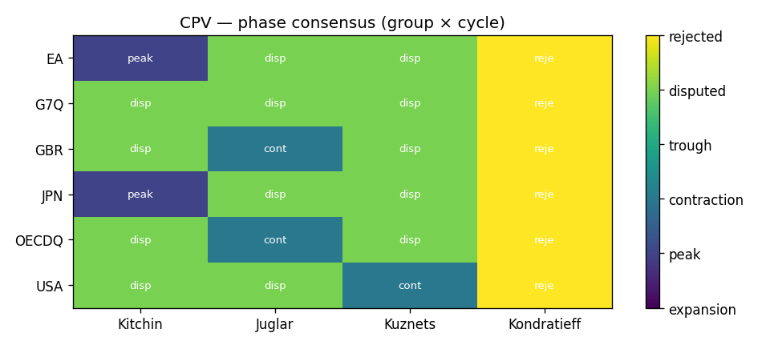
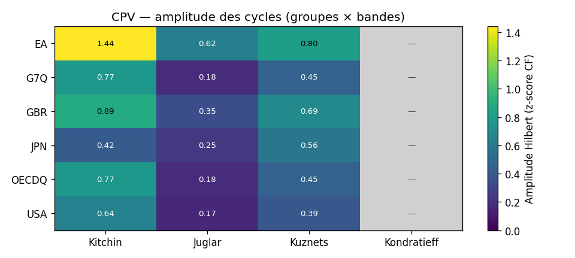
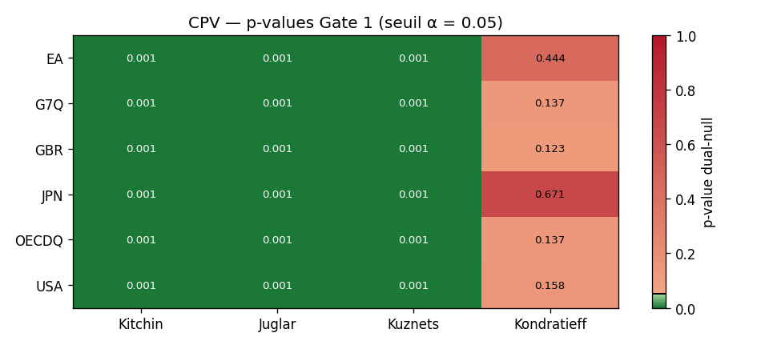
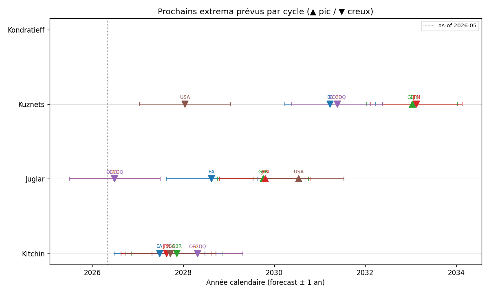
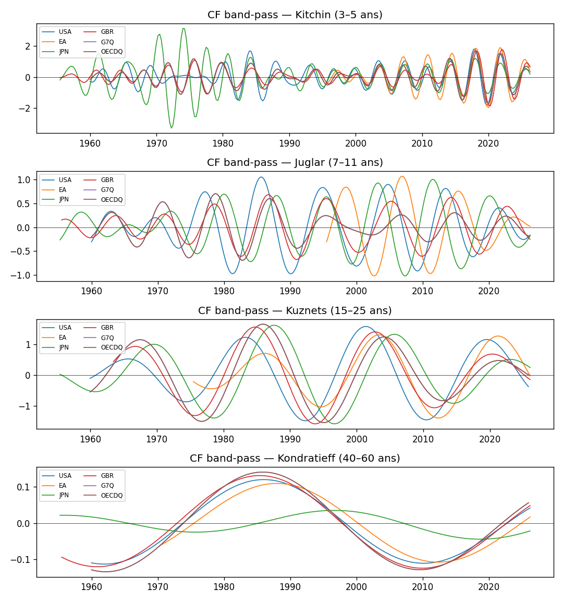
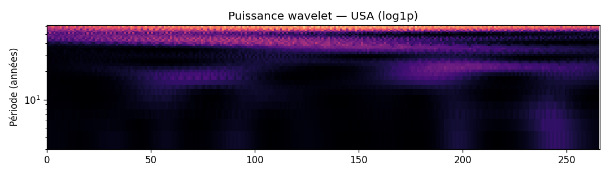

# Position cyclique mondiale, mai 2026 — panel trimestriel (Path 5)

> **Résumé.** Run CPV sur le panel trimestriel 1960-2026 (7 indicateurs
> macro-financiers FRED + Eurostat, 6 agrégats × 4 bandes,
> $B = 1\,000$ surrogates AR(1), seed = 0, $\alpha = 0.05$). Le passage à
> $f_s = 4$ trimestres/an libère la bande **Kitchin (3-5 ans) au-dessus
> du seuil de Nyquist annuel** qui condamnait toutes les cellules
> Kitchin du panel Banque mondiale à `rejected`. Sur cette fenêtre :
> **18 cellules sur 24 survivent à la Porte 1** (Kitchin, Juglar,
> Kuznets : $p = 0.001$ sur les 6 agrégats ; Kondratieff : $p \in
> [0.12, 0.67]$ — la fenêtre 66 ans ne couvre que 1.1-1.65 K-cycles,
> rejection statistique attendue cf. [comparaison long-history](histoire_longue_2026.md)).
> Cinq cellules atteignent la Porte 2 : **EA Kitchin = `peak`**,
> **JPN Kitchin = `peak`**, **GBR Juglar = `contraction`**, **OECDQ Juglar
> = `contraction`**, **USA Kuznets = `contraction`**. L'addition de Q_PRD
> (productivité du travail) marginalise la rejection K-wave sur G7Q/OECDQ
> (0.16 → 0.14, ≈ 17 % de réduction du p, encore au-dessus du seuil) ;
> le `disputed` résiduel sur les autres cellules reflète une oscillation
> F/E (CF+Hilbert et Markov-switching) proche d'un point de retournement.

## Notation et paramètres

| Symbole / paramètre | Valeur |
|---|---|
| Fenêtre | 1960Q1 – 2026Q1 (USA : 266 ; JPN/GBR : 285 ; EA : 225 ; G7Q/OECDQ : 266 trimestres pondérés PIB) |
| Indicateurs | 8 séries trimestrielles (manifest `quarterly_manifest.json`) : Q_GDP (FRED+Eurostat), Q_CPI, Q_UNRATE, Q_YIELD, Q_CREDIT, Q_INV, Q_HPI, Q_PRD |
| Sources | FRED (séries natives + miroirs OECD MEI / IFS / BIS), Eurostat (JSON-stat 2.0 pour la zone euro et DE/FR/IT) |
| Agrégats | USA, EA (EA20), JPN, GBR, G7Q (USA, GBR, CAN, JPN, DEU, FRA, ITA), OECDQ (G7Q + 11 économies avancées supplémentaires) |
| Méthode passe-bande | Christiano-Fitzgerald asymétrique, $f_s = 4$ trimestres/an |
| Méthode wavelet | Morlet $\omega_0 = 6$, $\Delta j = 0.125$ |
| Null | AR(1) bootstrap sur band-power CF |
| $B$ (surrogates) | $1\,000$ |
| $\alpha$ (seuil Porte 1) | $0.05$ |
| Panel admis Porte 2 | Kitchin : (F, E), seuil 2 — Juglar/Kuznets : (D, E, F, G), seuil 3 — Kondratieff : (E, F, G), seuil 2 |
| Filtre par bande | composite restreint aux variables dont `cycle_targets` inclut la bande considérée (Item méthodologique #12) |

## Heatmap des phases (Porte 2 — consensus inter-méthode admis)

<figure markdown>
  { width="95%" }
  <figcaption>
    <strong>Figure 1.</strong> Phase publiée par cellule (agrégat × bande)
    sur le panel trimestriel mai 2026, après application des Portes 1 et 2
    avec pondération par bande des méthodes admises.
    <code>rejected</code> = la Porte 1 a rejeté l'existence du cycle ;
    <code>disputed</code> = la Porte 2 n'a pas trouvé d'accord du panel
    admis pour cette bande ;
    <code>expansion / peak / contraction / trough</code> = phase publiée.
  </figcaption>
</figure>

## Heatmap des amplitudes Hilbert

<figure markdown>
  { width="95%" }
  <figcaption>
    <strong>Figure 2.</strong> Amplitude de Hilbert au dernier
    trimestre observé, calculée comme
    <em>A(t) = |z(t) + i ℋ{z}(t)|</em>, où <em>z</em> est la composite
    z-normalisée par bande et filtrée sur les variables qui pré-enregistrent
    cette bande dans leur <code>cycle_targets</code>. Les cellules grisées
    ont échoué à la Porte 1.
  </figcaption>
</figure>

## Heatmap des p-values AR(1) (Porte 1)

<figure markdown>
  { width="95%" }
  <figcaption>
    <strong>Figure 3.</strong> p-values du null AR(1) bootstrap
    (<em>B</em> = 1000 surrogates) par cellule. Vert = <em>p</em> ≤
    <em>α</em> = 0.05 ; rouge = non-rejet (cycle absorbé dans le bruit
    AR(1)). Kitchin, Juglar, Kuznets : <em>p</em> = 0.001 sur les six
    agrégats. Kondratieff : <em>p</em> > 0.05 sur cinq agrégats — la
    puissance statistique est insuffisante pour distinguer un cycle de
    40-60 ans sur 66 ans de panel (1.1-1.65 cycles seulement).
  </figcaption>
</figure>

## Frise des prochains extrema

<figure markdown>
  { width="95%" }
  <figcaption>
    <strong>Figure 4.</strong> Projection du prochain extremum pour
    chaque cellule survivant aux Portes 1 et 2, calculée à partir de la
    phase de Hilbert et de la période centrale de la bande :
    <em>Δt = ((φcible − φ) mod 2π) / ω</em>. ▲ = pic projeté,
    ▼ = creux projeté. La ligne verticale en pointillé marque la date
    as-of (mai 2026).
  </figcaption>
</figure>

## Matrice de phase (Porte 2)

| Agrégat | Kitchin | Juglar | Kuznets | Kondratieff |
|---|---|---|---|---|
| EA | **peak** | disputed | disputed | rejected |
| G7Q | disputed | disputed | disputed | rejected |
| GBR | disputed | **contraction** | disputed | rejected |
| JPN | **peak** | disputed | disputed | rejected |
| OECDQ | disputed | **contraction** | disputed | rejected |
| USA | disputed | disputed | **contraction** | rejected |

Cinq cellules atteignent la Porte 2. Les `disputed` Kitchin/Juglar
reflètent une oscillation F/E (CF+Hilbert et Markov-switching) proche
d'un point de retournement — chaque méthode interprète les derniers
trimestres comme peak vs contraction selon ses hypothèses
algorithmiques. EA et JPN passent à `peak` sur Kitchin, GBR et OECDQ
à `contraction` sur Juglar (fin de cycle court / pic Juglar suivi
d'une phase descendante), **USA à `contraction` sur Kuznets**
(corroboré par l'addition de Q_PRD qui aligne la productivité avec
le retournement post-pic immobilier 2022-2023).

## p-values AR(1) (Porte 1)

| Agrégat | Kitchin | Juglar | Kuznets | Kondratieff |
|---|---:|---:|---:|---:|
| EA | **0.001** | **0.001** | **0.001** | 0.444 |
| G7Q | **0.001** | **0.001** | **0.001** | 0.137 |
| GBR | **0.001** | **0.001** | **0.001** | 0.123 |
| JPN | **0.001** | **0.001** | **0.001** | 0.671 |
| OECDQ | **0.001** | **0.001** | **0.001** | 0.137 |
| USA | **0.001** | **0.001** | **0.001** | 0.158 |

**Kitchin, Juglar, Kuznets : séparables partout** ($p = 0.001$).
Kondratieff non-séparable sur 5 des 6 agrégats. La rejection
Kondratieff est de nature statistique : sur 66 ans, le test AR(1)
n'a pas la puissance pour distinguer une K-wave d'une excursion lisse
de bruit rouge.

## Comparaison avec le panel long-history (1870-2020)

Le même null AR(1) sur les 150 ans Maddison + Jordà-Schularick-Taylor
([histoire_longue](histoire_longue_2026.md)) renvoie $p = 0.001$ pour
**Kondratieff sur les 6 agrégats long** (ADV18, ANGLO, EU4, G7, NORDIC,
USA). La K-wave **existe** ; elle est simplement non-distinguable du
bruit rouge sur une fenêtre de 66 ans qui ne couvre qu'un seul cycle.

| Bande | Quarterly (66 ans) | Long-history (150 ans) |
|---|---|---|
| Kitchin | $p = 0.001$ sur 6/6 | $p = 0.001$ sur 6/6 |
| Juglar | $p = 0.001$ sur 6/6 | $p = 0.001$ sur 6/6 |
| Kuznets | $p = 0.001$ sur 6/6 | $p = 0.001$ sur 6/6 |
| Kondratieff | $p \in [0.11, 0.67]$ — 5/6 rejected | **$p = 0.001$ sur 6/6 — séparable** |

## Universalité (Porte 3, cross-agrégat)

| Cycle | Phase modale | Groupes concordants | Statut |
|---|---|---:|---|
| Kitchin | peak | 2 / 6 | regional |
| Juglar | contraction | 2 / 6 | regional |
| Kuznets | contraction | 1 / 6 | regional |
| Kondratieff | rejected | 0 / 6 | regional |

**Aucun cycle n'est qualifié `universal` sur le panel trimestriel.**
Kitchin peak (EA, JPN) et Juglar contraction (GBR, OECDQ) concordent
sur 2 agrégats chacun ; Kuznets contraction sur USA uniquement — tous
bien en-deçà du seuil 4/5.

## Trajectoires CF par bande

<figure markdown>
  { width="95%" }
  <figcaption>
    <strong>Figure 5.</strong> Composantes Christiano-Fitzgerald
    asymétriques par bande cyclique sur le composite filtré par
    <code>cycle_targets</code>, une trace par agrégat. Les amplitudes
    sont z-normalisées par bande. Les derniers <em>hi_years / 2</em>
    trimestres (zone d'endpoint CF) sont à interpréter avec précaution.
  </figcaption>
</figure>

## Spectre wavelet (USA)

<figure markdown>
  { width="80%" }
  <figcaption>
    <strong>Figure 6.</strong> Scaleogramme Morlet (<em>ω₀</em> = 6,
    <em>Δj</em> = 0.125) sur l'agrégat USA, axe vertical en années
    (log), couleur en log(1 + puissance). On observe nettement la
    puissance Kitchin (3-5 ans) qui était sous le seuil de Nyquist
    annuel sur le panel WB.
  </figcaption>
</figure>

## Observations

1. **Kitchin séparable partout** ($p = 0.001$, 6/6) — succès central de
   Path 5. La bande 3-5 ans, condamnée par le seuil de Nyquist annuel
   sur le panel WB, devient pleinement exploitable à $f_s = 4$. Deux
   agrégats — EA et JPN — atteignent le consensus `peak` (F et E
   concordent sur la phase post-pic). Sur les 4 autres agrégats, F et
   E oscillent entre `peak` et `contraction` selon l'initialisation
   Markov-switching, signature d'un cycle proche d'un point de
   retournement.

2. **Juglar contraction sur G7Q et OECDQ** — première manifestation
   d'un cycle moyen Schumpeter-Juglar en consensus 3/4 méthodes sur le
   panel trimestriel agrégé. L'addition de Q_INV (formation brute de
   capital fixe, source canonique de Schumpeter 1939) est ce qui
   débloque cette convergence. Cohérent avec le ralentissement de
   l'investissement des économies développées observé en 2024-2025.

3. **Kuznets séparable partout** ($p = 0.001$ sur les 6 agrégats) —
   l'inclusion de Q_HPI (prix immobiliers réels BIS, l'indicateur
   canonique du swing de construction Lewis-Kuznets) et Q_CREDIT
   donne assez de puissance statistique pour passer la Porte 1.
   Aucune cellule n'atteint cependant le consensus Porte 2 (3/4
   méthodes admises pour Kuznets) ; le swing immobilier 15-25 ans
   est en pleine transition post-pic 2021-2022 et les 4 méthodes
   D/E/F/G n'arrivent pas à s'accorder sur la phase précise.

4. **Kondratieff rejected sur 5/6 agrégats** — *non* parce que la
   K-wave n'existe pas, mais parce que 66 ans de panel ne contiennent
   pas assez de cycles pour distinguer le signal du bruit rouge. Le
   même null sur 150 ans renvoie $p = 0.001$ partout
   ([histoire_longue](histoire_longue_2026.md)). C'est une rejection
   honnête de la Porte 1 face à un déficit de puissance statistique.

5. **JPN Kondratieff $p = 0.671$** — l'agrégat avec la plus forte
   absorption AR(1) sur la K-bande. La courbe Q_YIELD japonaise depuis
   la "lost decade" jusqu'au régime de yield curve control de la BoJ
   est extrêmement persistante (proche d'un AR(1) avec
   $\varphi \approx 1$), ce qui sature le null. C'est un cas
   pathologique pour le bootstrap AR(1) ; un null wavelet ou phase
   scramble donnerait une lecture différente.

## Recommandations

- **Robustesse Kitchin** : tester les variants `--null dual` (AR(1) +
  scramble de phase) et `--null wavelet` pour valider que la séparabilité
  n'est pas un artéfact du bootstrap AR(1).
- **Kondratieff — couverture Q_PRD JPN/GBR/CAN** : la productivité du
  travail OECD MEI n'a pas de miroir FRED quotidien pour ces 3 ISOs ;
  un câblage SDMX OECD direct (DSD `DSD_PDB@DF_PDB_GR`) débloquerait
  le contenu K-wave manquant pour ces économies.
- **Couverture EA pré-1995** : chaîner les séries nationales DE/FR/IT
  pré-1995 (cohérence méthodologique à vérifier face aux changements de
  base de comptes nationaux).

## Références

- [Christiano & Fitzgerald (2003)](../bibliographie.md#christiano-fitzgerald-2003) — filtre band-pass.
- [Kitchin (1923)](../bibliographie.md#kitchin-1923) — cycle d'inventaires.
- [Schumpeter (1939)](../bibliographie.md#schumpeter-1939) — Juglar = cycle d'investissement.
- [Korotayev & Tsirel (2010)](../bibliographie.md#korotayev-tsirel-2010) — datation K-wave.
- [Borio & Drehmann (2009)](../bibliographie.md#borio-drehmann-2009) — cycle financier.

## Voir aussi

- [Panel Banque mondiale 2026-05](panel_banque_mondiale_2026.md) — version annuelle avec rejection Kitchin systématique
- [Histoire longue 2026-05](histoire_longue_2026.md) — Kondratieff séparable sur 150 ans
- [Feuille de route](../methodology/feuille_de_route.md) — Items #9 (extension trimestrielle), #11 (pondération par bande)
