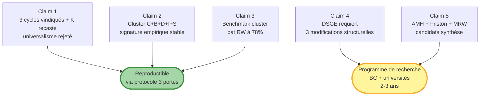
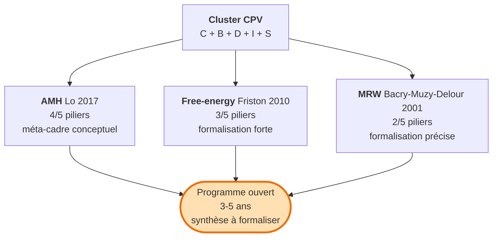
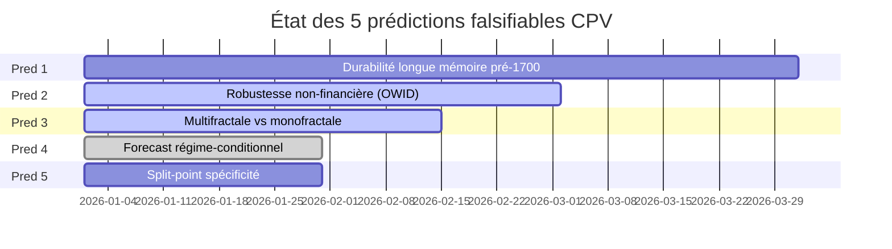

# Académique

!!! success "TL;DR (V3, juin 2026)"

    Pour économistes théoriciens, DSGE community, philosophes de l'économie. CPV se compose désormais de **deux papiers parallèles** :

    1. **Papier publié — *Cycles Refuted* V3** : trois cycles canoniques **vindiqués** sur les variables substantives prédites (Juglar 67/605 JST 2.2× ; Kuznets 51/529 JST 1.9× ; Kitchin 25/93 BIS Q 5.3×). **Kondratieff recasté** chronologie Reinhart-Rogoff (UK dette seule). **Lecture universaliste** sinusoïdale-sur-tout **rejetée** par BH-FDR sur grille jointe 1 456 cellules. Voir [résumé portail](../../papers/cycles_refuted_v3.md).
    2. **Papier compagnon en préparation** : signature empirique **cluster C+B+D+I+S** sur > 60 % des cellules. Benchmark out-of-sample valide 3 modèles cluster (MSM, ARFIMA+RS, HAR) qui battent random walk sur **78 % de 68 variables**. Conséquence : DSGE New-Keynesian standard doit être révisé structurellement (chocs ARFIMA, Markov layer paramètres deep, queues Tsallis/Lévy).

    Les six pages de cette track restent organisées autour du **papier compagnon** (cluster + DSGE + AMH/Friston/MRW + 5 prédictions falsifiables) ; le verdict sur les quatre cycles canoniques **suit** le V3 *Cycles Refuted*.

## Dans cette page

- **[Les 5 claims principaux](#claims)** — résumé des résultats falsifiables
- **[Les 6 pages de la track](#contenu)** — structure du parcours
- **[La synthèse théorique manquante](#synthese)** — AMH + Friston + MRW
- **[5 prédictions falsifiables](#predictions)** — état de la réplication

---

## Les 5 claims principaux { #claims }

| # | Claim | Statut |
|---|---|---|
| 1 | **V3** : 3 cycles vindiqués (Juglar/Kuznets/Kitchin) sur canaux substantifs ; Kondratieff recasté chronologie Reinhart-Rogoff ; lecture universaliste rejetée BH-FDR | **Démontré** ([Cycles Refuted V3](../../papers/cycles_refuted_v3.md), 166 / 1 456 Gate 1 unadjusted, 2.3× excès) |
| 2 | Cluster C+B+D+I+S co-apparaît sur ≥ 60 % des cellules | **Démontré** (14 diagnostics Tier 1+2 — companion paper) |
| 3 | 3 modèles cluster battent RW out-of-sample CRPS sur 78 % des variables | **Démontré** (PASS 78 %, robuste à n_origins — companion paper) |
| 4 | DSGE requiert 3 modifications structurelles | **Argumenté** (programme 2-3 ans documenté) |
| 5 | AMH + Friston + MRW = candidats synthèse théorique | **Ouvert** (aucun n'unifie seul les 5 piliers) |

---

## Contenu de la track { #contenu }

-   :material-function:{ .lg .middle } **[Méthode compacte](method_compact.md)**

    ---

    Protocole CPV en langage théoricien : Box-Jenkins étendu, Theiler-Vyushin-Kushner, Hamilton-Killick-Bry-Boschan. Formalisation statistique du triple-gate.

    **Lecture** : ~10 min · ~900 mots

-   :material-trophy:{ .lg .middle } **[Verdict constructif](verdict_constructive.md)**

    ---

    Cluster + benchmark en ton AER/JME. Distribution des rejets par famille, incompatibilité cycles canoniques, robustesse 78 %, 3 inférences hiérarchiques.

    **Lecture** : ~17 min · ~1 700 mots

-   :material-gavel:{ .lg .middle } **[DSGE en accusation](dsge_in_dock.md)**

    ---

    3 modifications structurelles requises (long-memory shocks, Markov layer paramètres deep, distributions non-gaussiennes). Programme de recherche conjoint 2-3 ans.

    **Lecture** : ~15 min · ~1 500 mots

-   :material-graph-outline:{ .lg .middle } **[Synthèse AMH](synthesis_amh.md)**

    ---

    AMH (Lo 2017, couvre 4/5 piliers) + free-energy (Friston 2010, couvre 3/5) + MRW (Bacry-Muzy-Delour 2001, couvre 2/5). Programme ouvert.

    **Lecture** : ~14 min · ~1 400 mots

-   :material-test-tube:{ .lg .middle } **[5 prédictions falsifiables](falsifiable_predictions.md)**

    ---

    Statut : prédiction 4 CONFIRMÉE par Roadmap #20, prédictions 1, 5 TODO, prédictions 2, 3 PARTIELLES. Total restant ~70 jours.

    **Lecture** : ~15 min · ~1 500 mots

-   :material-file-document-multiple:{ .lg .middle } **[Paper V2 académique](paper_v2_academic.md)**

    ---

    Paper phare avec dramaturgie constructive. Abstract + JEL codes + 5 sections + annexes + 30+ références. Conçu pour soumission AER/JME/QJE.

    **Lecture** : ~45 min · ~4 500 mots

---

## La synthèse théorique manquante { #synthese }

Aucun cadre théorique unique ne **prédit conjointement** les 5 piliers à partir de premiers principes. Les candidats :

**Proposition** : *MRW étendu à régimes de free-energy* — processus log-multifractal dont les paramètres sont conditionnellement Markoviens au régime cognitif suivant une dynamique d'active inference.

[Détail dans la synthèse →](synthesis_amh.md){ .md-button }

---

## 5 prédictions falsifiables { #predictions }

Statut détaillé :

| Prédiction | Statut | Effort restant |
|---|---|---|
| 1 — Durabilité longue mémoire (pré-1700) | TODO | 25-35 jours |
| 2 — Robustesse non-financière | PARTIAL | 18 jours |
| 3 — Multifractale > monofractale | PARTIAL | 10 jours |
| 4 — Forecast régime-conditionnel | **CONFIRMÉE** (Roadmap #20) | 7 jours (queues lourdes) |
| 5 — Split-point spécifique | TODO | 5 jours |

[Détail dans la page prédictions →](falsifiable_predictions.md){ .md-button }

---

## Pour aller plus loin

| Vous voulez... | Allez vers |
|---|---|
| Voir le verdict opérationnel chiffré | [Forecast benchmark consolidé](../../forecast_benchmark.md) |
| Reproduire les résultats | [Benchmark reproductible (Quants)](../quants/benchmark_reproducible.md) |
| Implications BC opérationnelles | [Track Banque centrale](../bc/index.md) |
| Vulgariser sans jargon | [Track Public éclairé](../public/index.md) |
| Le working paper V1 archivé | [Paper V1 (réfutation-first, déc 2025)](../../papers/cpv_main_paper.md) |
| Méthode complète détaillée | [Protocole CPV](../../methodology/protocole_cpv.md) |
| Panorama des 21 familles | [Au-delà des cycles](../../methodology_beyond_cycles.md) |
| Sources de données citées | [Sources](../../data_sources_cited.md) |
