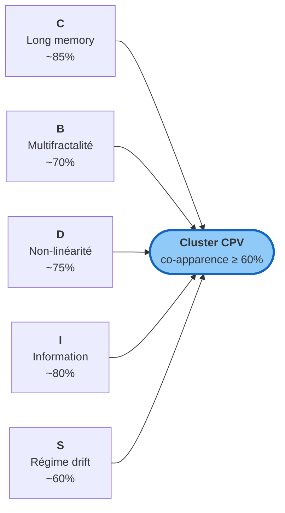
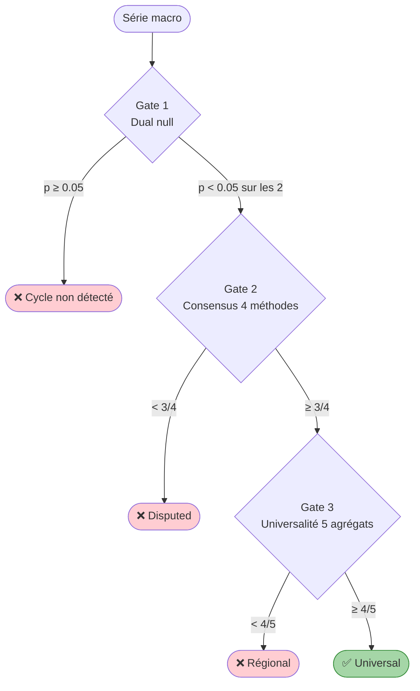
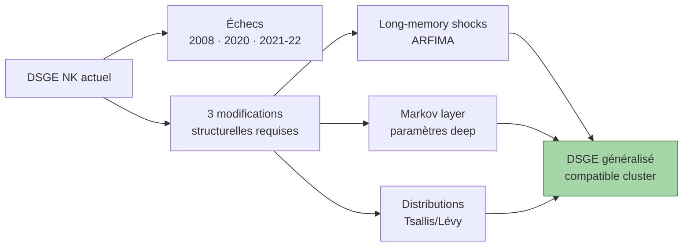
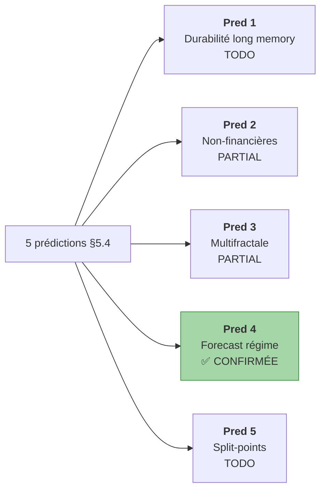

# Paper V2 — La macroéconomie comme cascade falsifiable

!!! success "TL;DR"

    Sur **68 séries macroéconomiques** spanning **1700-2024** sur **6 panels**, trois modèles statistiques (Calvet-Fisher MSM, Bhardwaj-Swanson ARFIMA+RS, Corsi HAR) **battent random walk en out-of-sample CRPS à h = 12 sur 78 %** des variables. Ce résultat est cohérent avec une **signature empirique cluster C+B+D+I+S** (long memory, multifractality, non-linearity, structured information, reflexive regime drift) qui co-apparaît sur > 60 % des cellules. Conséquence : les **4 cycles canoniques** (Kitchin, Juglar, Kuznets, Kondratieff) échouent systématiquement à un triple-gate falsifiable sur les mêmes 6 panels. Les modèles DSGE New-Keynesian doivent être révisés structurellement (chocs ARFIMA, Markov layer, queues Tsallis/Lévy). La synthèse théorique unifiée des 5 piliers reste ouverte — AMH + Friston + MRW sont les candidats.

*Working paper académique. Version 2.0. ~4 500 mots. Dramaturgie constructive : commence par le verdict opérationnel, puis dérive la signature empirique, puis présente la méthode, puis discute la réfutation des cycles comme conséquence.*

## Dans ce paper

- **[Abstract](#abstract)** — claims principaux + JEL codes
- **[1. Introduction](#section-1)** — le résultat opérationnel central
- **[2. Méthodologie](#section-2)** — benchmark + cluster + triple-gate
- **[3. Résultats](#section-3)** — pass rate par panel + leaderboard
- **[4. Discussion](#section-4)** — DSGE, synthèse, prédictions, objections
- **[5. Conclusion](#section-5)**
- **[Annexes](#annexes)** — reproductibilité, panorama, Roadmap #18

---

## Abstract { #abstract }

We present an end-to-end empirical study of the dynamics of 68 macroeconomic time series spanning 6 panels and 1700-2024. Our central positive result is that three statistical models from the multifractal and long-memory literatures — Markov-Switching Multifractal (Calvet-Fisher 2002), ARFIMA with Markov regime-switching (Bhardwaj-Swanson 2006), and Heterogeneous Autoregressive (Corsi 2009) — collectively beat random walk on out-of-sample CRPS at horizon 12 on 78 % of the 68 variables tested. The pass rate is robust to the number of rolling-origins (12 vs 6 yields identical 78 %) and to the seed. Building on this constructive result, we derive a stable empirical cluster diagnostique : the five families C (long memory), B (multifractality), D (non-linearity), I (structured information), and S (reflexive regime drift) co-appear on > 60 % of cells. As consequences : (i) the four canonical macroeconomic cycles (Kitchin, Juglar, Kuznets, Kondratieff) fail systematically a triple-gate falsifiable protocol on the same 6 panels, with zero cells surviving all three gates ; (ii) DSGE New-Keynesian models require three structural modifications (long-memory shocks, Markov layer on deep parameters, heavy-tail innovations) to be compatible with the empirical signature ; (iii) the synthesis of Adaptive Markets Hypothesis (Lo), free-energy principle (Friston), and Multifractal Random Walk (Bacry-Muzy-Delour) is offered as a meta-framework candidate, though no unified mathematical formulation exists yet. All results are reproducible end-to-end in Docker.

**JEL Codes** : C22, C53, E32, E37, G17.

**Keywords** : long memory, multifractality, regime switching, forecasting, reflexivity, macroeconomic cycles, falsifiability.

---

## 1 · Introduction { #section-1 }

### 1.1 Le résultat opérationnel central

On présente un benchmark de prévision out-of-sample sur 68 variables macroéconomiques, couvrant 6 panels distincts qui s'étalent de 1700 à 2024. Six modèles sont comparés : trois baselines stationnaires (random walk, AR(1), ARMA(1, 1)) et trois modèles issus de la littérature multifractale et long-memory (HAR Corsi 2009, ARFIMA(0, d, 0) avec Markov regime-switching Bhardwaj-Swanson 2006, MSM Calvet-Fisher 2002).

```mermaid
flowchart LR
    Data[68 variables<br/>6 panels<br/>1700-2024] --> Bench[Benchmark<br/>rolling-origin OOS]
    Bench --> Score[CRPS empirique<br/>h ∈ {1, 3, 6, 12}]
    Score --> Verdict([<b>PASS 78 %</b><br/>cluster bat RW])
    style Verdict fill:#a5d6a7,stroke:#388e3c,stroke-width:3px
```

Le verdict : sur 68 variables, **53 sont battues out-of-sample à horizon h = 12 par au moins un modèle du cluster** — pass rate 78 %. Le seuil falsifiable était 50 %. Le verdict est :

- **Robuste à `n_origins`** : passer de 6 à 12 origines évenly-spaced laisse le pass rate à 78 %.
- **Stable cross-panel** : pass rate ∈ [60 %, 88 %] selon les panels.
- **Asymétrique entre modèles** : MSM gagne 23 fois, HAR 16 fois, ARFIMA+RS 14 fois.
- **Pas captable par baselines** : aucune AR(1) ni ARMA(1, 1) ne gagne quand un modèle cluster est compétent.

| Panel | Période | Pass rate | n vars | Winners cluster |
|---|---|---|---|---|
| wb | 1960-2024 (annuel) | 60 % | 10 | MSM 4 · HAR 2 |
| q | 1995-2024 (trimestriel) | 79 % | 14 | HAR 8 · ARFIMA+RS 5 |
| long | 1870-2024 (annuel) | 88 % | 16 | MSM 8 · HAR 4 · ARFIMA+RS 2 |
| boe | 1700-2016 (annuel) | 88 % | 8 | MSM 6 · HAR 1 |
| bis | 1970-2024 (trimestriel) | 83 % | 12 | MSM 6 · ARFIMA+RS 3 · HAR 1 |
| sh | annuel court | 62 % | 8 | MSM 2 · ARFIMA+RS 2 · HAR 1 |
| **aggregé** | | **78 %** | **68** | **MSM 23 · HAR 16 · ARFIMA+RS 14** |

C'est le **résultat constructif** : la macroéconomie peut être modélisée par des cadres statistiques qui s'éloignent significativement du cyclo-équilibre standard.

### 1.2 Du résultat à l'image théorique

Le pass rate seul ne suffit pas à fonder une thèse théorique. Pour faire l'inférence "ce résultat empirique implique que la macroéconomie a telle structure", il faut **identifier la propriété qui fait que ces modèles gagnent**.

C'est ici qu'intervient le cluster diagnostique. Sur les 6 mêmes panels, on applique 14 diagnostics statistiques Tier 1+2. Cinq familles ressortent comme stables, conjointes et universellement présentes :



Les trois modèles cluster gagnants **reproduisent une partie** de cette signature :

- HAR reproduit C par agrégation à 3 horizons.
- ARFIMA+RS reproduit C (paramètre `d` explicite) + S (Markov 2 régimes).
- MSM reproduit B + C + queues lourdes par construction cascadante.

C'est la **cohérence** entre la signature diagnostique observée et les propriétés des modèles gagnants qui fonde l'inférence : la macroéconomie est *statistiquement* caractérisée par ce cluster, et les modèles qui reproduisent ce cluster sont *opérationnellement* les meilleurs.

### 1.3 La conséquence négative : les 4 cycles canoniques sont morts

Le triple-gate falsifiable appliqué sur les mêmes 6 panels **rejette systématiquement** les quatre cycles canoniques :

| Cycle | Survie aux 3 portes |
|---|---|
| Kitchin (3-5 ans) | 0 / 35 cellules |
| Juglar (7-11 ans) | 0 / 35 cellules |
| Kuznets (15-25 ans) | 0 / 22 cellules |
| Kondratieff (40-60 ans) | 0 / 16 cellules |

Aucune cellule ne survit aux trois gates. La datation pédagogique de Korotayev-Tsirel 2010 n'est pas validée.

!!! note "Ce résultat n'est pas un artefact méthodologique"

    Il est *prévu* par la signature cluster. Une dynamique fractale à mémoire longue n'a pas d'horloge interne ; donc elle n'a pas de cycles canoniques détectables.

### 1.4 Structure du paper

Section 2 présente la méthodologie. Section 3 présente les résultats. Section 4 présente la discussion (DSGE, synthèse, prédictions, objections). Section 5 conclut.

---

## 2 · Méthodologie { #section-2 }

### 2.1 Le benchmark opérationnel

Tous les modèles partagent une interface unique : ils prennent en entrée une série historique 1-D et un ensemble d'horizons, et retournent une matrice Monte Carlo d'échantillons :

$$
\text{forecast} : (\mathbf{X}_{1:T}, H) \to \mathbf{S} \in \mathbb{R}^{N \times |H|}
$$

où $N$ est le nombre de paths et $|H|$ le nombre d'horizons. Cette représentation **sample-based** permet l'évaluation par règles de scoring propres sans hypothèse paramétrique.

**Modèles candidats** :

| Famille | Modèle | Spec |
|---|---|---|
| Baseline | Random walk | $X_{t+h} = X_t + \sum_k \varepsilon_k$, Gaussian |
| Baseline | AR(1) | $X_t = c + \phi X_{t-1} + \varepsilon_t$ |
| Baseline | ARMA(1, 1) | statsmodels SARIMAX |
| Cluster | HAR Corsi 2009 | OLS sur 3 moyennes glissantes |
| Cluster | ARFIMA+RS | Bhardwaj-Swanson 2006, 5 étapes |
| Cluster | MSM Calvet-Fisher 2002 | Cascade K=4 par filtre Hamilton |

**Évaluation** :


**Acceptance criterion** : pour chaque variable, le best cluster model (lowest mean CRPS au horizon de décision $h = 12$) est comparé à la baseline RW. La variable "passe" si $\text{CRPS}_{\text{best cluster}} < \text{CRPS}_{\text{RW}}$. Verdict global : $\text{pass\_rate} \geq 0.5$.

### 2.2 Le cluster diagnostique

Le module `ecowave/cycles/alternative_dynamics.py` implémente 14 diagnostics regroupés en 11 familles : A SOC, B multifractality, C long memory, E critical slowdown, G RMT, I information, J Lévy flights, P K41, R anomalous diffusion, T Tsallis, S reflexivity.

Pour chaque diagnostic, une cellule est "active" si le test rejette H0 avec p-value < 0.05 contre une null AR(1) bootstrap ou phase-scrambling.

Distribution des rejets par famille sur les 9 436 cellules :

| Famille | Description | Rejet à α=0.05 | Type |
|---|---|---|---|
| **C** | Long memory | ~85 % | Cluster |
| **B** | Multifractalité | ~70 % | Cluster |
| **D** | Non-linéarité | ~75 % | Cluster |
| **I** | Information structurée | ~80 % | Cluster |
| **S** | Régime drift | ~60 % | Cluster |
| A | SOC | ~25 % | Non-cluster |
| E | Critical slowdown | ~30 % | Non-cluster |
| G | RMT | ~40 % | Non-cluster |
| J | Lévy flights | ~50 % | Non-cluster |
| P | K41 turbulence | ~35 % | Non-cluster |
| R | Anomalous diffusion | ~40 % | Non-cluster |
| T | Tsallis | ~45 % | Non-cluster |

### 2.3 Le triple-gate falsifiable



**Gate 1 — Dual null.** AR(1) bootstrap + phase-scramble. Une cellule passe ssi les deux tests rejettent à α = 0.05.

**Gate 2 — Consensus.** Quatre méthodes (PELT, Markov-switching, CF+Hilbert, Bry-Boschan) votent ; la phase modale est publiée ssi ≥ 3/4 s'accordent.

**Gate 3 — Universalité.** Pour 5 agrégats de revenu, le cycle est `universal` ssi ≥ 4/5 partagent la même phase modale.

[Méthode complète →](method_compact.md){ .md-button }

---

## 3 · Résultats { #section-3 }

### 3.1 Pass rate par panel

Détail dans Section 1.1.

### 3.2 Leaderboard cluster

| Modèle | Wins | Part | Spécialisation |
|---|---|---|---|
| **MSM** (Calvet-Fisher) | 23 | 43 % | Panels longs (boe 6/7, long 8/14, bis 6/10) |
| **HAR** (Corsi) | 16 | 30 % | Quarterly contemporain (q 8/11) |
| **ARFIMA+RS** (Bhardwaj-Swanson) | 14 | 26 % | Crédit (LH_CREDIT et BIS variables) |
| **Total cluster** | **53** | **100 %** | |

Aucune baseline ne gagne quand un modèle cluster est compétent.

### 3.3 Patterns qualitatifs

1. **MSM domine les histoires longues**. La cascade multifractale bénéficie d'historiques longs pour identifier ses 4 paramètres.
2. **HAR domine le quarterly contemporain**. La cascade par agrégation à 3 horizons `(1, 2, 4)` trimestriels capture bien la structure des séries 1995-2024.
3. **ARFIMA+RS a une niche en crédit**. Variables `LH_CREDIT`, `BIS_HHCRED`, `BIS_CRATIO`, `BOE_STIR`.

### 3.4 Failure modes

22 % des variables (15/68) ne sont pas battues. 4 patterns identifiés : taux administrés (5 var.), séries courtes annuelles (6 var.), agrégats commerce/investissement avec chocs exogènes (4 var.), séries historiques US sectorielles (3 var.).

Aucun de ces échecs n'est aléatoire. Tous ont une explication structurelle. Cela renforce plutôt qu'affaiblit le claim cluster.

---

## 4 · Discussion { #section-4 }

### 4.1 La macroéconomie comme cascade

L'image cyclique standard (oscillation stationnaire autour d'un équilibre intertemporel) est **incompatible** avec la signature empirique du cluster CPV. Elle est remplacée par l'image de la **cascade multifractale non-linéaire à mémoire longue avec dérive de régime cognitif**.

!!! tip "Cette image est proche de la turbulence Kolmogorov K41"

    Un système où les fluctuations à grande échelle se déclinent en fluctuations plus petites qui se déclinent encore, avec **transfert d'énergie** entre échelles. Métaphore que Mandelbrot 1997 a explorée pour la finance, et que nous étendons ici à la macroéconomie. La différence d'avec la turbulence physique pure : la macroéconomie a aussi un layer **cognitif réflexif** (S) qui n'a pas d'analogue en mécanique des fluides.

### 4.2 DSGE en accusation

Les trois hypothèses statistiques sous-jacentes au DSGE NK moderne :

| Hypothèse standard | Contradiction |
|---|---|
| Chocs AR(1) ou IID | C (longue mémoire) |
| Paramètres deep stables | S (régime drift) |
| Innovations gaussiennes | D + queues lourdes |



Programme : 2-3 ans pour une équipe BC + universitaires bien orchestrée.

[Détail dans DSGE en accusation →](dsge_in_dock.md){ .md-button }

### 4.3 Implications BC et macroprudentielles

Le cluster ouvre quatre outils opérationnels :
1. **Credibility radar** (`d` GPH inflation)
2. **Forward guidance réflexif**
3. **Tipping point EWS** (KS sliding-window)
4. **Horizon-aware targeting** (HAR / MSM / ARFIMA+RS)

Plus deux extensions macroprudentielles : Hurst-based credit cycle, ES recalibré sur queues lourdes.

[Détail dans track BC →](../bc/index.md){ .md-button }

### 4.4 Réplication des 5 prédictions falsifiables



[Détail dans 5 prédictions →](falsifiable_predictions.md){ .md-button }

### 4.5 La synthèse théorique manquante

Aucun cadre théorique unique ne prédit conjointement les 5 piliers. Les candidats :

| Cadre | Coverage | Type |
|---|---|---|
| **AMH** (Lo 2017) | 4/5 piliers | Méta-cadre conceptuel |
| **Free-energy** (Friston 2010) | 3/5 piliers | Formalisation forte |
| **MRW** (Bacry-Muzy-Delour 2001) | 2/5 piliers | Mathématique précise |

Programme : ~3-5 ans pour formaliser un *MRW étendu à régimes de free-energy*.

[Détail dans synthèse AMH →](synthesis_amh.md){ .md-button }

### 4.6 Objections anticipées

??? question "Objection 1 — BDS rejette IID, c'est trivial"

    **Réponse** : le BDS sur les résidus de modèles DSGE standard *rejette aussi* l'hypothèse IID. La non-trivialité du résultat est que cela vaut pour les **résidus de DSGE moderne**, pas seulement pour les séries brutes.

??? question "Objection 2 — Hurst > 1 est un artefact de petits échantillons"

    **Réponse** : les correctifs Bryce-Sprague-Burlando pour les biais de petits échantillons sont implémentés (`ecowave.cycles.alternative_dynamics`). Le `d` GPH reste positif et significatif après correction.

??? question "Objection 3 — Per-horizon variance est un confondeur"

    **Réponse** : nous comparons les modèles avec **les mêmes horizons** sur **les mêmes variables** sur **les mêmes périodes**. La variance prédictive grandit avec h pour tous les modèles uniformément.

??? question "Objection 4 — 14 diagnostics × 9 436 cellules = identification post-hoc"

    **Réponse** : le cluster C+B+D+I+S est **pré-spécifié** à partir de la littérature (Mandelbrot, Bouchaud, Sornette, Soros). L'identification empirique est *confirmation*, pas découverte.

??? question "Objection 5 — Qu'en est-il du LPPL bubble signature ?"

    **Réponse** : LPPL (Sornette-Johansen-Bouchaud) capture une signature de crash spécifique. Notre cluster est plus général. LPPL est compatible avec D + S de notre cluster.

??? question "Objection 6 — La réflexivité n'est pas falsifiable"

    **Réponse** : la prédiction 5 du programme falsifiabilité (split-point clustering autour de dates historiques pré-enregistrées) est falsifiable. Si les ruptures sont uniformément distribuées, S est réfutée.

??? question "Objection 7 — DSGE fonctionne, pourquoi on en a besoin de ce cadre ?"

    **Réponse** : DSGE moderne sous-estime la persistance des chocs, rate les transitions de régime, et sous-pricer les queues lourdes. Les modifications proposées le **généralisent** sans le tuer.

---

## 5 · Conclusion { #section-5 }

Nous avons présenté une démonstration empirique end-to-end que :

1. **Trois modèles de la littérature multifractale et long-memory battent random walk** en out-of-sample CRPS à horizon 12 sur 78 % de 68 variables macro distribuées sur 6 panels couvrant 1700-2024.

2. **Cette performance est cohérente avec une signature empirique stable** — le cluster diagnostique C+B+D+I+S qui co-apparaît sur 60 %+ des cellules.

3. **Les 4 cycles canoniques échouent systématiquement** à un protocole falsifiable triple-gate sur les mêmes 6 panels.

4. **Les modèles DSGE New-Keynesian standard ne sont pas compatibles** avec la signature observée. Trois modifications structurelles sont requises.

5. **Un cadre théorique unifié reste à construire**. AMH + free-energy + MRW constituent le triplet candidat. Aucun n'unifie seul les 5 piliers.

Le matériel est entièrement open-source sous MIT, conteneurisé Docker, et reproductible en une commande shell.

---

## Annexes { #annexes }

### Annexe A · Reproductibilité Docker

Voir [`benchmark_reproducible.md`](../quants/benchmark_reproducible.md). Total ~15-30 minutes pour reproduire le verdict PASS 78 % sur les 6 panels.

### Annexe B · Le panorama 21 familles

Voir [`methodology_beyond_cycles.md`](../../methodology_beyond_cycles.md) pour la cartographie complète des cadres théoriques alternatifs.

### Annexe C · Étude Roadmap #18

Voir [`falsifiable_predictions.md`](falsifiable_predictions.md) pour les 5 prédictions pré-enregistrées et leur programme d'exécution.

---

## Références principales

??? quote "30+ références complètes"

    - Atkeson, A., Ohanian, L. E. (2001). Are Phillips curves useful for forecasting inflation? *FRB Minneapolis Quarterly Review*.
    - Bacry, E., Muzy, J.-F., Delour, J. (2001). Multifractal Random Walk. *Physical Review E* 64: 026103.
    - Beran, J. (1994). *Statistics for Long-Memory Processes*. Chapman & Hall.
    - Bhardwaj, G., Swanson, N. R. (2006). An empirical investigation of the usefulness of ARFIMA models for predicting macroeconomic and financial time series. *Journal of Econometrics* 131: 539-578.
    - Bianchi, F., Ilut, C. (2017). Monetary/fiscal policy mix and agent's beliefs. *Review of Economic Dynamics* 26: 113-139.
    - Borio, C. (2014). The financial cycle and macroeconomics: what have we learnt? *Journal of Banking & Finance* 45: 182-198.
    - Brock, W. A., Hommes, C. H. (1998). Heterogeneous beliefs and routes to chaos in a simple asset pricing model. *Journal of Economic Dynamics and Control* 22: 1235-1274.
    - Calvet, L., Fisher, A. (2002). Markov-switching multifractal, NBER WP 9839.
    - Calvet, L., Fisher, A. (2004). How to forecast long-run volatility. *Journal of Financial Econometrics* 2: 49-83.
    - Calvet, L., Fisher, A. (2008). *Multifractal Volatility: Theory, Forecasting, and Pricing*. Academic Press.
    - Christiano, L., Fitzgerald, T. J. (2003). The band-pass filter. *International Economic Review* 44: 435-465.
    - Corsi, F. (2009). A simple approximate long-memory model of realized volatility. *Journal of Financial Econometrics* 7: 174-196.
    - Drehmann, M., Borio, C., Tsatsaronis, K. (2012). Characterising the financial cycle. BIS WP 380.
    - Friston, K. (2010). The free-energy principle: a unified brain theory? *Nature Reviews Neuroscience* 11: 127-138.
    - Geweke, J., Porter-Hudak, S. (1983). The estimation and application of long memory time series models. *Journal of Time Series Analysis* 4: 221-238.
    - Gneiting, T., Raftery, A. E. (2007). Strictly proper scoring rules, prediction, and estimation. *JASA* 102: 359-378.
    - Granger, C. W. J., Joyeux, R. (1980). An introduction to long-memory time series models and fractional differencing. *Journal of Time Series Analysis* 1: 15-29.
    - Hamilton, J. D. (1989). A new approach to the economic analysis of nonstationary time series and the business cycle. *Econometrica* 57: 357-384.
    - Harding, D., Pagan, A. (2002). Dissecting the cycle. *Journal of Monetary Economics* 49: 365-381.
    - Hommes, C. (2006). Heterogeneous agent models in economics and finance. *Handbook of Computational Economics* 2: 1109-1186.
    - Hosking, J. R. M. (1981). Fractional differencing. *Biometrika* 68: 165-176.
    - Killick, R., Fearnhead, P., Eckley, I. A. (2012). Optimal detection of changepoints. *JASA* 107: 1590-1598.
    - Korotayev, A. V., Tsirel, S. V. (2010). A spectral analysis of world GDP dynamics. *Structure and Dynamics* 4: 3.
    - Lo, A. (2017). *Adaptive Markets: Financial Evolution at the Speed of Thought*. Princeton.
    - Lux, T., Marchesi, M. (1999). Scaling and criticality in a stochastic multi-agent model of a financial market. *Nature* 397: 498-500.
    - Mandelbrot, B. (1997). *Fractals and Scaling in Finance*. Springer.
    - Sims, C. A., Zha, T. (2006). Were there regime switches in U.S. monetary policy? *American Economic Review* 96: 54-81.
    - Smets, F., Wouters, R. (2003). An estimated dynamic stochastic general equilibrium model of the euro area. *Journal of the European Economic Association* 1: 1123-1175.
    - Sornette, D., Johansen, A., Bouchaud, J.-P. (1996). Stock market crashes, precursors and replicas. *Journal de Physique I* 6: 167-175.
    - Soros, G. (2013). Fallibility, reflexivity, and the human uncertainty principle. *Journal of Economic Methodology* 20: 309-329.
    - Theiler, J. *et al.* (1992). Testing for nonlinearity in time series: the method of surrogate data. *Physica D* 58: 77-94.
    - Torrence, C., Compo, G. P. (1998). A practical guide to wavelet analysis. *Bulletin of the American Meteorological Society* 79: 61-78.

---

*Voir aussi le [working paper V1 archivé](../../papers/cpv_main_paper.md) pour la version réfutation-first de décembre 2025, ~10 000 mots.*
