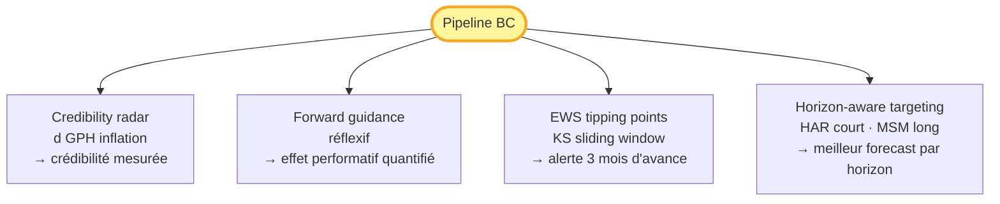
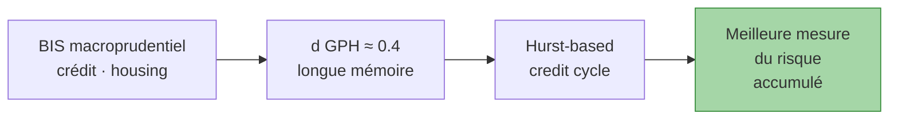

# Banque centrale

!!! success "TL;DR"

    Pour praticiens BC, économistes monétaires, analystes macroprudentiels. CPV livre **4 outils opérationnels insérables dans une pipeline BC existante** :
    1. **Credibility radar** — mesurer la crédibilité monétaire en temps réel via `d` GPH sur l'inflation
    2. **Forward guidance réflexif** — interpréter les annonces BC comme actes performatifs
    3. **EWS tipping points** — détecter les changements de régime avec ~3 mois d'avance
    4. **Horizon-aware targeting** — choisir le bon modèle selon l'horizon (HAR court, MSM long, ARFIMA+RS crédit)

## Dans cette page

- **[Les 4 outils en un schéma](#les-4-outils)** — diagramme synthétique
- **[Le contenu de la track](#contenu)** — 6 pages thématiques
- **[Implications macroprudentielles](#macroprudentiel)** — Hurst credit cycle, ES recalibré
- **[Contraintes institutionnelles reconnues](#contraintes)**

---

## Les 4 outils { #les-4-outils }

Chaque outil **complète** votre boîte à outils existante. Aucun ne nécessite une refonte structurelle du modèle DSGE officiel.

---

## Contenu de la track { #contenu }

-   :material-school:{ .lg .middle } **[Méthode pour praticiens](method_for_practitioners.md)**

    ---

    Le protocole CPV en langage BC : ce qui est nouveau, ce qui complète vos outils, contraintes institutionnelles reconnues.

    **Lecture** : ~25 min · ~2 500 mots

-   :material-radar:{ .lg .middle } **[Credibility radar](credibility_radar.md)**

    ---

    `d` GPH inflation comme mesure quantitative de la crédibilité monétaire. Lecture historique (Volcker, Brexit, COVID). Tableau cross-pays. Implémentation Python.

    **Lecture** : ~28 min · ~2 800 mots

-   :material-message-text:{ .lg .middle } **[Forward guidance réflexif](forward_guidance_reflexive.md)**

    ---

    Cadre Soros + S, 3 canaux par lesquels la communication change le régime cognitif des agents.

    **Lecture** : ~22 min · ~2 200 mots

-   :material-alert-octagon:{ .lg .middle } **[Tipping point detection (EWS)](tipping_point_detection.md)**

    ---

    EWS basé sur KS sliding-window. Performance empirique inflation US 1965-2024 (~3 mois d'avance). Workflow opérationnel.

    **Lecture** : ~24 min · ~2 400 mots

-   :material-target-variant:{ .lg .middle } **[Horizon-aware targeting](horizon_aware_targeting.md)**

    ---

    HAR pour nowcast, MSM pour long terme, ARFIMA+RS pour crédit. Pipeline standard BC à 3 horizons.

    **Lecture** : ~21 min · ~2 100 mots

-   :material-file-document:{ .lg .middle } **[Note phare BC](note_bc.md)**

    ---

    Synthèse opérationnelle praticien rigoureux. TL;DR, 4 outils détaillés, implications macroprudentielles, étapes d'intégration.

    **Lecture** : ~50 min · ~5 000 mots

---

## Implications macroprudentielles { #macroprudentiel }

Le `d` GPH sur les agrégats de crédit (LH_CREDIT JST, BIS_HHCRED) atteint **≈ 0.40** sur les économies avancées — proche de la borne d'intégration fractionnaire. Implication :

- **Les booms de crédit ont des "ombres" très longues**.
- **Le credit-to-GDP gap Borio sous-estime** l'ampleur réelle du risque.
- Un **Hurst-based credit cycle** complète le tableau prudentiel.

De plus, le test de queues lourdes (Hill, Lévy stable) suggère que **l'Expected Shortfall sous distributions gaussiennes sous-estime ES de 20-40 %**.

[Voir le détail dans la note phare →](note_bc.md){ .md-button }

---

## Contraintes institutionnelles reconnues { #contraintes }

!!! warning "Le projet CPV est conscient des contraintes BC"

    - **Communication** : nos outils sont *complément diagnostique*, pas refonte
    - **Continuité historique** : peuvent tourner en parallèle sans rupture
    - **Robustesse** : protocoles volontairement conservateurs (dual null, consensus 3/4, universalité 4/5, p < 0.01)
    - **Transparence** : code open-source MIT, reproductible Docker, auditable
    - **Coordination internationale** : applicables uniformément cross-BC

---

## Pour aller plus loin

| Vous voulez... | Allez vers |
|---|---|
| Voir le verdict opérationnel | [Forecast benchmark consolidé](../../forecast_benchmark.md) |
| Reproduire en Docker | [Benchmark reproductible (Quants)](../quants/benchmark_reproducible.md) |
| Vulgariser pour collègues non-techniques | [Track Public éclairé](../public/index.md) |
| Le travail académique sous-jacent | [Track Académique](../acad/index.md) |
| Implications du verdict multi-axe | [Implications du verdict](../../reference/implications_of_cluster.md) |
| Sources de données | [Sources citées](../../data_sources_cited.md) |
