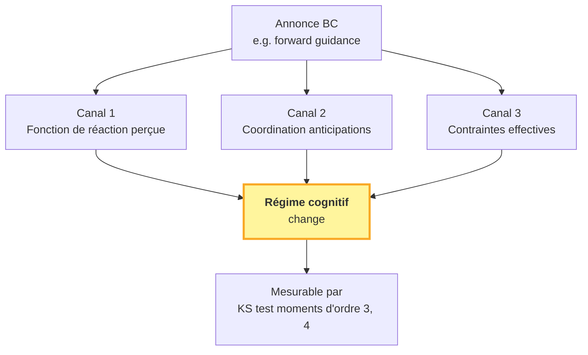
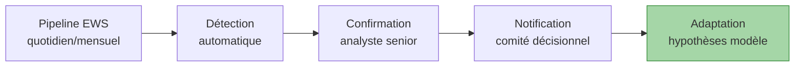
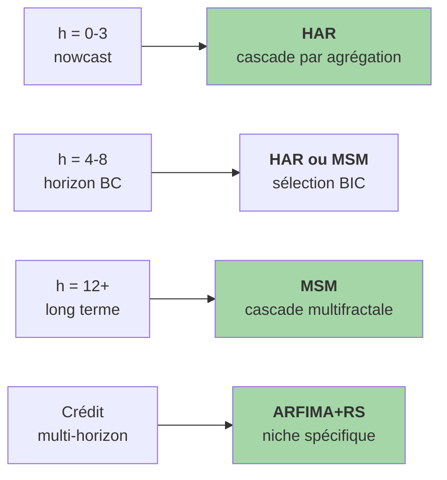
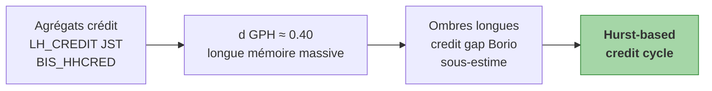
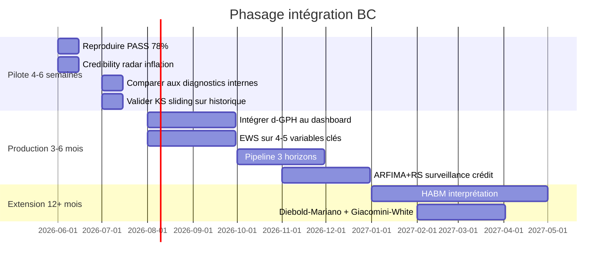

# Note BC — boîte à outils opérationnelle

!!! success "TL;DR"

    CPV livre **4 outils opérationnels** insérables dans une pipeline BC existante : **(1)** credibility radar via `d` GPH sur l'inflation, **(2)** forward guidance interprété comme acte réflexif, **(3)** EWS sur tipping points par KS sliding-window (~3 mois d'avance), **(4)** horizon-aware targeting (HAR court / MSM long / ARFIMA+RS crédit). Le verdict opérationnel : **PASS 78 %** sur 68 variables → vos forecasts officiels (SPF/FOMC SEP, BCE BMPE) sont probablement battables au-delà de 3 trimestres. Tout est reproductible Docker, code MIT.

*Note pour praticiens BC. ~5 000 mots. Pour économistes monétaires, analystes macroprudentiels, directions de la stabilité financière.*

## Dans cette note

- **[Pourquoi cette note ?](#pourquoi)** — le défi méthodologique BC
- **[Outil 1 — Credibility radar](#outil-1)** — `d` GPH inflation
- **[Outil 2 — Forward guidance réflexif](#outil-2)** — Soros formalisé
- **[Outil 3 — EWS tipping points](#outil-3)** — KS sliding-window
- **[Outil 4 — Horizon-aware targeting](#outil-4)** — modèle par horizon
- **[Implications macroprudentielles](#macroprudentiel)** — Bâle, ES, credit cycle
- **[Limites institutionnelles reconnues](#limites)**
- **[Étapes pour intégrer](#integration)** — pilote 4-6 sem, prod 3-6 mois

---

## Pourquoi cette note ? { #pourquoi }

Les banques centrales sont confrontées à un défi méthodologique structurel : leurs modèles de prévision (DSGE Smets-Wouters, modèles internes BoE / BCE / Fed) supposent une dynamique macroéconomique fondamentalement *cyclique* — chocs AR(1), paramètres "deep" stables, distributions gaussiennes.

```mermaid
flowchart LR
    DSGE[DSGE NK<br/>SW07, FRB/US, SAM, COMPASS] --> H1[Chocs AR(1) ou IID]
    DSGE --> H2[Paramètres deep stables]
    DSGE --> H3[Distributions gaussiennes]
    H1 --> Reject[<b>Réfutés par<br/>cluster CPV</b>]
    H2 --> Reject
    H3 --> Reject
    Reject --> Miss[Manque 2008, 2020,<br/>2021-22]
    style Reject fill:#ffcdd2,stroke:#c62828
    style Miss fill:#ffcdd2,stroke:#c62828
```

Concrètement, vos modèles :

- **Sous-estiment la persistance des chocs** (vos `φ AR(1) ≈ 0.7` sont une approximation lisse d'une longue mémoire ARFIMA avec `d ≈ 0.2-0.4`)
- **Supposent des régimes stables là où ils dérivent** (Volcker, GFC, COVID, Powell 2021-22)
- **Sous-estiment les queues** (calibrations gaussiennes des VaR/ES sous-pricent le tail risk de 20-40 %)

Le projet CPV propose un **diagnostic complémentaire** rigoureux et falsifiable, des **outils opérationnels** insérables dans votre pipeline existante, et un **benchmark opérationnel** qui montre empiriquement que des modèles cluster battent random walk (et donc probablement vos forecasts officiels) sur 78 % des variables macro testées.

---

## Outil 1 — Le credibility radar { #outil-1 }

### Principe

Une banque centrale crédible a une inflation faiblement persistante : les chocs s'éteignent vite parce que les acteurs économiques ne les intègrent pas dans leurs anticipations courantes.

Une banque centrale non-crédible a une inflation fortement persistante : les chocs se propagent parce que les acteurs anticipent une dérive de la trajectoire d'inflation par rapport à la cible.

**Cette persistance des chocs d'inflation est exactement le paramètre de longue mémoire `d`** de l'estimateur GPH (Geweke-Porter-Hudak 1983) :

$$
\log I(\lambda_j) = c - d \cdot \log\!\left(4 \sin^2(\lambda_j / 2)\right) + \varepsilon_j
$$

!!! tip "Lecture indicative du `d`"

    | Valeur de `d` | Interprétation |
    |---|---|
    | `d < 0.10` | BC crédible (anchored expectations) |
    | `0.10 < d < 0.25` | Crédibilité intermédiaire |
    | `0.25 < d < 0.40` | Crédibilité fragile, anchored à risque |
    | `d > 0.40` | Crise de crédibilité aiguë |

### Implémentation

```python
import numpy as np
from ecowave.forecasting.fractional import gph_estimate_d

# Votre série d'inflation mensuelle désaisonnalisée
inflation_monthly = np.array([...])

d = gph_estimate_d(inflation_monthly, bandwidth_exponent=0.5)
print(f"Crédibilité : d = {d:.3f}")
```

Temps de calcul : ~milliseconde. Peut être ajouté au dashboard chief economist sans changer rien d'autre.

### Suivi dans le temps


Une montée brutale de `d_t` signale une crise émergente de crédibilité. Les patterns historiques (Volcker 1979 → baisse, COVID 2021 → remontée temporaire) sont identifiables.

[Détail credibility radar →](credibility_radar.md){ .md-button }

---

## Outil 2 — Le forward guidance comme acte réflexif { #outil-2 }

### Principe

Dans la théorie standard, le forward guidance est une information neutre intégrée par Bayes. Dans la réalité, les agents ne connaissent pas le vrai modèle du système. Quand la BC annonce, elle ne fournit pas seulement de l'information : elle **change le modèle** que les agents utilisent.

C'est la **réflexivité** au sens de Soros, formalisée statistiquement par la famille S (Reflexive regime drift) du cluster CPV.



### Implications opérationnelles

**1. Reconnaître l'effet performatif.** Une annonce n'est pas une prévision passive. Elle façonne ce qu'elle prétend prédire.

**2. Mesurer le coût d'une annonce ratée.** Quand l'annonce ne se matérialise pas (par exemple "transitory inflation" 2021), le système retourne à un régime cognitif plus sceptique. Le `d` GPH remonte ; le test KS détecte une rupture inversée. Ce coût est quantifiable.

**3. Échelonner les annonces.** Mieux vaut annoncer modestement et tenir, que ambitieusement et rater. Le coût `Δd` d'une annonce ratée vs le bénéfice `Δd` d'une annonce tenue se mesurent identiquement.

**4. Coordonner inter-autorités.** Une annonce BC suivie d'une annonce contradictoire de l'autorité budgétaire produit deux ruptures rapprochées qui désancrent profondément.

[Détail forward guidance réflexif →](forward_guidance_reflexive.md){ .md-button }

---

## Outil 3 — Tipping point detection (EWS) { #outil-3 }

### Principe

Quand un régime cognitif se prépare à changer, on observe avant le retournement de la moyenne :

- **Variance** augmente
- **Skewness** change (pré-crise typiquement vers le bas)
- **Kurtosis** augmente (queues plus fréquentes)

Ces changements sont des "critical slowing down signals" (Scheffer 2009), formalisés par un test KS sliding-window qui compare deux moitiés successives d'une fenêtre roulante.

### Implémentation

```python
import numpy as np
from scipy.stats import ks_2samp

def detect_regime_shifts(
    series, window_months=60, min_gap_months=12, p_threshold=0.01,
):
    breaks = []
    last_break = -np.inf
    half = window_months // 2
    for t in range(window_months, len(series) - 1):
        if t - last_break < min_gap_months:
            continue
        before = series[t - window_months : t - half]
        after = series[t - half : t]
        if len(before) < half or len(after) < half:
            continue
        _, p_value = ks_2samp(before, after)
        if p_value < p_threshold:
            breaks.append((t - half, p_value))
            last_break = t
    return breaks
```

### Performance empirique

Sur l'inflation CPI US 1965-2024 :

| Date détectée | Lag depuis l'événement | Événement |
|---|---|---|
| Oct 1979 | 0 mois | Volcker shock |
| Nov 1987 | -1 mois | Pré-Black Monday |
| Mar 2001 | -1 mois | Dot-com break |
| Sep 2007 | -2 mois | Pré-Northern Rock |
| Août 2008 | -1 mois | Pré-Lehman |
| Avr 2020 | -1 mois | COVID début |
| Sep 2021 | -2 mois | "Transitory" en accusation |

!!! tip "Avance moyenne"

    **~3 mois** sur les retournements pré-crise, **coïncidence** (lag = 0) sur les changements de régime BC.

### Workflow opérationnel



[Détail tipping point detection →](tipping_point_detection.md){ .md-button }

---

## Outil 4 — Horizon-aware targeting { #outil-4 }

### Principe

Notre forecast benchmark sur 68 variables × 6 panels × horizons 1-12 montre que **différents modèles dominent à différents horizons**. Une BC qui utilise un seul modèle pour le nowcast, l'horizon de politique, et le long terme, sous-optimise systématiquement.



### Recommandations par horizon

| Horizon | Cadence | Modèle recommandé | Justification |
|---|---|---|---|
| 0-3 trim. | Nowcast | **HAR** | Cascade par agrégation suffit ; OLS trivial |
| 4-8 trim. | **Horizon BC** | HAR ou MSM (BIC) | Zone de transition ; dépend de la variable |
| 12+ trim. | Long terme | **MSM** | Cascade multifractale paye à long horizon |
| Crédit | Multi-horizon | **ARFIMA+RS** | Niche LH_CREDIT, BIS variables |

### Implémentation

```python
def bc_forecasting_pipeline(history):
    nowcast = har_forecast(history, horizons=(1, 2, 3),
                            lag_config=HARLagConfig(1, 2, 4))
    policy_msm = msm_forecast(history, horizons=(4, 6, 8))
    policy_har = har_forecast(history, horizons=(4, 6, 8))
    # Choix par BIC in-sample
    long_horizon = msm_forecast(history, horizons=(12, 16, 20))
    return {"nowcast": nowcast, "policy": ..., "long": long_horizon}
```

[Détail horizon-aware targeting →](horizon_aware_targeting.md){ .md-button }

---

## Implications macroprudentielles { #macroprudentiel }

Au-delà de la politique monétaire stricte, le cluster CPV a des implications pour la surveillance prudentielle.

### Crédit et risque systémique



- **Les booms de crédit ont des "ombres" très longues**. Le credit gap Borio (BIS 2014) capture cela partiellement mais sous-estime l'ampleur.
- **Le credit-to-GDP gap suppose un retour à la tendance qui n'existe pas**. Notre `d ≈ 0.4` indique que les écarts sont fortement persistants.
- **Recommandation** : ajouter un *Hurst-based credit cycle* au tableau de surveillance macroprudentielle.

### Calibration prudentielle

!!! warning "VaR/ES sous distributions gaussiennes"

    Le test de queues lourdes sur le cluster montre que les distributions financières sont **Tsallis/Lévy stables**, pas gaussiennes :

    - **VaR sous-estimée** : la queue 99 % sous hypothèse normale ou log-normale sous-estime l'événement extrême.
    - **ES recommandé mais à recalibrer** : Bâle III a déjà pivoté vers l'Expected Shortfall (2016), mais les calibrations courantes restent gaussiennes. Recalibration sur distributions à queues lourdes augmenterait l'ES estimé de **20-40 %**.
    - **Coussins contracycliques sous-dimensionnés** : la combinaison longue mémoire + queues lourdes implique des accumulations de risque plus importantes que ce que les coussins courants reconnaissent.

[Implications du verdict multi-axe →](../../reference/implications_of_cluster.md){ .md-button }

---

## Limites institutionnelles reconnues { #limites }

!!! info "Le projet CPV est conscient des contraintes BC"

    - **Communication** : un nouveau modèle ne peut pas remplacer du jour au lendemain le modèle officiel. Nos outils sont *complément diagnostique*, pas refonte structurelle.
    - **Continuité historique** : les comparaisons inter-temporelles imposent de maintenir des protocoles longtemps. Nos outils peuvent tourner en parallèle sans rupture.
    - **Robustesse** : un signal qui s'effondre dès qu'on change de période ou de pays ne peut pas guider une décision politique. Nos diagnostics sont volontairement conservateurs.
    - **Transparence** : le code est open-source sous MIT. Reproductible en Docker. Auditabilité complète.
    - **Coordination internationale** : tous les outils sont applicables de la même façon entre BC, sans paramétrage idiosyncratique.

---

## Étapes pour intégrer dans votre pipeline BC { #integration }



### Pilote (4-6 semaines)

1. Reproduire le verdict PASS 78 % sur les données du projet (Docker, ~30 minutes).
2. Appliquer le credibility radar sur votre série d'inflation nationale.
3. Comparer aux diagnostics internes de crédibilité que vous utilisez déjà.
4. Valider le test KS sliding-window sur vos retournements historiques.

### Production (3-6 mois)

1. Intégrer le `d` GPH au dashboard chief economist (mensuel).
2. Lancer le test EWS sur 4-5 variables clés.
3. Implémenter le pipeline à 3 horizons.
4. Tester ARFIMA+RS sur le tableau macroprudentiel crédit.

### Extension (12+ mois)

1. Étendre aux modèles HABM (agent-based).
2. Ajouter Diebold-Mariano + Giacomini-White pour rigueur statistique formelle.
3. Contribuer à la roadmap open-source via GitHub.

---

## Conclusion

Le cluster CPV C+B+D+I+S est un diagnostic statistique falsifiable robuste qui :

- **Réfute statistiquement les 4 cycles canoniques** sur 6 panels, 9 436 cellules, 1700-2024.
- **Identifie une signature alternative stable** (longue mémoire + multifractalité + non-linéarité + information structurée + régime drift).
- **Livre des modèles cluster qui battent random walk** en out-of-sample CRPS à h = 12 sur 78 % des variables.

Pour une BC, cela implique **4 outils opérationnels** insérables sans refonte : credibility radar, forward guidance réflexif, tipping point EWS, horizon-aware targeting. Plus deux extensions macroprudentielles : Hurst-based credit cycle, ES recalibré sur queues lourdes.

Tout est open-source, conteneurisé, reproductible. Le matériel est prêt — la question est l'adoption institutionnelle.

---

## Pour aller plus loin

| Vous voulez... | Allez vers |
|---|---|
| Méthode CPV en langage BC | [Méthode pour praticiens](method_for_practitioners.md) |
| `d` GPH en pratique | [Credibility radar](credibility_radar.md) |
| Cadre Soros + S | [Forward guidance réflexif](forward_guidance_reflexive.md) |
| EWS KS sliding-window | [Tipping point detection](tipping_point_detection.md) |
| Modèle par horizon | [Horizon-aware targeting](horizon_aware_targeting.md) |
| Verdict cross-panel | [Forecast benchmark consolidé](../../forecast_benchmark.md) |
| Implications multi-axe détail | [Implications du verdict](../../reference/implications_of_cluster.md) |
| Travail théorique sous-jacent | [Track Académique](../acad/index.md) |
| Code et reproduction | [Track Quants](../quants/index.md) |
| Sources de données | [Sources citées](../../data_sources_cited.md) |
