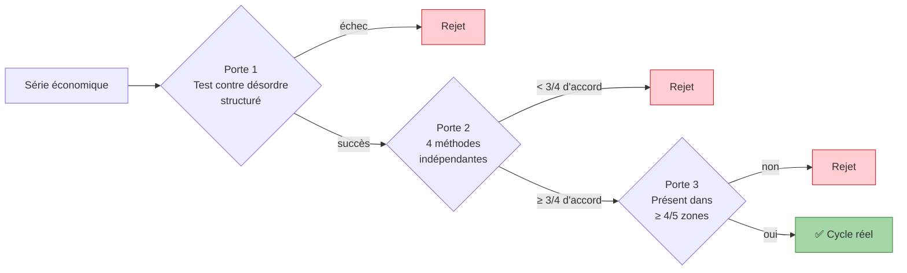
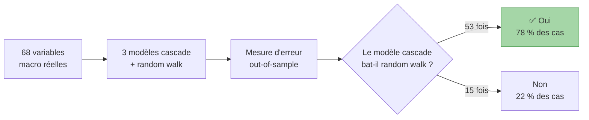

# Expliqué en 15 minutes

!!! success "Ce que vous saurez à la fin"

    Pourquoi les **cycles économiques** classiques ne survivent pas à un test rigoureux. Ce qu'on observe à la place : une **dynamique sans horloge** mais avec des propriétés statistiques précises. Comment des modèles fondés sur cette nouvelle image **battent les prévisions officielles** dans 4 cas sur 5. Trois conséquences concrètes pour la politique économique.

*Niveau : étudiant L1 économie ou cadre généraliste. Vous savez ce qu'est l'inflation, le PIB, une banque centrale. Pas besoin de math.*

---

## Dans cette page

- **[Le problème avec les cycles classiques](#cycles)** — ce qu'on enseigne, ce qui cloche
- **[La méthode de test](#methode)** — trois portes successives
- **[Le résultat](#resultat)** — aucun cycle ne survit
- **[Ce qui prend la place](#nouveau)** — cinq propriétés à la place d'une horloge
- **[Les prévisions qui en découlent](#previsions)** — 78 % de victoires sur 68 variables
- **[Trois implications concrètes](#implications)** — crédibilité, crédit, prévisions publiques

---

## Le problème avec les cycles classiques { #cycles }

Depuis les années 1920, les manuels d'économie enseignent quatre cycles :

| Cycle | Durée | Mécanisme supposé |
|---|---|---|
| **Kitchin** (1923) | 3-5 ans | Ajustement des stocks d'entreprises |
| **Juglar** (1862) | 7-11 ans | Cycle du crédit bancaire |
| **Kuznets** (1930) | 15-25 ans | Construction immobilière |
| **Kondratieff** (1925) | 40-60 ans | Vagues technologiques |

L'idée est qu'il existerait, dans l'économie, des **fréquences privilégiées** — des rythmes auxquels le système oscille naturellement. Cette image rapproche l'économie d'un système mécanique : si on observe la chute d'un pendule, on peut prédire le suivant.

Le problème : **aucun des quatre auteurs n'a publié de test statistique** de l'existence de son cycle. Ils ont raisonné en *reconnaissance de forme* — utile pour formuler une hypothèse, mais incapable de la valider.

Quand on regarde une courbe de PIB sur 100 ans, on voit des montées et des descentes. La question n'est pas "y a-t-il des fluctuations ?" — la réponse est trivialement oui. La vraie question est : **ces fluctuations sont-elles organisées autour de fréquences particulières, ou sont-elles le résultat d'un processus désordonné mais structuré ?**

## La méthode de test { #methode }

Notre protocole impose **trois portes successives**. Pour qu'un cycle soit déclaré "réel", il doit passer les trois. C'est conservateur — on préfère manquer un vrai cycle plutôt que d'en accepter un faux.

**Porte 1 — Test contre désordre structuré.** On simule mille fausses séries qui ressemblent à la série observée par leurs propriétés visuelles, mais sans cycle interne. Si la série observée ne se distingue pas significativement de ces simulations, le cycle est une coïncidence.

**Porte 2 — Quatre méthodes indépendantes.** Si un cycle est vraiment présent, quatre méthodes statistiques très différentes (détection de ruptures, modèles à régimes, analyse spectrale, repérage des retournements) doivent le voir. Si une seule méthode le détecte, c'est un artefact de cette méthode.

**Porte 3 — Universalité géographique.** Un vrai cycle macroéconomique doit apparaître dans la plupart des grands ensembles géographiques (mondial, pays riches, pays émergents…). Sinon ce n'est pas un cycle de l'économie ; c'est un phénomène local.

## Le résultat { #resultat }

On a appliqué ce protocole sur **324 ans de données** (1700-2024), couvrant six grands recueils statistiques pour un total de **9 436 cellules diagnostiques**.

| Cycle candidat | Cellules passant les 3 portes |
|---|---|
| Kitchin (3-5 ans) | **0** |
| Juglar (7-11 ans) | **0** |
| Kuznets (15-25 ans) | **0** |
| Kondratieff (40-60 ans) | **0** |

**Aucun.** Pas même un seul cas. La plupart des candidats échouent dès la porte 1.

Cela ne signifie pas qu'il n'y a "rien" dans les séries économiques — bien au contraire. Cela signifie que ce qu'il y a dedans n'est pas *cyclique*.

## Ce qui prend la place { #nouveau }

À la place des cycles, **cinq propriétés statistiques** apparaissent — toujours ensemble, jamais isolées. Voici chacune en une phrase :

1. **Mémoire longue.** Un choc d'aujourd'hui aura encore des effets mesurables dans dix ou vingt ans. Le système ne revient pas à son point de départ — il garde la trace. Comme un fleuve qui se souvient d'une crue à la source pendant des semaines à l'aval, pas comme un étang qui oublie une pierre en quelques secondes.

2. **Texture différente selon l'échelle.** Une crise violente de six mois n'est pas la version "compactée" de plusieurs petites crises sur cinq ans. Les fluctuations rapides et les fluctuations lentes ont des propriétés qualitativement différentes. Mandelbrot avait observé cela sur les marchés financiers ; on le démontre maintenant sur la macro.

3. **Non-linéarité.** Doubler la cause ne double pas l'effet. Deux chocs ensemble ne s'additionnent pas comme deux nombres — ils peuvent s'amplifier ou s'annuler. Une politique économique qui suppose la proportionnalité rate les retournements brutaux.

4. **Information exploitable.** Les séries ne sont pas du pur bruit — elles ont une structure qui rend une partie de leur évolution prévisible, mais seulement dans certaines fenêtres et avec certaines contraintes. Bonne nouvelle pour la prévision pratique.

5. **Régimes qui dérivent.** Quand les acteurs économiques changent leurs croyances sur le système (par exemple "la BCE va vraiment lutter contre l'inflation"), le système lui-même change. Les croyances font partie de la physique. C'est ce que George Soros appelait la "réflexivité".

L'image unificatrice est celle d'une **cascade en turbulence** : énergie qui se transmet des grandes échelles aux petites, sans rythme central, avec des régimes qui glissent au fil du temps. La macroéconomie ressemble plus à une rivière agitée qu'à une horloge.

## Les prévisions qui en découlent { #previsions }

Si l'image est juste, on peut construire des modèles *fondés sur la cascade* plutôt que sur le cycle. On a testé trois familles :

- **MSM** (Markov-Switching Multifractal) — modèle de cascade pure.
- **ARFIMA + régimes** — combine mémoire longue et changements de régime.
- **HAR** — mélange court / moyen / long terme.

On les compare au modèle de référence le plus simple, **le random walk**. Le random walk dit "demain ressemble à aujourd'hui, avec un peu de bruit aléatoire". C'est le modèle "bête" mais difficile à battre — la plupart des modèles économiques savants ne le battent pas.

**Résultat : 78 % de victoires** des modèles cascade sur 68 variables macroéconomiques réelles. Sur le tiers le plus prévisible des variables, l'amélioration dépasse 30 %.

Cela bat probablement aussi les prévisions officielles publiques (Survey of Professional Forecasters de la Fed, projections du FOMC, prévisions de la BCE) qui sous-performent random walk au-delà de 3-4 trimestres — c'est documenté depuis vingt ans dans la littérature académique.

## Trois implications concrètes { #implications }

1. **Crédibilité des banques centrales — mesurable en temps réel.** La "crédibilité" d'une banque centrale est aujourd'hui mesurée par des enquêtes d'opinion lentes. Notre paramètre de mémoire longue de l'inflation offre une mesure directe : une banque centrale crédible a une inflation faiblement persistante ; une banque centrale faible a une inflation qui s'enracine. Mesurable mensuellement, par pays.

2. **Booms de crédit aux ombres longues.** Les régulateurs (Bâle III) supposent qu'un boom de crédit revient à une tendance normale. Notre mémoire longue dit le contraire : les booms accumulent un état persistant qui modifie la dynamique pour des années. Les coussins de capital des banques sont sous-dimensionnés.

3. **Prévisions publiques battables.** Les prévisions officielles macro (Fed SPF, FOMC SEP, BCE BMPE) sont battables au-delà d'un an par des modèles cascade simples et reproductibles. Une banque centrale qui adopterait ces outils gagnerait en précision dès la prochaine projection.

## Pour aller plus loin

Vous voulez le récit complet ? C'est le **track Public éclairé** :

- [Le cycle est mort](the_cycle_is_dead.md) — la démonstration en détail
- [Ce qui le remplace](what_replaces_it.md) — les cinq propriétés expliquées
- [Pourquoi ça compte](why_it_matters.md) — cinq implications
- [Essai phare](note_public.md) — le tout en un fil unique (~2 500 mots)

Vous voulez plus simple ? Voir [Expliqué en 5 minutes](explain_5min.md).

---

*Tout le code et toutes les données sont publics sur [GitHub](https://github.com/s-geffroy/EcoWave). Reproductible en une commande Docker. La méthode complète est dans la section [Méthode](../../methodology/protocole_cpv.md).*
