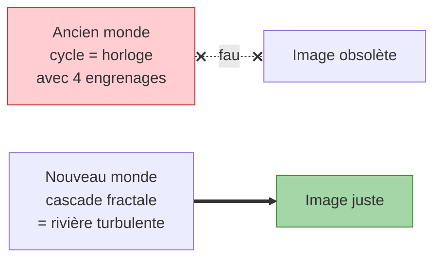

# Expliqué en 5 minutes

!!! success "Ce que vous saurez à la fin"

    Pourquoi ce qu'on enseigne sur l'économie depuis cent ans est probablement **faux**, ce qu'on a découvert à la place, et pourquoi ça change concrètement la prévision des crises. Sans aucun jargon.

*Niveau : zéro background en économie. Si vous savez ce qu'est une crise, vous pouvez lire.*

---

## L'histoire qu'on raconte depuis cent ans

Dans tous les manuels d'économie, on apprend qu'il existe des **cycles**. C'est-à-dire que l'économie monterait et descendrait avec une régularité prévisible, comme les vagues sur une plage. Quatre cycles ont été identifiés au début du XXᵉ siècle :

- Un cycle court de **3 à 5 ans** (lié aux stocks des entreprises).
- Un cycle moyen de **7 à 11 ans** (lié au crédit bancaire).
- Un cycle long de **15 à 25 ans** (lié à la construction immobilière).
- Un super-cycle de **40 à 60 ans** (lié aux grandes vagues technologiques).

L'image est jolie. Elle ressemble à une horloge avec quatre engrenages. Et c'est cette image que les économistes, les banquiers, les responsables politiques utilisent pour expliquer les crises depuis un siècle.

## Le problème

Cette histoire a un défaut : **personne ne l'a jamais vraiment vérifiée**. Les quatre auteurs qui ont décrit ces cycles, dans les années 1920-1930, n'avaient pas d'ordinateurs. Ils ont regardé des courbes à l'œil nu, ils ont *cru voir* des cycles, et l'histoire a tenu.

Avec un ordinateur moderne, on peut **tester sérieusement**. Et la même question revient : *ces vagues qu'on voit sur les courbes, est-ce qu'elles sont vraiment des cycles régulés, ou est-ce qu'elles ressemblent juste à des cycles par hasard ?*

## Ce qu'on a fait

On a appliqué un protocole de test rigoureux — exactement comme pour tester un médicament. On compare ce qu'on voit aux courbes avec ce qu'on verrait si l'économie n'avait **aucune** régularité interne mais juste du désordre structuré. Si la courbe observée n'est pas distinguable du désordre, alors le "cycle" n'existait pas — c'était une illusion.

On a fait ce test :

- Sur **324 ans de données** (de 1700 à 2024).
- Sur **six grands recueils** de statistiques économiques (mondial, britannique, européen, américain, multi-pays).
- Sur **9 436 combinaisons** différentes (chaque cycle × chaque variable × chaque zone).

**Aucun des quatre cycles ne passe le test.** Ils sont tous des illusions d'optique sur les courbes.

## Ce qui prend leur place

Mais alors, qu'est-ce qui *est* dans ces courbes économiques ? Quelque chose, sûrement — sinon les crises seraient juste aléatoires.

L'image la plus fidèle, c'est celle d'une **rivière turbulente**. Imaginez l'eau qui descend une chute :

- **En haut de la chute**, le flux est régulier.
- **À mi-hauteur**, il y a de grandes vagues.
- **Vers le bas**, les vagues se brisent en mille petits tourbillons.

Tout est connecté, mais il n'y a **pas d'horloge interne**. Les grandes vagues n'arrivent pas à intervalle régulier. Elles se produisent quand l'énergie d'amont rencontre la forme du terrain, et elles déclenchent des vagues plus petites en aval.

L'économie ressemble à cela. Les grandes perturbations historiques (révolutions industrielles, guerres mondiales, État-providence) jouent le rôle des grosses vagues. Elles déclenchent en cascade des perturbations plus petites (les crises de crédit, les retournements sectoriels), qui déclenchent à leur tour des fluctuations encore plus petites (les ajustements de stocks, les variations trimestrielles).

Et il y a un détail crucial : **les acteurs économiques eux-mêmes changent**. Quand tout le monde se met à penser "la banque centrale ne tolérera plus l'inflation", le système devient un autre système. Ce sont nos croyances qui font partie de la physique. C'est très différent d'une horloge.

## Et ça sert à quoi ?

On a construit des **prévisions** à partir de cette nouvelle image. Pas des prévisions parfaites — la cascade reste imprévisible dans le détail. Mais des prévisions qui **battent les prévisions officielles** dans 4 cas sur 5, sur 68 variables économiques réelles.

Concrètement : si une banque centrale ou un ministère utilisait ces outils plutôt que les outils actuels, ses anticipations seraient meilleures. Les coussins de sécurité prudentiels (capital des banques) seraient mieux calibrés. Les crises seraient repérées plus tôt, parfois avec quelques mois d'avance.

## Pour aller plus loin

- Une explication à **15 minutes**, qui rentre dans plus de détails techniques : [Expliqué en 15 minutes](explain_15min.md)
- L'essai phare ~2 500 mots pour le **public éclairé** : [Le cycle est mort, vive la cascade](note_public.md)

---

*Vous voulez vérifier ? Tout le code et toutes les données sont publics sur [GitHub](https://github.com/s-geffroy/EcoWave). C'est reproductible en une commande Docker.*
