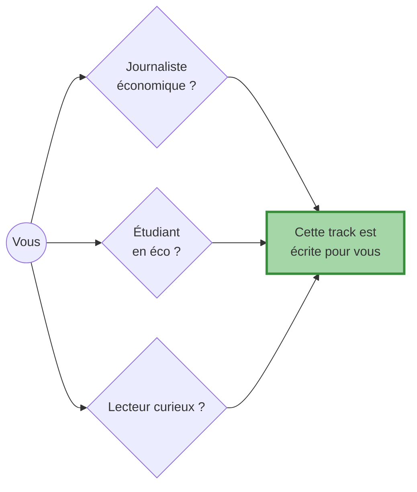
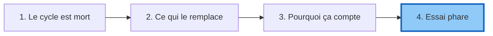

# Public éclairé

!!! success "TL;DR"

    *Vous n'avez pas besoin de connaître la statistique avancée.* Cette
    track raconte en français accessible, avec analogies physiques, **pourquoi
    les 4 cycles canoniques sont morts** et **par quoi la macroéconomie est
    mieux décrite** : une cascade fractale, plutôt qu'une horloge. La preuve
    opérationnelle : des modèles cascade **battent random walk sur 78 % de
    68 variables macro réelles**.

## Dans cette page

- **[Pour qui c'est écrit](#pour-qui)** — journalistes, étudiants, curieux
- **[Les 4 pages de la track](#les-4-pages)** — diagramme du parcours
- **[L'essai phare](#essai-phare)** — 2 500 mots prêts à être lus d'une vue

---

## Pour qui { #pour-qui }

Si vous avez déjà lu un ou deux articles sur "les cycles économiques", vous avez ce qu'il faut. Pas de jargon non-expliqué. Pas de formule sans interprétation.

---

## Les 4 pages { #les-4-pages }

-   :material-skull-crossbones:{ .lg .middle } **[Le cycle est mort](the_cycle_is_dead.md)**

    ---

    Comment on a testé sérieusement les quatre cycles canoniques (Kitchin, Juglar, Kuznets, Kondratieff), et pourquoi aucun n'a survécu.

    **Lecture** : ~10 min · ~1 200 mots

-   :material-waves:{ .lg .middle } **[Ce qui remplace les cycles](what_replaces_it.md)**

    ---

    Cinq propriétés statistiques. Une métaphore (la cascade en turbulence). Un changement radical de vision de la macroéconomie.

    **Lecture** : ~13 min · ~1 500 mots

-   :material-target:{ .lg .middle } **[Pourquoi ça compte](why_it_matters.md)**

    ---

    Cinq implications concrètes pour la politique monétaire, le risque, et la prévision.

    **Lecture** : ~11 min · ~1 300 mots

-   :material-book-open-page-variant:{ .lg .middle } **[Essai phare](note_public.md)**

    ---

    Le récit complet, prêt à être lu d'une vue. Tresse les trois pages précédentes en un seul fil narratif.

    **Lecture** : ~20 min · ~2 500 mots

---

## L'essai phare { #essai-phare }

!!! tip "Si vous ne lisez qu'une seule chose"

    **[Le cycle est mort, vive la cascade →](note_public.md)**

    Cet essai de ~2 500 mots condense tout ce qu'il faut savoir : l'histoire racontée pendant un siècle, la démonstration, ce qui prend la place des cycles, et les cinq implications concrètes. Lisez-le d'une traite.

---

## Pour aller plus loin

| Vous voulez... | Allez vers |
|---|---|
| Voir le verdict opérationnel chiffré | [Forecast benchmark consolidé](../../forecast_benchmark.md) |
| Comprendre le détail technique | [Track Quants](../quants/index.md) |
| Voir les implications BC | [Track Banque centrale](../bc/index.md) |
| Lire le travail académique | [Track Académique](../acad/index.md) |
| Naviguer par profil ou question | [Comment naviguer](../../how_to_navigate.md) |
| Vérifier un terme technique | [Glossaire](../../glossary.md) |
| Voir les données sources | [Sources de données citées](../../data_sources_cited.md) |
