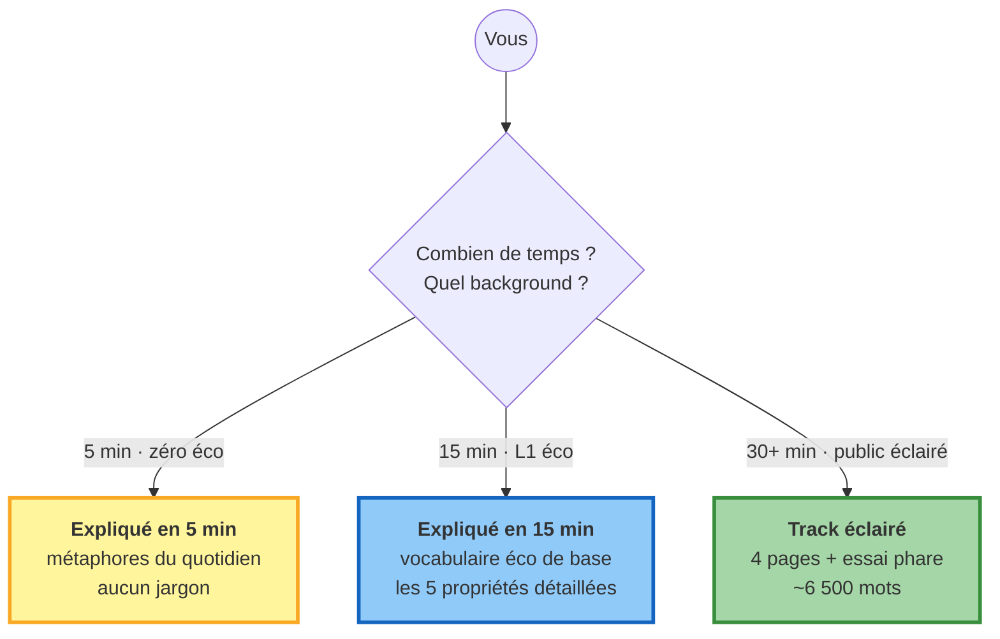

# Public

!!! success "TL;DR"

    Cette track propose **trois niveaux d'entrée** selon votre background et votre temps. Choisissez le vôtre : 5 minutes zéro-jargon (journaliste, lycéen, voisin curieux), 15 minutes niveau L1 éco (étudiant, cadre généraliste), ou public éclairé (4 pages + essai phare ~2 500 mots).

## Dans cette page

- **[Choisir votre niveau](#niveaux)** — 3 portes selon votre background
- **[Pour le public éclairé : les 4 pages](#les-4-pages)** — diagramme du parcours
- **[L'essai phare](#essai-phare)** — 2 500 mots prêts à être lus d'une vue

---

## Choisir votre niveau { #niveaux }

-   :material-clock-fast:{ .lg .middle } **[Expliqué en 5 minutes](explain_5min.md)**

    ---

    *Pour un journaliste, un lycéen, un voisin curieux.* Zéro background en économie nécessaire. Métaphores du quotidien (rivière, météo, vagues). Aucun jargon.

    **Lecture** : ~5 min · ~600 mots

-   :material-clock-outline:{ .lg .middle } **[Expliqué en 15 minutes](explain_15min.md)**

    ---

    *Pour un étudiant L1 éco ou un cadre généraliste.* Vous connaissez inflation, PIB, banque centrale. On rentre dans les 5 propriétés et les 3 implications concrètes.

    **Lecture** : ~15 min · ~1 200 mots

-   :material-book-open-variant:{ .lg .middle } **Public éclairé** (4 pages ci-dessous)

    ---

    *Pour le lecteur de presse économique, le curieux exigeant.* Le récit complet en 4 étapes, avec analogies physiques et chiffres-clés. Pas de jargon non-expliqué.

    **Lecture** : ~30-50 min · ~6 500 mots

---

## Pour le public éclairé { #les-4-pages }

Si vous avez déjà lu un ou deux articles sur "les cycles économiques", vous avez ce qu'il faut. Pas de jargon non-expliqué. Pas de formule sans interprétation.

---

### Les 4 pages du parcours { #parcours }

-   :material-skull-crossbones:{ .lg .middle } **[Le cycle est mort](the_cycle_is_dead.md)**

    ---

    Comment on a testé sérieusement les quatre cycles canoniques (Kitchin, Juglar, Kuznets, Kondratieff), et pourquoi aucun n'a survécu.

    **Lecture** : ~10 min · ~1 200 mots

-   :material-waves:{ .lg .middle } **[Ce qui remplace les cycles](what_replaces_it.md)**

    ---

    Cinq propriétés statistiques. Une métaphore (la cascade en turbulence). Un changement radical de vision de la macroéconomie.

    **Lecture** : ~13 min · ~1 500 mots

-   :material-target:{ .lg .middle } **[Pourquoi ça compte](why_it_matters.md)**

    ---

    Cinq implications concrètes pour la politique monétaire, le risque, et la prévision.

    **Lecture** : ~11 min · ~1 300 mots

-   :material-book-open-page-variant:{ .lg .middle } **[Essai phare](note_public.md)**

    ---

    Le récit complet, prêt à être lu d'une vue. Tresse les trois pages précédentes en un seul fil narratif.

    **Lecture** : ~20 min · ~2 500 mots

---

## L'essai phare { #essai-phare }

!!! tip "Si vous ne lisez qu'une seule chose"

    **[Le cycle est mort, vive la cascade →](note_public.md)**

    Cet essai de ~2 500 mots condense tout ce qu'il faut savoir : l'histoire racontée pendant un siècle, la démonstration, ce qui prend la place des cycles, et les cinq implications concrètes. Lisez-le d'une traite.

---

## Pour aller plus loin

| Vous voulez... | Allez vers |
|---|---|
| Voir le verdict opérationnel chiffré | [Forecast benchmark consolidé](../../forecast_benchmark.md) |
| Comprendre le détail technique | [Track Quants](../quants/index.md) |
| Voir les implications BC | [Track Banque centrale](../bc/index.md) |
| Lire le travail académique | [Track Académique](../acad/index.md) |
| Naviguer par profil ou question | [Comment naviguer](../../how_to_navigate.md) |
| Vérifier un terme technique | [Glossaire](../../glossary.md) |
| Voir les données sources | [Sources de données citées](../../data_sources_cited.md) |
