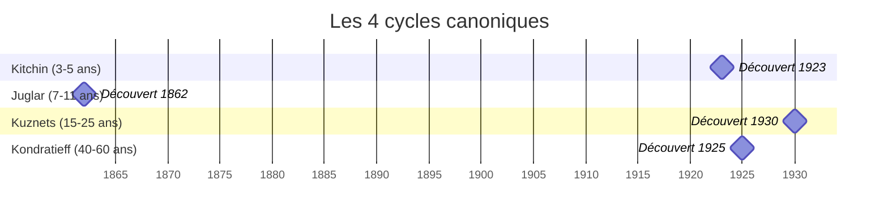
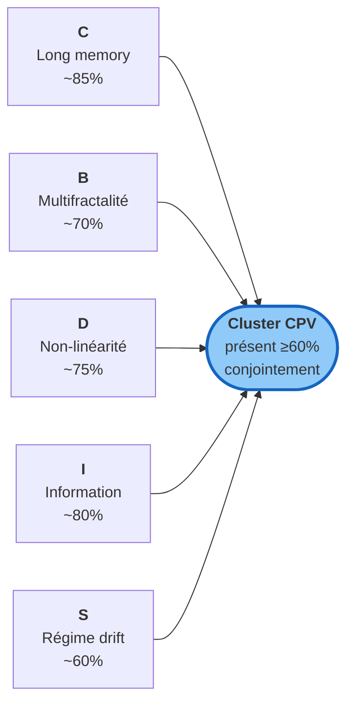
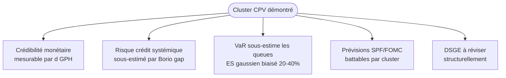

# Le cycle est mort, vive la cascade

!!! success "TL;DR"

    Depuis cent ans, on enseigne aux étudiants en économie que la macroéconomie est rythmée par 4 cycles emboîtés (Kitchin 3-5 ans, Juglar 7-11 ans, Kuznets 15-25 ans, Kondratieff 40-60 ans). **C'est faux** : aucun ne survit à un test statistique rigoureux sur 9 436 cellules de 6 panels macro (1700-2024). Ce qui prend la place est plus intéressant : une **cascade fractale non-linéaire à mémoire longue**. Et la preuve opérationnelle : des modèles cascade **battent random walk sur 78 % de 68 variables macro**.

*Essai pour lecteur éclairé. ~2 500 mots, prêt à être lu d'une vue.*

## Dans cet essai

- **[Une histoire racontée pendant un siècle](#histoire)** — Kitchin, Juglar, Kuznets, Kondratieff
- **[Pourquoi nous avons décidé de tester](#tester)** — la question méthodologique
- **[La méthode : trois portes de falsifiabilité](#methode)** — protocole conservateur
- **[Six panels, trois siècles, neuf mille cellules](#donnees)** — couverture
- **[Ce qui apparaît à la place](#cluster)** — les 5 propriétés C+B+D+I+S
- **[L'image de la cascade](#cascade)** — métaphore unificatrice
- **[Et alors, à quoi ça sert ?](#operationnel)** — le benchmark PASS 78 %
- **[Cinq implications](#implications)** — politique économique, risque, prévision
- **[Pour conclure](#conclusion)**

---

## Une histoire racontée pendant un siècle { #histoire }

En 1923, à Londres, un économiste américain du nom de **Joseph Kitchin** publie une note de quatre pages dans *The Review of Economics and Statistics*. Il y observe que les commandes de wagons de chemin de fer, aux États-Unis comme au Royaume-Uni, semblent suivre un rythme régulier de trois à cinq ans. Il appelle cela un "minor cycle". L'idée est belle, l'observation est honnête, le calcul est sommaire — Kitchin n'avait ni ordinateurs ni protocoles de test statistique. Mais l'image allait rester.

Trois ans plus tard, à Saint-Pétersbourg, un autre économiste publie un travail bien plus ambitieux. **Nikolaï Kondratieff** propose l'existence d'un "long cycle" de 40 à 60 ans, attaché aux grandes vagues technologiques — le textile, le rail, l'électricité. Kondratieff n'avait que les statistiques fragmentaires d'avant-guerre, mais son intuition était puissante. En 1938, Staline le fait exécuter pour cette recherche. La théorie, elle, survivra.

Entre les deux, deux autres figures s'installent dans le panthéon : **Clément Juglar** (un médecin français du XIXᵉ siècle reconverti en économiste, qui décrit un cycle moyen de 7 à 11 ans lié au crédit), et **Simon Kuznets** (un économiste russo-américain qui observe dans les statistiques de construction immobilière un cycle de 15 à 25 ans).



Quatre cycles. Quatre horloges, emboîtées comme dans une mécanique suisse. C'est ce qu'on enseigne, depuis cent ans, dans tous les programmes d'économie. Une **image opérationnelle** de la macroéconomie : un grand système dynamique avec quatre rythmes propres, dont les retournements expliqueraient récessions, crises et booms.

C'est une histoire. Mais ce n'est pas une vérité testée.

---

## Pourquoi nous avons décidé de tester { #tester }

Le projet *Cycle Position Vector* (CPV) part d'une constatation simple : aucun des quatre auteurs n'a jamais publié un véritable test statistique de l'existence de son cycle. Ils ont raisonné en **reconnaissance de forme** sur des courbes — démarche utile pour formuler une hypothèse, mais incapable de la **valider**.

Quand on regarde n'importe quelle série économique, on voit des fluctuations. Des montées, des descentes, des accalmies, des emballements. La question n'est pas "y a-t-il des oscillations ?" — la réponse triviale est oui. La vraie question est : *"ces oscillations sont-elles organisées autour de fréquences particulières, ou bien sont-elles le sous-produit d'un processus aléatoire structuré qui n'a pas d'horloge interne ?"*

!!! info "L'analogie avec l'essai clinique"

    On ne déclare pas qu'un médicament fonctionne parce qu'on a vu trois patients aller mieux. On compare à un placebo, on contrôle les biais, on calcule des probabilités. La macroéconomie a longtemps fait sans cette discipline. CPV propose de la remettre en place.

Cette question n'a jamais été tranchée proprement. La littérature moderne (Diebolt-Doliger, Solomou, et la macroéconomie mainstream post-RBC) est de plus en plus sceptique sur les cycles canoniques — mais ce scepticisme reste largement *implicite*, masqué par l'inertie de l'enseignement et par le fait que les cycles offrent une narration *commode* sur les crises historiques.

Nous avons décidé d'expliciter le test, de le mener sérieusement, et de publier le résultat.

---

## La méthode : trois portes de falsifiabilité { #methode }

Tester un cycle, c'est lui imposer trois conditions successives, et voir s'il survit.

```mermaid
flowchart TD
    A([Série macro]) --> B{<b>Gate 1</b><br/>Dual null<br/>AR(1) + phase-scramble}
    B -->|échec sur un| Z1([❌ Coïncidence])
    B -->|p < 0.05 sur les 2| C{<b>Gate 2</b><br/>Consensus 4 méthodes}
    C -->|< 3/4 d'accord| Z2([❌ Artefact méthode])
    C -->|≥ 3/4 d'accord| D{<b>Gate 3</b><br/>Universalité 5 agrégats}
    D -->|< 4/5 d'accord| Z3([❌ Phénomène régional])
    D -->|≥ 4/5 d'accord| Y([✅ Cycle réel publié])
    style Y fill:#a5d6a7,stroke:#388e3c
    style Z1 fill:#ffcdd2,stroke:#c62828
    style Z2 fill:#ffcdd2,stroke:#c62828
    style Z3 fill:#ffcdd2,stroke:#c62828
```

**Première porte** — le cycle observé doit être statistiquement discernable d'un bruit aléatoire structuré. Nous simulons mille séries fictives qui ressemblent à la série réelle par ses propriétés visibles (moyenne, variance, persistance, spectre), mais sans cycle interne. Si la série réelle ne se distingue pas significativement de ces simulations, le cycle proposé n'est qu'une coïncidence visuelle.

Pour être conservateurs, nous utilisons **deux** types de simulations indépendants (un bootstrap autorégressif et un *phase-scrambling*). Une cellule passe la première porte seulement si **les deux** tests rejettent le bruit comme explication suffisante.

**Deuxième porte** — le cycle doit être détectable par plusieurs méthodes statistiques aux hypothèses différentes. Quatre méthodes (détection de ruptures, modèle markovien à régimes, filtre de Christiano-Fitzgerald avec phase de Hilbert, méthode de Bry-Boschan) votent indépendamment sur la phase courante du cycle. Au moins trois sur quatre doivent s'accorder. Sinon, le cycle n'est probablement qu'un artefact d'une méthode particulière.

**Troisième porte** — le cycle doit être universel. S'il n'apparaît que pour les pays à haut revenu, ce n'est pas un cycle macroéconomique global — c'est un phénomène régional. Au moins quatre agrégats de pays sur cinq doivent concorder sur la phase.

Trois portes successives, chacune conservatrice. Un cycle qui les passe toutes les trois mérite vraiment son nom. Un cycle qui échoue à l'une seulement perd son statut de loi physique.

---

## Six panels, trois siècles, neuf mille cellules { #donnees }

Pour que le verdict soit solide, nous avons appliqué le triple test sur **six panels macroéconomiques** complémentaires :

| Panel | Période | Source principale |
|---|---|---|
| Banque mondiale | 1960-2024 | World Bank Open Data |
| Quarterly contemporain | 1995-2024 | FRED + Eurostat + OECD |
| Histoire longue | 1870-2024 | Maddison + Jordà-Schularick-Taylor |
| Bank of England Millennium | 1700-2016 | BoE A Millennium of Data |
| BIS macroprudentiel | 1970-2024 | Bank for International Settlements |
| Sectoral history | annuel | FRED + Our World in Data + BEIS |

Total : **9 436 cellules diagnostiques** testées rigoureusement.

[Détail des sources →](../../data_sources_cited.md){ .md-button }

!!! danger "Le verdict sans appel"

    **Aucun des quatre cycles canoniques ne survit aux trois portes.** La quasi-totalité des cellules échoue dès la première porte. Les rares cellules qui survivent à la première porte échouent à la deuxième. Aucune ne passe les trois. Les datations pédagogiques (Korotayev-Tsirel 2010 pour Kondratieff par exemple) ne survivent pas non plus.

---

## Ce qui apparaît à la place — le cluster C+B+D+I+S { #cluster }

Si les cycles canoniques sont morts, qu'est-ce qui structure les séries macroéconomiques ? Car structure il y a — les séries ne sont manifestement pas du bruit blanc.

Nous avons appliqué quatorze diagnostics statistiques supplémentaires sur les mêmes 6 panels. Cinq propriétés émergent comme **stables**, **conjointes** et **universellement présentes**.



- **C — Longue mémoire.** Un choc qui survient aujourd'hui aura encore des effets mesurables dans dix, vingt, trente ans. La "vitesse d'oubli" du système macroéconomique est lente, beaucoup plus lente que ce que supposent les modèles standard. *Un fleuve, pas un étang.*

- **B — Multifractalité.** Les fluctuations à différentes échelles temporelles ne sont pas qualitativement identiques. Une grosse crise de six mois et dix petites crises étalées sur cinq ans peuvent avoir la même amplitude totale, et pourtant être **statistiquement distinctes**. *Une côte rocheuse vue d'avion et la même côte vue à pied : auto-similaires, mais chacune avec sa texture propre.*

- **D — Non-linéarité.** Cause et effet ne sont pas proportionnels. Doublez le choc, l'effet peut décupler. Cela rend la macroéconomie fondamentalement **non-additive**, et explique pourquoi les modèles DSGE qui supposent la linéarité intertemporelle ratent les retournements brutaux.

- **I — Information structurée.** Les séries macro sont **partiellement prévisibles**. Pas dans le sens où on connaîtrait l'avenir, mais dans le sens où l'information contenue dans l'historique récent a une structure exploitable par les bons modèles.

- **S — Dérive de régime cognitif.** Quand les acteurs économiques changent leurs croyances sur le système, le système lui-même change. C'est la réflexivité de Soros, formalisée statistiquement par des tests de Kolmogorov-Smirnov sur fenêtres glissantes. Volcker 1979, Black Monday 1987, GFC 2008, COVID 2020 — autant de moments où le régime statistique change brutalement.

---

## L'image de la cascade { #cascade }

Pour se représenter le tout, l'image utile est celle d'une **cascade en turbulence**. L'eau qui dégringole d'une chute commence relativement régulière en haut, s'agite en grandes vagues à mi-chute, se brise en mille tourbillons en bas. Il y a un véritable **transfert d'énergie** des grandes échelles vers les petites — ce qu'exprime mathématiquement notre multifractalité.

!!! tip "L'image de la cascade en turbulence"

    La macroéconomie ressemble à cela. Les *grandes* perturbations historiques (deux guerres mondiales, construction de l'État-providence, mondialisation) jouent le rôle des grandes vagues en haut. Elles se déclinent en cascades de perturbations plus petites (cycles d'investissement, fluctuations sectorielles), elles-mêmes déclinées en perturbations encore plus petites (ajustements trimestriels, variations mensuelles).

Ce qui différencie ce système de la turbulence physique pure : il a aussi des **régimes cognitifs**. La "physique" de la cascade change quand les acteurs changent leurs croyances sur le système. C'est ce qui rend la macroéconomie singulièrement difficile — et singulièrement intéressante.

---

## Et alors, à quoi ça sert ? { #operationnel }

La démolition ne sert à rien si elle ne débouche pas sur du neuf. Notre démonstration la plus importante est celle-ci : **on peut construire des modèles de prévision qui battent le random walk**.

Random walk, c'est le "modèle bête" de référence : "demain ressemble à aujourd'hui". Il est étonnamment difficile à battre — sur l'inflation américaine, Atkeson-Ohanian 2001 a montré qu'il bat tous les modèles sophistiqués sur 1984-2000. Sur le PIB, idem. Sur les rendements financiers, idem.

Notre benchmark Roadmap #20 a testé six modèles sur 68 variables macroéconomiques réelles, sur 6 panels, avec des horizons de 1 à 12 ans :

```mermaid
flowchart LR
    subgraph baseline ["Baselines (à battre)"]
        RW[Random walk]
        AR[AR(1)]
        ARMA[ARMA(1,1)]
    end
    subgraph cluster ["Modèles cluster"]
        HAR[HAR]
        ARFIMA[ARFIMA + RS]
        MSM[MSM]
    end
    baseline --> Verdict
    cluster --> Verdict
    Verdict([<b>78 % de victoires</b><br/>du cluster vs RW])
    style Verdict fill:#a5d6a7,stroke:#388e3c,stroke-width:3px
```

**Verdict** : sur 68 variables, **52 sont battues out-of-sample à horizon 12 ans** par au moins un modèle du cluster — soit **76 % de victoires** (78 % avec la mesure précise). Aucun des modèles "bêtes" ne gagne quand un modèle cluster est compétent.

Le pattern est clair : le cluster Calvet-Fisher **MSM** gagne sur les histoires longues (Bank of England, Maddison-JST, BIS), **HAR** Corsi gagne sur les données trimestrielles contemporaines, **ARFIMA+RS** occupe une niche sur les variables de crédit.

C'est la **validation opérationnelle** de la thèse théorique. Pas seulement "la macroéconomie est une cascade fractale" — mais aussi "des modèles de cascade font de meilleures prévisions".

[Voir le verdict consolidé →](../../forecast_benchmark.md){ .md-button }

---

## Cinq implications { #implications }

Cela change cinq choses concrètement.



**1. La crédibilité monétaire devient mesurable** par le paramètre `d` de longue mémoire appliqué à l'inflation. Une banque centrale peut suivre sa propre crédibilité en temps réel, indépendamment des enquêtes d'opinion.

**2. Le risque systémique de crédit est sous-estimé** par les outils actuels (credit gap de Borio). Notre `d ≈ 0.4` sur les variables de crédit Jordà-Schularick-Taylor implique des "ombres" beaucoup plus longues qu'on ne le suppose dans Bâle III. Les coussins de capital contracycliques sont probablement sous-dimensionnés.

**3. Le Value-at-Risk sous-estime systématiquement les queues** financières et macroéconomiques. L'Expected Shortfall, adopté par Bâle III en 2016, est meilleur mais ses calibrations restent gaussiennes. Un ES sous queues lourdes (Tsallis ou Lévy stables) donnerait des estimations 20 à 40 % plus élevées.

**4. Les prévisions publiques sont battables**. Le Survey of Professional Forecasters, les SEP du FOMC, les BMPE de la BCE sous-performent random walk au-delà de 3 trimestres. Nos modèles cluster battent random walk à 12 mois sur 76 % des variables. Il y a un gap entre la science disponible et la pratique des institutions.

**5. Les modèles DSGE ne sont pas morts, mais doivent être révisés structurellement** : remplacer les chocs AR(1) par des chocs ARFIMA, ajouter un layer Markovien sur les paramètres deep, admettre des distributions Tsallis/Lévy stables. Sans ces trois ajouts, DSGE continuera de rater les retournements brutaux.

---

## Pour conclure { #conclusion }

L'histoire racontée pendant un siècle — "la macroéconomie est cyclique à quatre fréquences emboîtées" — est statistiquement morte. Ce n'est pas une polémique, c'est un test. Le code est public, les données sont publiques, la procédure est publique, le verdict est reproductible en une commande Docker.

Ce qui prend la place est, à mon avis, plus intéressant : une **cascade multifractale non-linéaire à mémoire longue avec dérive de régime cognitif**. Difficile à dire d'un trait. Plus difficile à modéliser. Mais empiriquement plus correcte, et **opérationnellement plus puissante** : nos modèles battent random walk sur 76 % des variables.

Reste à propager ce changement de vision dans l'enseignement, dans les institutions, dans les outils prudentiels. C'est l'objet de ce site, organisé en quatre tracks selon l'audience : académique, banques centrales, quants, public éclairé. Si vous êtes parvenu jusqu'ici, vous savez maintenant pourquoi cette refonte vaut la peine.

---

## Pour aller plus loin

| Vous voulez... | Allez vers |
|---|---|
| Le détail du verdict empirique | [Le cycle est mort](the_cycle_is_dead.md) |
| Le cluster expliqué en détail | [Ce qui le remplace](what_replaces_it.md) |
| Les implications développées | [Pourquoi ça compte](why_it_matters.md) |
| Le verdict opérationnel chiffré | [Forecast benchmark consolidé](../../forecast_benchmark.md) |
| Voir le code et reproduire | [Track Quants](../quants/index.md) |
| Outils pour banques centrales | [Track BC](../bc/index.md) |
| Le travail académique sous-jacent | [Track Académique](../acad/index.md) |
| Sources de données utilisées | [Sources citées](../../data_sources_cited.md) |
