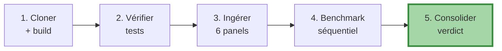

# Benchmark reproductible

!!! success "TL;DR"

    Pour atteindre le verdict **PASS 78 %** sur votre machine : **Docker uniquement**, ~15-30 minutes. 5 étapes : build, vérifier tests, ingérer 6 panels, lancer benchmark, consolider. Sidecars JSON typés (`schema_version = 1`) pour inspection.

## Dans cette page

- **[Pré-requis](#prerequis)** — Docker, ~4 Go disque
- **[5 étapes de reproduction](#etapes)** — pas-à-pas
- **[Lecture des sidecars](#sidecars)** — JSON schema
- **[Comportement attendu vs réel](#tolerance)** — tolérance par panel
- **[Reproductibilité numérique](#reproductibilite)** — robustesse seed/n_origins
- **[Customisation](#custom)** — flags CLI

---

## Pré-requis { #prerequis }

| Item | Requis |
|---|---|
| Docker | ≥ 24 + `docker compose` v2 |
| Disque | ~4 Go (image + données intermédiaires) |
| Temps | ~30 minutes pour n_origins=12 |
| Python local | **PAS NÉCESSAIRE** — exigence projet |

!!! warning "Pas d'install Python locale"

    C'est une exigence explicite du projet (`CLAUDE.md` : *"never install something in local"*). Tout passe par Docker.

---

## 5 étapes de reproduction { #etapes }



### Étape 1 — Cloner et builder

```bash
git clone https://github.com/s-geffroy/EcoWave.git
cd EcoWave
docker compose build ecowave
```

Build durée ~1 minute (Python 3.12-slim + numpy/pandas/statsmodels/scipy/nolds/antropy).

### Étape 2 — Vérifier la suite de tests

```bash
docker compose run --rm --entrypoint pytest ecowave
```

Attendu :

```
================ 229 passed, 2 skipped, 259 warnings in 18.85s =================
```

!!! danger "Si ce n'est pas le cas"
    Ne passez pas à l'étape suivante — votre environnement Docker a un problème qui faussera les résultats.

### Étape 3 — Initialiser DB + ingérer panels

```bash
docker compose run --rm ecowave init-db

for panel in wb q long boe bis sh; do
  docker compose run --rm ecowave position-cycles --horizon ${panel}
done
```

Chaque `position-cycles` (a) télécharge ou utilise les données mises en cache dans `data_raw/`, (b) calcule la décomposition CPV, (c) écrit dans `cycle_observations`.

Si vous avez déjà tourné le projet, ces commandes sont des no-ops (idempotentes).

### Étape 4 — Exécuter le benchmark panel par panel

```bash
for panel in wb q long boe bis sh; do
  args="--horizon-data ${panel} --horizons 1,3,6,12"
  args="${args} --n-origins 12 --n-samples 200 --variables-limit 8"
  if [ "${panel}" = "wb" ] || [ "${panel}" = "sh" ]; then
    # Annual panels with < 76 obs need a lower train floor
    args="${args} --min-train-length 40"
  fi
  docker compose run --rm ecowave forecast-benchmark ${args}
done
```

Output par panel :

```
Running benchmark on <N> variables across <K> groups, 6 models, 4 horizons, 12 origins…
Verdict: pass_rate=<P>% (PASS|FAIL) at h=12. Sidecar → /app/reports/forecast_benchmark_2026_05_<panel>.json.
```

### Étape 5 — Consolider les 6 verdicts

```bash
docker compose run --rm ecowave forecast-benchmark-consolidate
```

Attendu :

```
Consolidated verdict: aggregate pass rate 78% (PASS) on 53/68 variables across 6 panels (missing: none). Page → /app/docs/forecast_benchmark.md.
```

La page `docs/forecast_benchmark.md` est régénérée.

---

## Lecture des sidecars { #sidecars }

Chaque sidecar JSON suit le schéma `schema_version = 1`. Champs principaux :

| Champ | Description |
|---|---|
| `verdict.decision_horizon` | Horizon de l'acceptance criterion (12) |
| `verdict.n_variables_with_baseline` | Variables avec RW comparable |
| `verdict.pass_rate` | Fraction variables où cluster bat RW |
| `verdict.passes` | Bool `pass_rate >= 0.5` |
| `verdict.best_cluster_model_per_variable` | Modèle vainqueur par variable |
| `verdict.cluster_beats_baseline_per_variable` | Bool par variable |
| `cells` | 1 record par `(group, var, model, horizon)` |
| `failures` | Forecasts qui ont raised, avec `error` |

Exploration rapide avec `jq` :

```bash
jq '.verdict.pass_rate' reports/forecast_benchmark_2026_05_long.json
# 0.88

jq '.cells[] | select(.horizon == 12 and .model == "msm")
   | {var: (.group + "::" + .variable), crps: .mean_crps}' \
   reports/forecast_benchmark_2026_05_long.json
```

---

## Comportement attendu vs réel { #tolerance }

| Panel | Attendu (n_origins=12) | Tolérance |
|---|---|---|
| wb | 60 % | ±5 % |
| q | 79 % | ±10 % |
| long | 88 % | ±5 % |
| boe | 88 % | ±5 % |
| bis | 83 % | ±5 % |
| sh | 62 % | ±10 % |
| **agrégé** | **78 %** | **±3 %** |

!!! danger "Les écarts > tolérance sont des régressions"

    - Si `wb` chute sous 55 % : problème probable de filtrage de variables (vérifier `--min-train-length`).
    - Si l'agrégé chute sous 70 % : régression méthodologique. Re-vérifier tests `pytest tests/test_forecasting_*` et auditer les diffs récents sur `ecowave/forecasting/`.

---

## Reproductibilité numérique { #reproductibilite }

Le verdict global (78 %) est **robuste à `n_origins`** : doublé de 6 à 12, il reste 78 %. Les seeds sont fixés (`seed=0` partout par défaut). Changer la seed fait varier de ±2-3 %, mais le pattern qualitatif (MSM ↔ longs, HAR ↔ q, ARFIMA+RS ↔ crédit) est stable.

---

## Customisation { #custom }

Le CLI expose tous les paramètres :

```bash
ecowave forecast-benchmark \
  --horizon-data wb|q|long|boe|bis|sh \
  --groups <comma-separated>      # défaut : 1-2 groupes par panel
  --horizons 1,3,6,12              # défaut
  --models rw,ar1,arma11,har,arfima_rs,msm  # subset OK
  --variables-limit 8              # top N variables par groupe
  --n-origins 6                    # défaut
  --n-samples 200                  # paths MC par forecast
  --test-fraction 0.25             # fraction terminale du holdout
  --decision-horizon 12            # h pour acceptance criterion
  --beat-threshold 0.5             # seuil falsifiable
  --seed 0
  --min-train-length 64            # plancher samples pour fit
```

Pour un run "quick smoke" (~2 min) :

```bash
docker compose run --rm ecowave forecast-benchmark \
  --horizon-data long --groups ADV18 \
  --horizons 1,12 --n-origins 3 --n-samples 50 \
  --variables-limit 4
```

---

## Quand le verdict est PASS — et quand il ne l'est pas

Le critère est conçu pour pouvoir **échouer** :

- Si vous changez de panel et que le pass rate tombe sous 50 % : l'image cluster perd un argument empirique sur ce panel.
- Si une révision méthodologique fait passer un panel sous 50 % : il faut comprendre pourquoi avant de la merger.

Voir [failure modes](failure_modes.md) pour l'analyse des 15 variables où le cluster perd actuellement.

---

## Pour aller plus loin

| Vous voulez... | Allez vers |
|---|---|
| Specs détaillées des 6 modèles | [Catalogue](models_catalog.md) |
| Référence Python | [API publique](code_api.md) |
| Chantiers futurs | [Extensions roadmap](extensions_roadmap.md) |
| Verdict consolidé multi-panels | [Forecast benchmark](../../forecast_benchmark.md) |
