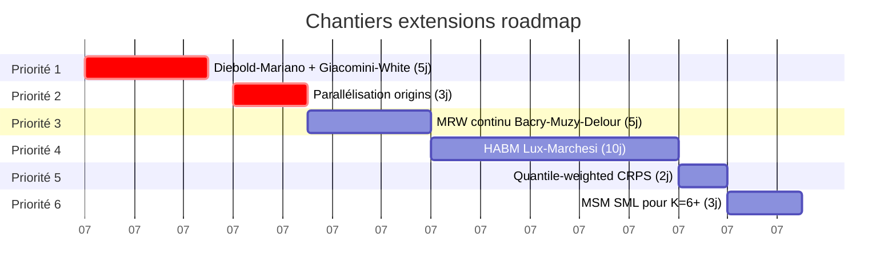

# Extensions roadmap

!!! success "TL;DR"

    **10+ chantiers** classés par priorité pour pousser le verdict au-delà des 78 % actuels. Top priorités : (1) **Diebold-Mariano + Giacomini-White** pour rigueur statistique (5 j), (2) **parallélisation origins** pour scaling (3 j), (3) **MRW continu** Bacry-Muzy-Delour (5 j), (4) **HABM** Lux-Marchesi pour explication mécaniste (10 j). Total effort estimé : ~60-80 jours pour le cluster complet.

## Dans cette page

- **[Modèles à ajouter](#nouveaux-modeles)** — HABM, MRW, AMH-ensemble, active inference
- **[Modèles déjà implémentés à raffiner](#raffinement)** — MSM K élargi, SML, ARFIMA(p,d,q)
- **[Scoring rules à ajouter](#scoring)** — Energy, Variogram, quantile-weighted CRPS
- **[Pipeline / infrastructure](#pipeline)** — parallélisation, rolling-window
- **[Cadre d'évaluation théorique](#evaluation)** — Diebold-Mariano, Giacomini-White
- **[Priorités suggérées](#priorites)** — matrice effort × impact

---

## Priorités suggérées { #priorites }



| Priorité | Item | Effort | Impact |
|---|---|---|---|
| **1** | Diebold-Mariano + Giacomini-White | 5 j | Crédibilité statistique du verdict |
| **2** | Parallélisation origins | 3 j | n_origins=20-30 facilement |
| **3** | MRW continu | 5 j | Test : régime-switching apporte-t-il vraiment ? |
| **4** | HABM | 10 j | Mécanique sous-jacente du cluster |
| **5** | Quantile-weighted CRPS | 2 j | Focus risque systémique |
| **6** | MSM SML pour K=6+ | 3 j | Calibration stable sur panels longs |

---

## Modèles à ajouter { #nouveaux-modeles }

### Heterogeneous Agent-Based Models (HABM)

**Référence** : Lux-Marchesi 1999 *Nature*, Brock-Hommes 1998 *JEDC*,
Hommes 2006 *Handbook of Computational Economics*.

**Pourquoi** : nos 3 modèles cluster (MSM, ARFIMA+RS, HAR) sont
*statistiques* — ils reproduisent la signature C+B+D+I+S sans expliquer
*pourquoi* elle émerge. Les HABM produisent la même signature par
*agrégation endogène d'agents à mémoires hétérogènes* — ils donnent
une explication mécaniste à la cascade.

**Spec proposée** : agents à `n_types` croyances différentes (chartistes,
fondamentalistes, momentum), switching endogène via utilité observée.

**Effort estimé** : ~10 jours. Probablement un module `agent_based.py`
dans `ecowave/forecasting/`, avec calibration via simulated method of
moments.

**Acceptance** : sur les variables où HABM est calibrable (séries
trimestrielles avec données de croyances disponibles type SPF), comparer
CRPS contre MSM. Hypothèse : HABM ≈ MSM sur prévision pure, gagne sur
*interprétabilité*.

### Multifractal Random Walk (MRW)

**Référence** : Bacry-Muzy-Delour 2001 *Physical Review E*.

**Pourquoi** : MRW est le modèle fondateur du cluster C+B+queues
lourdes sans régime switching. Si MSM bat MRW sur nos panels, c'est
que le régime-switching apporte vraiment quelque chose au-delà de la
cascade multifractale. Si MRW bat MSM, on simplifie.

**Spec proposée** : `MRW(λ², T, σ²)` — variance log-multifractale,
cutoff temporel `T`, volatilité unconditionnelle `σ`.

**Effort estimé** : ~5 jours. Plus simple que MSM (continuous-time
cascade au lieu de discrete Markov). Implémentation Cholesky sur
matrice de covariance log-volatility.

**Acceptance** : niche à identifier — probablement variables sans
S-signal fort (peu de régime drift). Diagnostic préalable via `S` test
de la pipeline existante.

### Adaptive Markets Hypothesis (AMH) implementé

**Référence** : Lo 2017 *Adaptive Markets*, Hommes-Lo 2024 *Oxford
Handbook*.

**Pourquoi** : AMH est un cadre conceptuel ; il n'a pas de modèle
calibrable canonique. Mais on pourrait construire un *ensemble* qui
mime l'idée : population de modèles concurrents avec poids évoluant
selon performance récente.

**Spec proposée** : ensemble `BMA-like` sur nos 6 modèles, avec poids
décroissants exponentiellement sur erreur CRPS récente.

**Effort estimé** : ~7 jours. Module `ensemble.py` + tests sur
synthétique (MRW + régime switch artificiel).

**Acceptance** : ensemble bat le meilleur modèle individuel par CRPS
sur ≥ 30 % des variables. Si oui, validation opérationnelle de AMH.
Si non, AMH reste cadre conceptuel.

### Active Inference / Free-Energy (Friston)

**Référence** : Friston 2010 *Nature Reviews Neuroscience*, applications
macro en émergence.

**Pourquoi** : le free-energy principle formalise la mise à jour
bayésienne de croyances sous incertitude. Lien naturel avec S
(regime drift) et I (information structurée). Très peu d'applications
macro pour le moment — c'est un boulevard.

**Spec proposée** : agents bayésiens avec generative model paramétré ;
mise à jour minimisant free-energy variationnel.

**Effort estimé** : ~15-20 jours (modèle complexe, paramètres
nombreux). Probablement une étude exploratoire dans un module séparé
avant de l'intégrer au benchmark.

## Modèles déjà implémentés à raffiner { #raffinement }

### MSM : étendre K

Aujourd'hui K = 4 (16 états). Calvet-Fisher trouvent typiquement
K = 6-8 optimal pour finance. À tester sur nos panels longs.

```python
MSMConfig(n_components=6)  # 64 états → ~50% plus lent qu'à K=4
```

Effort : 1 jour.

### MSM : SML (Simulated Maximum Likelihood) au lieu de ML direct

Calvet-Fisher 2004 recommandent SML pour K élevé. Notre ML par filtre
forward devient cher au-delà de K = 6.

Effort : ~3 jours.

### ARFIMA+RS : ARFIMA(p, d, q) au lieu de ARFIMA(0, d, 0)

Aujourd'hui pas de termes AR ni MA. Ajouter `p, q ∈ {1, 2}` peut
améliorer sur variables avec composante short-memory marquée.

Effort : ~3 jours. Réutilisation de statsmodels SARIMAX pour la
composante ARMA après différenciation Hosking.

### HAR : configuration multi-horizon

Aujourd'hui un seul `HARLagConfig` par série. Pour les panels mixtes,
on pourrait sélectionner par BIC sur des candidats `{(1, 3, 12),
(1, 2, 4), (1, 6, 24)}`.

Effort : ~2 jours.

## Scoring rules à ajouter { #scoring }

### Energy Score (multivariate generalization de CRPS)

**Référence** : Gneiting-Raftery 2007 §3.3.

**Pourquoi** : permet d'évaluer la dépendance jointe entre variables
prévues (par exemple cross-variable corrélation forecast vs réalisée).

**Effort** : ~1 jour pour `energy_score(samples_matrix, observation_vector)`.

### Variogram Score

**Référence** : Scheuerer-Hamill 2015.

**Pourquoi** : sensible aux corrélations temporelles inside la
prévision multi-horizon. Complément naturel à CRPS qui est marginal
par horizon.

**Effort** : ~1 jour.

### Quantile-weighted CRPS

**Pourquoi** : peser plus les queues qu'aujourd'hui. Sous-axe :
quantile-weighted CRPS donne plus de poids aux 5 % de queue, ce qui
matche mieux nos préoccupations risque systémique.

**Effort** : ~2 jours.

## Pipeline / infrastructure { #pipeline }

### Parallélisation des origins

Aujourd'hui pipeline séquentielle. Pour `n_origins = 12`, 6 modèles,
8 variables, 2 groupes, 6 panels → ~6 000 forecasts. Parallélisation
par `concurrent.futures` ou `joblib` réduirait `n_origins=12` à
~3 minutes au lieu de ~15.

**Effort** : ~3 jours. Principal challenge : statsmodels et scipy ne
sont pas tous thread-safe ; il faut probablement multi-process.

### Rolling-window calibration

Aujourd'hui les modèles sont re-fittés à chaque origin. Pour les
panels très longs, on pourrait fitter en rolling window plus large et
reforecaster — proxy pour adaptive learning.

**Effort** : ~5 jours. Ajouter `fit_window` parameter sur tous les
modèles.

### Diagnostic intra-cellule

Aujourd'hui le sidecar contient `mean_crps`, `mean_coverage_95`, etc.
mais on perd l'information des `n_origins` valeurs individuelles. Pour
les analyses fines (où la variance des CRPS provient), il faudrait
exposer la distribution.

**Effort** : ~2 jours. Backward-compatible : `schema_version = 2` avec
champ optionnel `origin_level_scores`.

### Cross-validation type "leave-one-decade-out"

Pour les panels longs (boe 1700-2016), tester un protocole où chaque
décennie sert tour à tour de test set, le reste de train set. Plus
robuste à la non-stationnarité historique que rolling-origin.

**Effort** : ~7 jours. Nouveau script CLI
`forecast-benchmark-decade-cv`.

## Cadre théorique d'évaluation { #evaluation }

### Test de Diebold-Mariano

**Référence** : Diebold-Mariano 1995 *J. Business & Econ. Stat.*.

**Pourquoi** : aujourd'hui notre acceptance criterion est "best cluster
< baseline en mean CRPS". C'est binaire. DM donne un test de
significativité statistique sur la différence des CRPS, panel par panel.

**Effort** : ~2 jours. Ajouter au sidecar `dm_pvalue_per_(group,
variable)`.

### Test de Giacomini-White

**Référence** : Giacomini-White 2006 *Econometrica*.

**Pourquoi** : version "conditional predictive ability" du DM, plus
robuste à l'hétéroscédasticité et à la non-stationnarité.

**Effort** : ~3 jours.

### Forecast horizon scaling laws

**Hypothèse** : la fraction de CRPS expliquée par chaque famille de
modèles devrait suivre une loi d'échelle en `h` (long memory plus
importante à h grand, regime switching plus important à h court).

**Effort exploratoire** : ~7 jours.

## Priorités suggérées

| Priorité | Item | Effort | Impact |
|---|---|---|---|
| **1** | Diebold-Mariano + Giacomini-White | 5 j | Donne crédibilité statistique forte au verdict |
| **2** | Parallélisation origins | 3 j | Permet n_origins=20-30 facilement |
| **3** | MRW | 5 j | Test si régime-switching apporte vraiment au cluster |
| **4** | HABM | 10 j | Mécanique sous-jacente du cluster |
| **5** | Quantile-weighted CRPS | 2 j | Renforce focus risque systémique |
| **6** | MSM SML pour K=6+ | 3 j | Calibration plus stable sur panels longs |

## Ouvert à la collaboration

Toutes ces extensions sont des chantiers indépendants. Si vous voulez
en prendre un, ouvrez une issue
[ici](https://github.com/s-geffroy/EcoWave/issues) avec votre design
note. Les PRs sont évalués sur (a) tests passants en Docker, (b)
mkdocs build --strict, (c) cohérence avec l'API `ProbabilisticForecast`,
(d) métrique d'acceptance falsifiable.
