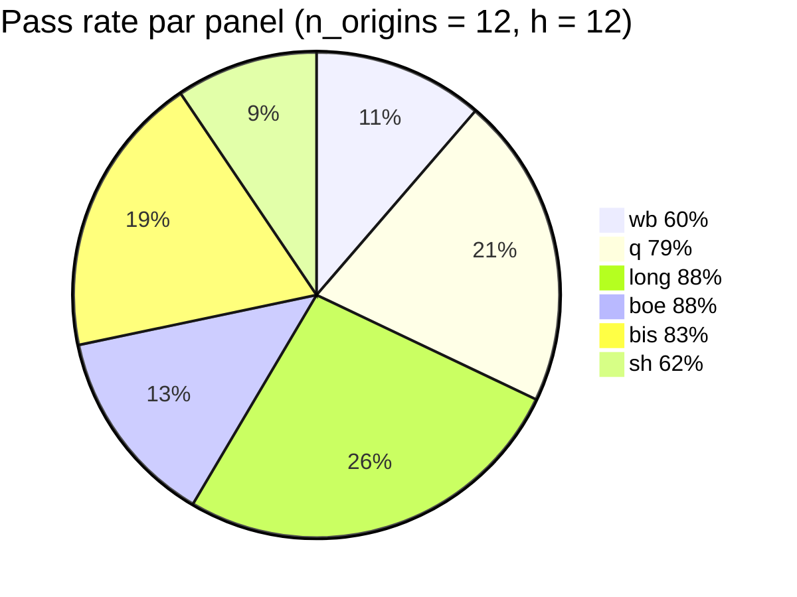
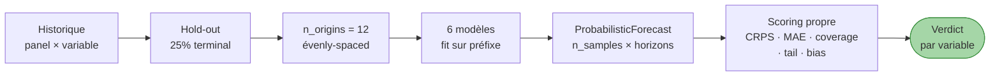

# Quants

!!! success "TL;DR"

    Pour data scientists, quants, forecasters, équipes risque. **6 modèles** (3 baselines stationnaires + 3 modèles cluster) testés sur **68 variables × 6 panels × 4 horizons** via protocole rolling-origin out-of-sample. Verdict : **PASS 78 %** à h = 12 par CRPS empirique. MSM gagne 23 fois (43 %), HAR 16 (30 %), ARFIMA+RS 14 (26 %). **Aucune baseline AR(1)/ARMA(1,1) ne gagne** quand un modèle cluster est compétent. Tout est reproductible Docker, code public sous MIT.

## Dans cette page

- **[Les 6 modèles en un schéma](#les-6-modeles)** — baselines vs cluster
- **[Le verdict consolidé](#le-verdict)** — chiffres par panel
- **[Pipeline benchmark](#pipeline)** — protocole rolling-origin
- **[Le contenu de la track](#contenu)** — 6 pages
- **[Reproduction Docker rapide](#reproduction-rapide)**

---

## Les 6 modèles { #les-6-modeles }

```mermaid
flowchart LR
    subgraph baseline ["3 baselines stationnaires"]
        RW[Random walk<br/>Gaussian]
        AR[AR(1)]
        ARMA[ARMA(1,1)]
    end
    subgraph cluster ["3 modèles cluster"]
        HAR[HAR Corsi 2009<br/>cascade par agrégation]
        ARFIMA[ARFIMA + Markov RS<br/>Bhardwaj-Swanson 2006]
        MSM[MSM Calvet-Fisher 2002<br/>cascade multifractale]
    end
    Bench{Benchmark<br/>out-of-sample<br/>CRPS}
    baseline --> Bench
    cluster --> Bench
    style cluster fill:#a5d6a7,stroke:#388e3c
    style baseline fill:#ffe0b2,stroke:#ef6c00
```

**Interface commune** : tous les modèles retournent un objet `ProbabilisticForecast` (matrice Monte Carlo `(n_samples, n_horizons)` sur le niveau). Permet CRPS empirique + coverage + tail coverage **sans hypothèse paramétrique**.

[Catalogue détaillé →](models_catalog.md){ .md-button }
[API publique →](code_api.md){ .md-button }

---

## Le verdict { #le-verdict }



| Panel | Pass rate | n vars | Vainqueur dominant |
|---|---|---|---|
| **wb** (1960-2024 annuel) | 60 % | 10 | MSM 4 · HAR 2 |
| **q** (1995-2024 trim.) | 79 % | 14 | HAR 8 · ARFIMA+RS 5 |
| **long** (1870-2024) | 88 % | 16 | MSM 8 · HAR 4 · ARFIMA+RS 2 |
| **boe** (1700-2016) | 88 % | 8 | MSM 6 · HAR 1 |
| **bis** (1970-2024 trim.) | 83 % | 12 | MSM 6 · ARFIMA+RS 3 · HAR 1 |
| **sh** (annuel court) | 62 % | 8 | MSM 2 · ARFIMA+RS 2 · HAR 1 |
| **AGRÉGÉ** | **78 %** | **68** | **MSM 23 · HAR 16 · ARFIMA+RS 14** |

[Verdict consolidé détaillé →](../../forecast_benchmark.md){ .md-button }

---

## Pipeline benchmark { #pipeline }



**Critère d'acceptance falsifiable** : pour chaque variable, le best cluster model gagne si son CRPS moyen < CRPS du random walk. Verdict global : pass rate ≥ 50 % (seuil falsifiable).

---

## Contenu de la track { #contenu }

<div class="grid cards" markdown>

-   :material-format-list-bulleted-type:{ .lg .middle } **[Catalogue des modèles](models_catalog.md)**

    ---

    Specs précises des 6 modèles : formules, paramètres, code paths, quand utiliser quoi par panel.

    **Lecture** : ~25 min · ~2 500 mots

-   :material-docker:{ .lg .middle } **[Benchmark reproductible](benchmark_reproducible.md)**

    ---

    Pas-à-pas Docker pour atteindre PASS 78 %. Setup, ingestion, exécution séquentielle des 6 panels, consolidation, lecture des sidecars.

    **Lecture** : ~20 min · ~2 000 mots

-   :material-api:{ .lg .middle } **[API publique](code_api.md)**

    ---

    Référence Python du module `ecowave.forecasting` : types, baselines, har, arfima_rs, msm, benchmark, reporting. Exemple end-to-end.

    **Lecture** : ~30 min · ~3 000 mots

-   :material-rocket-launch:{ .lg .middle } **[Extensions roadmap](extensions_roadmap.md)**

    ---

    10+ chantiers techniques chiffrés : HABM Lux-Marchesi, MRW Bacry-Muzy-Delour, AMH-ensemble, active inference, Diebold-Mariano, parallélisation.

    **Lecture** : ~25 min · ~2 500 mots

-   :material-alert-circle:{ .lg .middle } **[Failure modes](failure_modes.md)**

    ---

    Analyse honnête des 15 variables où le cluster perd. 4 patterns structurels : taux ZIRP, séries courtes, agrégats exogènes-driven, séries Wen.

    **Lecture** : ~20 min · ~2 000 mots

-   :material-file-document:{ .lg .middle } **[Note phare Quants](note_quants.md)**

    ---

    Note technique reproductible. TL;DR, motivation, méthode, verdict, robustesse, limites, implications praticien.

    **Lecture** : ~50 min · ~5 000 mots

</div>

---

## Reproduction Docker rapide { #reproduction-rapide }

!!! tip "En une commande shell"

    ```bash
    # Build + tests
    docker compose build ecowave
    docker compose run --rm --entrypoint pytest ecowave  # 225 passed attendu

    # Benchmark séquentiel (6 panels, ~15-30 min)
    for panel in wb q long boe bis sh; do
      args="--horizon-data ${panel} --horizons 1,3,6,12"
      args="${args} --n-origins 12 --n-samples 200 --variables-limit 8"
      if [ "${panel}" = "wb" ] || [ "${panel}" = "sh" ]; then
        args="${args} --min-train-length 40"
      fi
      docker compose run --rm ecowave forecast-benchmark ${args}
    done

    # Consolidation → docs/forecast_benchmark.md mis à jour
    docker compose run --rm ecowave forecast-benchmark-consolidate
    ```

[Détail pas-à-pas →](benchmark_reproducible.md){ .md-button }

---

## Pour aller plus loin

| Vous voulez... | Allez vers |
|---|---|
| Voir le verdict consolidé multi-panels | [Forecast benchmark](../../forecast_benchmark.md) |
| Les outils orientés banque centrale | [Track Banque centrale](../bc/index.md) |
| Le travail académique sous-jacent | [Track Académique](../acad/index.md) |
| Vulgariser pour collègues | [Track Public éclairé](../public/index.md) |
| Sources de données citées | [Sources citées](../../data_sources_cited.md) |
| Méthode CPV complète | [Méthode](../../methodology/protocole_cpv.md) |
| Diagnostics non-cycliques | [DX diagnostics](../../dx_diagnostics.md) |
