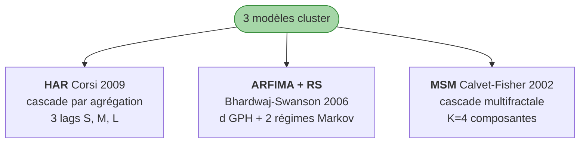

# Catalogue des modèles

!!! success "TL;DR"

    **6 modèles** = **3 baselines stationnaires** (RW, AR(1), ARMA(1,1)) + **3 modèles cluster** (HAR, ARFIMA+RS, MSM). Interface commune `ProbabilisticForecast(samples, horizons)`. **MSM** domine les histoires longues, **HAR** le quarterly contemporain, **ARFIMA+RS** la niche crédit. Verdict empirique : seul un modèle cluster gagne sur les 78 % de variables battues.

## Dans cette page

- **[Interface commune](#interface)** — `ProbabilisticForecast`
- **[Famille Baselines](#baselines)** — RW, AR(1), ARMA(1,1)
- **[Famille Cluster](#cluster)** — HAR, ARFIMA+RS, MSM
- **[Table comparative](#comparatif)** — caractéristiques par modèle
- **[Sélection par panel](#par-panel)** — vainqueurs empiriques

---

## Interface commune { #interface }

Tous les modèles partagent la signature :

```python
def model_forecast(
    history: np.ndarray,            # 1-D level series, no NaNs
    horizons: tuple[int, ...],      # forecast horizons in cadence steps
    n_samples: int = 1000,          # MC paths
    seed: int = 0,                  # RNG seed (deterministic)
    **config_specific_kwargs,
) -> ProbabilisticForecast
```

Retour : un `ProbabilisticForecast` portant `samples` de shape `(n_samples, len(horizons))`. Le sample-based representation est la *lingua franca* : empirical CRPS, coverage, tail coverage sont calculés sur la matrice sans hypothèse paramétrique.

[Code source `types.py` →](https://github.com/s-geffroy/EcoWave/blob/main/ecowave/forecasting/types.py){ .md-button }

---

## Famille 1 — Baselines stationnaires { #baselines }

```mermaid
flowchart TB
    Baselines([3 baselines]) --> RW[<b>Random walk</b><br/>X_t+h = X_t + Σ ε_k<br/>Gaussian]
    Baselines --> AR[<b>AR(1)</b><br/>X_t = c + φ X_t-1 + ε_t<br/>fallback RW si |φ| ≥ 0.999]
    Baselines --> ARMA[<b>ARMA(1,1)</b><br/>statsmodels SARIMAX<br/>fallback AR(1)]
    style Baselines fill:#ffe0b2,stroke:#ef6c00
```

### Random walk (RW)

**Spec** : `X_{t+h} = X_t + Σ_{k=1}^{h} ε_k` avec `ε_k ~ N(0, σ²)` estimé par la sample variance des first differences.

**Hypothèses** : pas de tendance, innovations gaussiennes indépendantes. La variance prédictive croît linéairement avec h.

!!! tip "Quand utiliser"
    Comme *benchmark de référence* — c'est le modèle qu'on doit battre. Jamais comme modèle final.

```python
forecast = random_walk_forecast(history, horizons=(1, 3, 12), n_samples=500, seed=0)
```

[Code `baselines.py` →](https://github.com/s-geffroy/EcoWave/blob/main/ecowave/forecasting/baselines.py){ .md-button }

### AR(1)

**Spec** : `X_t = c + φ X_{t-1} + ε_t` estimé par OLS. Pour `|φ| ≥ 0.999` (quasi-unit-root), fallback automatique vers RW.

**Quand utiliser** : comparateur stationnaire minimal. Si AR(1) bat RW de façon significative, la série est mean-reverting.

### ARMA(1, 1)

**Spec** : `X_t = c + φ X_{t-1} + ε_t + θ ε_{t-1}` estimé par ML via `statsmodels.tsa.SARIMAX(order=(1, 0, 1))`. Fallback AR(1) si non-convergence.

**Quand utiliser** : test du gain d'un terme MA. Modeste habituellement.

---

## Famille 2 — Cluster cascade { #cluster }



### HAR — Heterogeneous Autoregressive (Corsi 2009)

**Spec** : `y_t = c + b_s · S_{t-1} + b_m · M_{t-1} + b_l · L_{t-1} + ε_t` où `S, M, L` sont des moyennes glissantes à trois échelles.

**Defaults** : mensuel `(1, 3, 12)` ; trimestriel `(1, 2, 4)`.

**Hypothèses** : la longue mémoire empirique émerge de l'agrégation. Innovations gaussiennes homoscédastiques.

!!! tip "Quand utiliser"
    Quarterly contemporain ou monthly. Notre benchmark montre **16 wins** sur les 6 panels, dominants sur `q` (8/13).

```python
from ecowave.forecasting.har import HARLagConfig, har_forecast

forecast = har_forecast(
    history, horizons=(1, 3, 6, 12),
    n_samples=200, lag_config=HARLagConfig(1, 2, 4),  # quarterly
)
```

[Code `har.py` →](https://github.com/s-geffroy/EcoWave/blob/main/ecowave/forecasting/har.py){ .md-button }

### ARFIMA(0, d, 0) + Regime-Switching (Bhardwaj-Swanson 2006)

**Pipeline en 5 étapes** :


**Hypothèses** : longue mémoire exacte (`d ∈ (-0.5, 0.5)`) + dérive de régime cognitif à 2 états Markov.

**Fallback gracieux** vers single-regime ARFIMA(0, d, 0) si MarkovRegression ne converge pas.

!!! tip "Quand utiliser"
    Variables avec longue mémoire claire et signature de switching (notamment crédit). **14 wins** sur les 6 panels, niche spécifique sur `LH_CREDIT`.

```python
from ecowave.forecasting.arfima_rs import ARFIMARSConfig, arfima_rs_forecast

forecast = arfima_rs_forecast(history, horizons=(1, 3, 6, 12))
```

[Code `arfima_rs.py` →](https://github.com/s-geffroy/EcoWave/blob/main/ecowave/forecasting/arfima_rs.py){ .md-button }

### MSM — Markov-Switching Multifractal (Calvet-Fisher 2002)

**Spec** :

```
r_t = σ_t · z_t,         z_t ~ N(0, 1)
σ_t = σ̄ · √(M_{1,t} · M_{2,t} · … · M_{K,t})
M_{k,t} ∈ {m_0, 2 − m_0},   chaîne de Markov à 2 états
γ_k = 1 − (1 − γ_1)^{b^{k−1}}
```

**4 paramètres** : `(m_0, σ̄, b, γ_1)`.

- `m_0` : taille du multiplicateur (proche de 1 = stable, proche de 2 = bursts)
- `σ̄` : niveau de volatilité unconditionnelle
- `b` : décroissance géométrique des switching rates (`b > 1`)
- `γ_1` : probabilité de switch de la composante la plus rapide

**Estimation** : ML par filtre forward Hamilton sur l'espace combiné `2^K`. K = 4 (16 états) sweet spot. Grille de starting points + L-BFGS-B avec box constraints.

!!! tip "Quand utiliser"
    Panels longs (histoires de plusieurs siècles). Notre benchmark montre **23 wins** sur les 6 panels, dominants sur `boe` (6/7), `long` (7/14) et `bis` (6/10).

```python
from ecowave.forecasting.msm import MSMConfig, msm_forecast

forecast = msm_forecast(
    history, horizons=(1, 3, 6, 12), n_samples=200,
    config=MSMConfig(n_components=4, use_log_returns=True),
)
```

[Code `msm.py` →](https://github.com/s-geffroy/EcoWave/blob/main/ecowave/forecasting/msm.py){ .md-button }

---

## Table comparative { #comparatif }

| Modèle | Famille | Params | Long memory | Regime switching | Multifractalité |
|---|---|---|---|---|---|
| RW | Baseline | 1 (σ) | non | non | non |
| AR(1) | Baseline | 3 | non (persistance) | non | non |
| ARMA(1,1) | Baseline | 4 | non | non | non |
| **HAR** | Cluster | 5 | par agrégation | non | non |
| **ARFIMA+RS** | Cluster | 4 + 2·k | **exact (d)** | **oui (Markov)** | non |
| **MSM** | Cluster | 4 | **par cascade** | **oui (multi)** | **oui** |

---

## Quel modèle sur quel panel ? { #par-panel }

Verdict empirique du [forecast benchmark consolidé](../../forecast_benchmark.md) (n_origins=12, h=12) :

| Panel | Période | Vainqueur dominant | Note |
|---|---|---|---|
| `wb` | 1960-2024 annuel | **MSM 4/6** | Limité par série courte |
| `q` | 1995-2024 trim. | **HAR 8/11** | Cascade par agrégation suffit |
| `long` | 1870-2024 annuel | **MSM 8/14** | Bénéficie de l'historique long |
| `boe` | 1700-2016 annuel | **MSM 6/7** | Idem, encore plus marqué |
| `bis` | 1970-2024 trim. | **MSM 6/10** | Variables financières favorables MSM |
| `sh` | annuel court | **MSM 2/5 + ARFIMA+RS 2/5** | Spécialisation ARFIMA+RS sur LH_CREDIT |

---

## Pour aller plus loin

| Vous voulez... | Allez vers |
|---|---|
| Reproduire le verdict | [Benchmark reproductible](benchmark_reproducible.md) |
| Référence Python complète | [API publique](code_api.md) |
| Chantiers techniques futurs | [Extensions roadmap](extensions_roadmap.md) |
| Analyse des 15 échecs | [Failure modes](failure_modes.md) |
| Note phare technique | [Note Quants](note_quants.md) |
