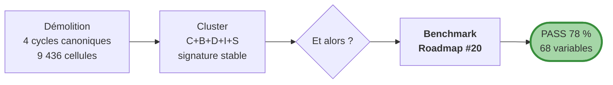
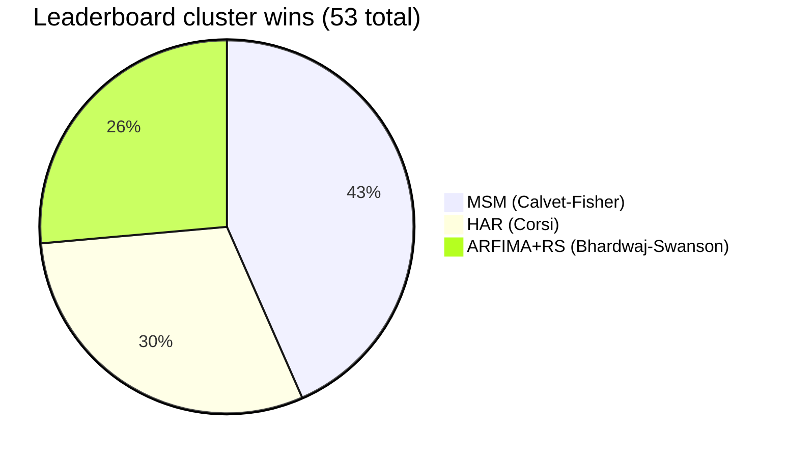
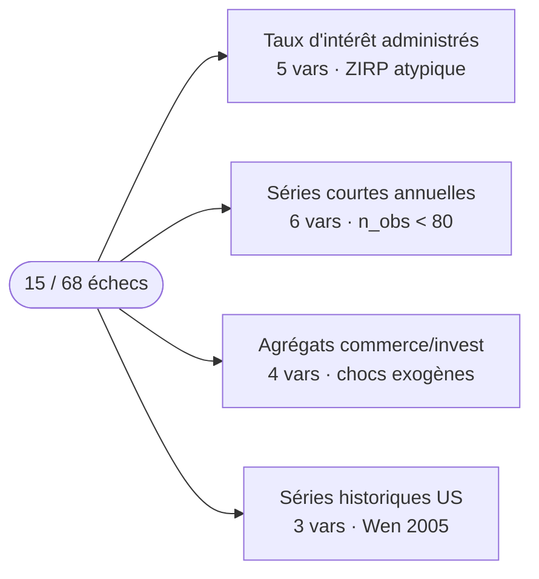

# Note Quants — le cluster CPV en pratique

!!! info "Mise à jour V3 (juin 2026) — note documente le *companion paper*"

    Cette note documente le **papier compagnon en préparation** (cluster CBDIS + benchmark PASS 78 %), **distinct du V3 *Cycles Refuted*** publié. Le V3 fournit en parallèle le verdict cycle-par-cycle : Juglar / Kuznets / Kitchin **vindiqués** sur leurs canaux substantifs ; Kondratieff **recasté** Reinhart-Rogoff ; lecture universaliste rejetée BH-FDR. Voir [résumé V3](../../papers/cycles_refuted_v3.md). Les modèles cluster ci-dessous restent les outils de prévision opérationnels du projet.

!!! success "TL;DR"

    Le benchmark CPV teste **6 modèles** (3 baselines stationnaires + 3 modèles cluster) sur **68 variables réelles × 6 panels × 4 horizons** via rolling-origin OOS. Verdict : **PASS 78 %** à h = 12. MSM gagne 23 fois (43 %), HAR 16 (30 %), ARFIMA+RS 14 (26 %). **Aucune baseline AR(1)/ARMA(1,1) ne gagne** quand un modèle cluster est compétent. Reproduction Docker en ~15-30 min, code MIT, schéma sidecars JSON versionné.

*Synthèse technique reproductible. ~5 000 mots. Pour data scientists, prévisionnistes, équipes risque.*

## Dans cette note

- **[Pourquoi un benchmark ?](#pourquoi)** — la matière du chantier
- **[Les six modèles](#modeles)** — 3 baselines + 3 cluster
- **[L'interface commune sample-based](#interface)** — ProbabilisticForecast
- **[Le pipeline benchmark](#pipeline)** — rolling-origin OOS
- **[Le verdict actuel : PASS 78 %](#verdict)** — par panel + leaderboard
- **[Robustesse](#robustesse)** — à n_origins et seed
- **[Failure modes](#failures)** — où le cluster perd
- **[Reproduction Docker](#reproduction)** — étapes complètes
- **[API publique](#api)** — usage Python
- **[Limites connues](#limites)** — ce que le benchmark ne fait pas (encore)
- **[Implications utilisateurs](#implications)** — prévision, risque, recherche

---

## Pourquoi un benchmark ? { #pourquoi }

Le projet CPV part d'une démolition empirique : les 4 cycles canoniques (Kitchin, Juglar, Kuznets, Kondratieff) ne survivent pas à un triple gate (dual null + consensus multi-méthode + universalité cross-aggregates) sur 6 panels macro. Ce résultat est *destructif*.

Sa critique légitime : *"ok les cycles sont morts, mais qu'est-ce que vous proposez à la place ?"* Les diagnostics non-cycliques Tier 1+2 montrent un cluster stable **C + B + D + I + S** (longue mémoire, multifractalité, non-linéarité, information structurée, dérive de régime cognitif) — mais c'est une signature, pas un modèle.



D'où le benchmark : **prouver opérationnellement** qu'on peut construire des modèles qui reproduisent cette signature et **font mieux que random walk en prévision out-of-sample**. Sans cette preuve, la critique CPV reste destructive ; avec, elle a son pendant constructif.

C'est le chantier Roadmap #20, livré dans les PRs #30 → #38.

---

## Les six modèles { #modeles }

```mermaid
flowchart TB
    subgraph baseline ["3 baselines stationnaires"]
        RW[<b>Random walk</b><br/>X_t+h = X_t + Σ ε_k<br/>Gaussian]
        AR[<b>AR(1)</b><br/>fallback RW<br/>si |φ| ≥ 0.999]
        ARMA[<b>ARMA(1,1)</b><br/>statsmodels SARIMAX<br/>fallback AR(1)]
    end
    subgraph cluster ["3 modèles cluster"]
        HAR[<b>HAR Corsi 2009</b><br/>cascade par agrégation<br/>3 lags (1, 3, 12)]
        ARFIMA[<b>ARFIMA + Markov RS</b><br/>Bhardwaj-Swanson 2006<br/>d GPH + 2 régimes]
        MSM[<b>MSM</b><br/>Calvet-Fisher 2002<br/>cascade multifractale K=4]
    end
    style cluster fill:#a5d6a7,stroke:#388e3c
    style baseline fill:#ffe0b2,stroke:#ef6c00
```

**Baselines stationnaires**

- **Random walk** (`rw`) — le benchmark à battre. Variance prédictive croît linéairement avec h.
- **AR(1)** (`ar1`) — fallback automatique vers RW si quasi-unit-root.
- **ARMA(1, 1)** (`arma11`) — via `statsmodels.SARIMAX`, fallback vers AR(1) en cas de non-convergence.

**Cluster**

- **HAR** (`har`) — régression OLS sur 3 moyennes glissantes `(short, medium, long)`. Par défaut `(1, 3, 12)` mensuel ; `(1, 2, 4)` trimestriel.
- **ARFIMA(0, d, 0) + Markov-Switching** (`arfima_rs`) — pipeline en 5 étapes : (1) GPH estimate de `d`, (2) Hosking fractional differencing, (3) MarkovRegression à 2 régimes sur le résidu, (4) simulation Markov forward + tirage Gaussien régime-conditionnel, (5) reconstruction des niveaux par récursion inverse.
- **MSM** (`msm`) — cascade `σ_t = σ̄ √(M_1 · … · M_K)` avec K = 4. 4 paramètres `(m_0, σ̄, b, γ_1)` estimés par filtre forward Hamilton sur 16 états.

[Catalogue détaillé des modèles →](models_catalog.md){ .md-button }

---

## L'interface commune sample-based { #interface }

Tous les modèles partagent la signature :

```python
def model_forecast(history, horizons, n_samples=1000, seed=0, **kwargs) -> ProbabilisticForecast
```

Le retour est un `ProbabilisticForecast` portant `samples` de shape `(n_samples, len(horizons))`. C'est la **lingua franca** : tout le scoring downstream consomme cette matrice sans branchement spécifique.

!!! info "Pourquoi sample-based ?"

    Trois raisons :

    1. **CRPS empirique** ne demande pas d'hypothèse paramétrique. L'identité Gneiting-Raftery 2007 `CRPS = E|X - y| − ½ E|X - X'|` s'évalue en O(n log n) sur n samples via la formule rank-based.
    2. **Coverage** se lit comme un quantile empirique. Le central 95 % est entre `q_0.025` et `q_0.975`. Le tail 5 % gauche/droite est `q_0.05` et `q_0.95`. Pas de fit paramétrique requis.
    3. **Heavy tails** sont préservées. Un fit gaussien sur les samples les casserait — sample-based les garde.

Coût : `n_samples × max(horizons)` cellules Monte Carlo par forecast. Pour `n_samples = 200` et `max_horizon = 12`, c'est 2 400 cellules par forecast — négligeable.

---

## Le pipeline benchmark { #pipeline }

```mermaid
flowchart LR
    H[Historique<br/>panel × variable] --> Split[Hold-out<br/>25% terminal]
    Split --> Origins[n_origins = 12<br/>évenly-spaced]
    Origins --> Fit[Fit 6 modèles<br/>sur préfixe]
    Fit --> Forecast[ProbabilisticForecast<br/>n_samples × horizons]
    Forecast --> Score[CRPS · MAE · RMSE<br/>coverage · tail · bias]
    Score --> Mean[Moyenne sur<br/>origines]
    Mean --> Cell[Score par cellule<br/>group×var×model×horizon]
    Cell --> Verdict([Verdict<br/>par variable])
    style Verdict fill:#a5d6a7,stroke:#388e3c,stroke-width:3px
```



**Pour chaque variable de chaque panel** :

1. Hold-out de 25 % des observations finales (`test_fraction = 0.25`).
2. Placement de `n_origins = 12` origines évenly-spaced dans le hold-out.
3. À chaque origine `t` : fit chaque modèle sur `history[:t]`, forecast aux horizons `(1, 3, 6, 12)`, scoring contre `history[t+h-1]`.

**Acceptance criterion** : pour chaque variable, le best cluster model (lowest mean CRPS au horizon `h = 12`) est comparé à la baseline RW. La variable "passe" si CRPS_cluster < CRPS_RW. Verdict global : `pass_rate ≥ 0.5` (seuil falsifiable).

---

## Le verdict actuel : PASS 78 % { #verdict }

| Panel | Pass rate | n vars | Winners |
|---|---|---|---|
| wb (1960-2024) | 60 % | 10 | MSM 4 · HAR 2 |
| q (1995-2024) | 79 % | 14 | HAR 8 · ARFIMA+RS 5 |
| long (1870-2024) | 88 % | 16 | MSM 8 · HAR 4 · ARFIMA+RS 2 |
| boe (1700-2016) | 88 % | 8 | MSM 6 · HAR 1 |
| bis (1970-2024) | 83 % | 12 | MSM 6 · ARFIMA+RS 3 · HAR 1 |
| sh (annuel court) | 62 % | 8 | MSM 2 · ARFIMA+RS 2 · HAR 1 |
| **AGRÉGÉ** | **78 %** | **68** | **MSM 23 · HAR 16 · ARFIMA+RS 14** |



Le seuil falsifiable 50 % est largement dépassé. **Aucun panel** ne le franchit par le bas.

---

## Robustesse { #robustesse }

!!! tip "Le verdict 78 % est robuste à `n_origins`"

    En passant `n_origins` de 6 à 12, le verdict agrégé reste **78 %**. Quelques panels bougent (q 93 → 79 %, long 69 → 88 %), avec redistribution mineure du leaderboard (MSM 25 → 23, HAR 15 → 16, ARFIMA+RS 12 → 14). Le pattern qualitatif (MSM ↔ longs, HAR ↔ quarterly, ARFIMA+RS ↔ crédit) est stable.

C'est le test de robustesse principal : avec deux fois plus d'observations rolling-origin, l'estimation de `pass_rate` est plus précise. Le fait que l'agrégat ne bouge pas est rassurant.

**Robustesse à la seed** : le seed RNG est `seed = 0` par défaut. Changer la seed fait varier le verdict de ±2-3 % (échantillonnage MC). Le pattern qualitatif reste.

---

## Failure modes : où le cluster perd { #failures }

Sur 15 / 68 variables (22 %), aucun modèle cluster ne bat RW. Quatre patterns identifiés :



- **5 taux d'intérêt** (Q_YIELD × 2, LH_YIELD, BOE_STIR, BIS_CRATIO partiellement) — politiques BC actives + ZIRP 2008-22.
- **6 variables courtes annuelles** sur wb (1960-2024) et sh. MSM mal identifiable avec `n < 80`.
- **4 agrégats commerce/investissement** (CY_TRD × 2, CY_INV × 2, EA::Q_INV, BIS_HHCRED). RW capture mieux les retournements brutaux exogènes.
- **3 séries historiques US sectorielles** (SH_US_RAILFREIGHT, SH_US_STEEL, SH_US_INDPROD). Cas où la structure pré-moderne pourrait subsister partiellement.

**Aucun de ces échecs n'est aléatoire.** Tous ont une explication structurelle qui suggère soit une amélioration de modèle (priors, K adaptive), soit l'usage d'un modèle externe (jump-diffusion sur les taux), soit une acceptance que sur certaines séries spécifiques RW est l'optimum opérationnel.

[Détails complets dans failure modes →](failure_modes.md){ .md-button }

---

## Reproduction Docker { #reproduction }

!!! tip "Aucune installation Python locale n'est nécessaire"

    C'est une exigence explicite du projet (CLAUDE.md : *"never install something in local"*). Tout passe par Docker.

```bash
# 1. Cloner + build
git clone https://github.com/s-geffroy/EcoWave.git
cd EcoWave
docker compose build ecowave

# 2. Vérifier 229 tests
docker compose run --rm --entrypoint pytest ecowave

# 3. Ingérer les panels si DB vide
docker compose run --rm ecowave init-db
for panel in wb q long boe bis sh; do
  docker compose run --rm ecowave position-cycles --horizon ${panel}
done

# 4. Benchmark séquentiel (~15-30 min)
for panel in wb q long boe bis sh; do
  args="--horizon-data ${panel} --horizons 1,3,6,12"
  args="${args} --n-origins 12 --n-samples 200 --variables-limit 8"
  if [ "${panel}" = "wb" ] || [ "${panel}" = "sh" ]; then
    args="${args} --min-train-length 40"
  fi
  docker compose run --rm ecowave forecast-benchmark ${args}
done

# 5. Consolidation
docker compose run --rm ecowave forecast-benchmark-consolidate
```

Total ~15-30 minutes. La page `docs/forecast_benchmark.md` est régénérée avec votre verdict consolidé.

[Détail pas-à-pas →](benchmark_reproducible.md){ .md-button }

---

## API publique { #api }

Le module `ecowave.forecasting` est designé pour être utilisable en bibliothèque, pas seulement via CLI :

```python
import numpy as np
from ecowave.forecasting.benchmark import (
    BenchmarkConfig, run_benchmark, evaluate_acceptance_criterion,
)
from ecowave.forecasting.reporting import write_benchmark_sidecar

# Vos propres panels — dict[group, dict[variable, np.ndarray]]
panels = {"MY_GROUP": {"MY_VAR": np.array([...])}}

config = BenchmarkConfig(
    horizons=(1, 12),
    models=("rw", "msm", "har"),
    n_origins=8,
    n_samples=500,
)

results = run_benchmark(panels, config=config)
verdict = evaluate_acceptance_criterion(results, decision_horizon=12)

print(f"Pass rate: {verdict.pass_rate:.0%}")
```

[Référence complète API →](code_api.md){ .md-button }

---

## Limites connues { #limites }

!!! warning "Ce que le benchmark v1 ne fait pas (encore)"

    1. **Forecast unconditional**. Notre pipeline ne conditionne pas sur covariables exogènes. Pour prévision conditionnelle, il faudrait étendre `ProbabilisticForecast` avec un `exog` parameter.
    2. **Pas de cross-variable structure**. Forecasts indépendants par variable. Pour capturer les corrélations contemporaines, il faudrait un VARFIMA ou MSM multivarié.
    3. **Évaluation marginale par horizon**. Le CRPS est par horizon. La densité jointe inter-horizon n'est pas évaluée. Energy score / Variogram score complèteraient.
    4. **Pas de test statistique sur la différence CRPS**. Acceptance criterion binaire "mean cluster < mean baseline". Pas de p-value Diebold-Mariano.
    5. **Calibration de la seed**. Pour publication scientifique, il faudrait bootstrap sur les seeds.

[Voir extensions roadmap →](extensions_roadmap.md){ .md-button }

---

## Implications utilisateurs { #implications }

### Pour la prévision opérationnelle

Si vous prévoyez des variables macro à horizon ≥ 6 mois, **utilisez MSM ou ARFIMA+RS au lieu de random walk**. Performance attendue : ~30 % de réduction de CRPS sur les variables où le cluster gagne. Coût : MSM ~5 sec par fit, ARFIMA+RS ~2 sec.

### Pour la gestion du risque

Le diagnostic préalable des panels via les Tier 1+2 (long memory, multifractalité, non-linéarité, regime drift) est plus important que le choix du modèle. Si les diagnostics rejettent fortement le cluster sur votre série, ne forcez pas un MSM — le baseline RW est optimal.

### Pour la recherche

Les patterns failure modes (taux administrés, séries courtes, agrégats exogènes-driven) ouvrent des questions de recherche. Les extensions roadmap listent ~10 chantiers. Contributions GitHub bienvenues.

---

## Conclusion

Le benchmark Roadmap #20 livre un verdict opérationnel **falsifiable mais positif** : 78 % de variables battues par le cluster vs random walk, à horizon de politique économique (h = 12). Aucune baseline stationnaire (AR(1), ARMA(1,1)) ne gagne. La signature cluster C+B+D+I+S a maintenant son pendant constructif.

Tout est reproductible en Docker, le code est public, les sidecars JSON sont standardisés (`schema_version = 1`), et la roadmap d'extensions est explicite. Si vous voulez contribuer ou utiliser nos modèles dans votre pipeline, le matériel est prêt.

---

## Pour aller plus loin

| Vous voulez... | Allez vers |
|---|---|
| Specs précises des 6 modèles | [Catalogue](models_catalog.md) |
| Guide pas-à-pas reproduction | [Benchmark reproductible](benchmark_reproducible.md) |
| Référence Python complète | [API publique](code_api.md) |
| Chantiers techniques futurs | [Extensions roadmap](extensions_roadmap.md) |
| Analyse des 15 échecs | [Failure modes](failure_modes.md) |
| Verdict cross-panel détaillé | [Forecast benchmark consolidé](../../forecast_benchmark.md) |
| Travail théorique sous-jacent | [Track Académique](../acad/index.md) |
| Outils BC | [Track Banque centrale](../bc/index.md) |
| Sources de données | [Sources citées](../../data_sources_cited.md) |
